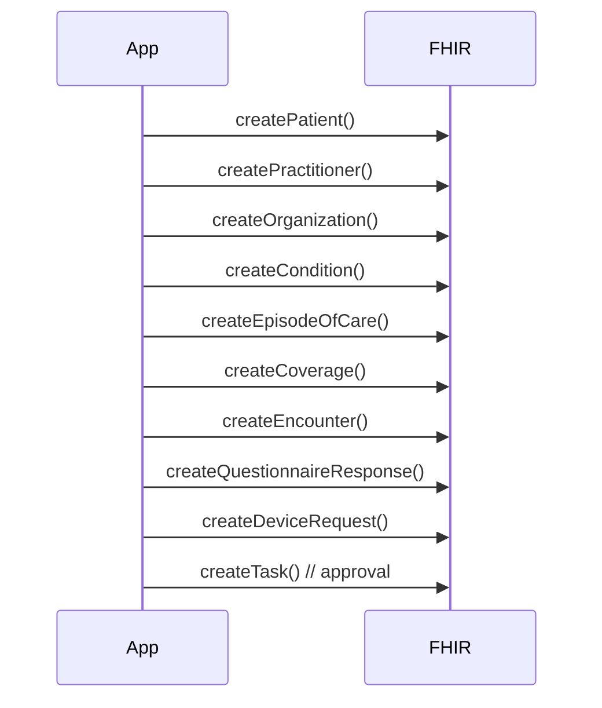

Looking at the new workflow documentation and the database change, I'll update the Claude.md to reflect these significant architectural changes:

# CLAUDE.md

This file provides guidance to Claude Code (claude.ai/code) when working with code in this repository.

# MSC Wound Portal - Codebase Guide for Claude

## Project Overview
MSC Wound Portal is a HIPAA-compliant healthcare platform for wound care distribution management. Built with Laravel 11, React 18, and TypeScript, it features episode-based order workflows through the Quick Request system, sophisticated DocuSeal IVR integration, and strict PHI/non-PHI data separation between Azure SQL (operational) and Azure Health Data Services (clinical).

## 🚨 CRITICAL: Azure FHIR Migration
**URGENT**: Azure API for FHIR will be retired on September 30, 2026
- New deployments blocked starting April 1, 2025
- Must migrate to Azure Health Data Services FHIR® service
- Current endpoint: `medexchangefhir-fhirserver.fhir.azurehealthcareapis.com`
- Migration impacts authentication, endpoints, and API features

## Important Project Rules
- **Always use permissions**, and never use mock data
- Organizations can have multiple facilities and providers
- Facilities have only one office manager
- Providers can have relationships with multiple facilities and organizations
- Always fully finish a feature including all functionality before moving on
- Always use UUID for primary keys (following existing patterns)
- Patients can only request one product with multiple sizes per order
- Patient display format: `JOSM473` (first 2 letters of first + last name + 3 random digits)
- Orders are grouped into episodes by patient+manufacturer combination
- Follow the Quick Request workflow for all new episodes and orders
- Use episode-based workflows, not individual order management
- NEVER create files unless absolutely necessary
- ALWAYS prefer editing existing files to creating new ones
- Follow existing architectural patterns and conventions

## Build Commands & Setup

### Prerequisites
- PHP 8.3+
- Node.js 22+ (LTS required)
- Composer 2.x
- Azure SQL Database
- Azure Health Data Services workspace
- Redis (for caching and queues)
- AWS S3 (for file storage)

### Development Commands
```bash
# Install dependencies
composer install
npm install

# Development servers
php artisan serve
npm run dev  # Vite dev server

# Build for production
npm run build  # Vite production build

# Database (Azure SQL)
php artisan migrate
php artisan db:seed
php artisan migrate:fresh --seed  # Reset and seed

# DocuSeal Template Sync
php artisan docuseal:sync-templates
php artisan docuseal:sync-templates --force  # Force update
php artisan docuseal:sync-templates --queue  # Process via queue

# Testing
php artisan test
php artisan test --filter=QuickRequest  # Quick Request tests
php artisan test --testsuite=Unit
php artisan test --testsuite=Feature
npx vitest  # Frontend tests

# Code quality
npx tsc --noEmit  # TypeScript type checking
npx eslint resources/js --ext .ts,.tsx  # Linting
php artisan pint  # PHP formatting

# FHIR Connection Test
php artisan fhir:test-connection
```

## Architecture

### Tech Stack
- **Backend**: Laravel 11, PHP 8.3+
- **Frontend**: React 18, TypeScript 5.x, Inertia.js
- **Styling**: Tailwind CSS 3.x with glassmorphic design system
- **State**: Zustand, React Context API
- **Database**: Azure SQL Database (non-PHI), Azure Health Data Services FHIR R4 (PHI)
- **Auth**: Laravel Sanctum with role-based access
- **Queues**: Laravel Horizon with Redis
- **File Storage**: AWS S3
- **Document Signing**: DocuSeal API
- **Caching**: Redis
- **Email**: Laravel Mail with queued notifications

### Data Architecture (HIPAA Compliance)

**Azure SQL Database (Non-PHI)**:
```yaml
Operational Data:
  - User accounts and authentication
  - Organizations, facilities, providers
  - Product catalogs and pricing
  - Episodes (patient references only)
  - Orders (initial and follow-up)
  - Commission structures
  - DocuSeal template configurations
  - Manufacturer relationships
  - Audit logs (non-PHI)
  - Task references for approval workflows
```

**Azure Health Data Services (PHI)**:
```yaml
Clinical Data:
  - FHIR Patient resources
  - FHIR Practitioner resources
  - FHIR Organization resources
  - FHIR Condition (diagnoses)
  - FHIR EpisodeOfCare (care coordination)
  - FHIR Coverage (insurance)
  - FHIR Encounter (visits)
  - FHIR QuestionnaireResponse (assessments)
  - FHIR DeviceRequest (product orders)
  - FHIR Task (approval workflows)
  - FHIR DocumentReference (PDFs)
```

### Quick Request Workflow
The Quick Request system is the primary workflow for initiating episodes and placing orders:

#### UI Flow (5 Steps):
1. **Patient & Insurance** (`Step2PatientInsurance`)
2. **Clinical & Billing** (`Step4ClinicalBilling`)
3. **Product Selection** (`Step5ProductSelection`)
4. **DocuSeal IVR** (`Step7DocuSealIVR`)
5. **Review & Submit** (`Step6ReviewSubmit`)

#### FHIR Orchestration Sequence:


#### API Endpoints:
```
POST   /api/v1/quick-request/episodes                 # Create episode + initial order
GET    /api/v1/quick-request/episodes/{episode}       # Get episode details
POST   /api/v1/quick-request/episodes/{episode}/orders # Add follow-up order
GET    /api/v1/quick-request/episodes/{episode}/orders # List episode orders
POST   /api/v1/quick-request/episodes/{episode}/approve # Approve episode
```

### Episode-Based Architecture
```typescript
// Episode structure
interface Episode {
  id: string;  // UUID
  patient_fhir_id: string;  // FHIR Patient reference
  practitioner_fhir_id: string;  // FHIR Practitioner reference
  organization_fhir_id: string;  // FHIR Organization reference
  status: 'draft' | 'pending_review' | 'manufacturer_review' | 'completed';
  orders: Order[];
  created_at: string;
  updated_at: string;
}

// Order structure
interface Order {
  id: string;  // UUID
  episode_id: string;  // FK to Episode
  based_on?: string;  // FK to parent Order (for follow-ups)
  type: 'initial' | 'follow_up';
  details: object;  // JSON payload
  created_at: string;
  updated_at: string;
}
```

### Key Healthcare Integrations
- **Azure FHIR**: Complete FHIR R4 resource management
- **DocuSeal**: IVR forms with dynamic template selection
- **Medicare MAC**: Validation engine for compliance
- **Email Notifications**: Queued manufacturer approvals

## Project Structure
```
msc-wound-portal/
├── app/
│   ├── Http/
│   │   ├── Controllers/
│   │   │   ├── Api/V1/
│   │   │   │   ├── QuickRequestEpisodeController.php
│   │   │   │   └── QuickRequestOrderController.php
│   │   │   └── Admin/
│   │   │       └── OrderCenterController.php
│   │   └── Requests/Api/V1/QuickRequest/  # Request validation
│   ├── Models/
│   │   ├── Episode.php  # Core episode model
│   │   ├── Order.php    # Order model with relationships
│   │   └── DocuSeal/
│   │       └── Document.php  # Polymorphic attachments
│   ├── Services/
│   │   ├── FhirService.php  # Azure FHIR integration
│   │   ├── DocusealService.php  # PDF generation
│   │   └── QuickRequestService.php  # Orchestration
│   ├── Mail/
│   │   └── ManufacturerApprovalMail.php
│   └── Jobs/
│       └── ProcessQuickRequestJob.php
├── resources/
│   ├── js/
│   │   ├── Components/
│   │   │   ├── QuickRequest/  # Quick Request UI components
│   │   │   │   ├── Step2PatientInsurance.tsx
│   │   │   │   ├── Step4ClinicalBilling.tsx
│   │   │   │   ├── Step5ProductSelection.tsx
│   │   │   │   ├── Step7DocuSealIVR.tsx
│   │   │   │   └── Step6ReviewSubmit.tsx
│   │   │   └── ui/  # Reusable UI components
│   │   ├── Pages/
│   │   └── types/
│   │       └── quickRequest.ts  # TypeScript definitions
│   └── css/
├── database/
│   └── migrations/
│       ├── create_episodes_table.php
│       └── create_orders_table.php
├── docs/
│   ├── ivr-forms/  # DocuSeal templates by manufacturer
│   └── features/
│       └── quick-request-workflow.md
└── storage/
    └── app/public/insurance-verifications/  # Generated PDFs
```

## Common Development Patterns

### Quick Request Implementation
```php
// Episode creation with FHIR orchestration
class QuickRequestService {
    public function createEpisode(array $data): Episode {
        // 1. Create FHIR resources
        $patientId = $this->fhirService->createPatient($data['patient']);
        $practitionerId = $this->fhirService->createPractitioner($data['provider']);
        
        // 2. Create EpisodeOfCare
        $episodeOfCareId = $this->fhirService->createEpisodeOfCare([
            'patient' => $patientId,
            'team' => [$practitionerId],
            'managingOrganization' => $organizationId
        ]);
        
        // 3. Create local episode
        return Episode::create([
            'patient_fhir_id' => $patientId,
            'practitioner_fhir_id' => $practitionerId,
            'organization_fhir_id' => $organizationId,
            'status' => 'draft'
        ]);
    }
}
```

### FHIR Resource Creation with Error Handling
```php
// Retry pattern for FHIR calls
$retry = retry(3, function () use ($data) {
    return $this->fhirClient->create('Patient', $data);
}, 1000); // Exponential backoff
```

### DocuSeal Integration
```php
// Template selection based on manufacturer
$template = "docs/ivr-forms/{$manufacturer->name}/insurance-verification.docx";
$fields = $this->mapFhirToDocuSeal($fhirData, $orderDetails);
$pdf = $this->docuSealService->generatePdf($template, $fields);

// Store PDF reference
Document::create([
    'documentable_type' => Episode::class,
    'documentable_id' => $episode->id,
    'path' => $pdf->path,
    'type' => 'insurance_verification'
]);
```

### State Transitions
```typescript
// Episode status flow
type EpisodeStatus = 'draft' | 'pending_review' | 'manufacturer_review' | 'completed';

// Task-driven transitions
const transitionEpisode = async (episodeId: string, action: string) => {
  const task = await fhirClient.updateTask(taskId, {
    status: 'completed',
    businessStatus: { text: action }
  });
  
  await updateEpisodeStatus(episodeId, getNextStatus(action));
};
```

## Security & Compliance

### HIPAA Compliance Checklist
- ✅ PHI stored only in Azure FHIR
- ✅ Operational data in Azure SQL (non-PHI)
- ✅ Comprehensive audit logging
- ✅ Role-based access control (RBAC)
- ✅ Encrypted data transmission (TLS 1.2+)
- ✅ Token-based authentication with expiry
- ✅ Patient display IDs instead of names
- ✅ Business Associate Agreements (BAA)
- ✅ PDF storage with access controls

### Database Security (Azure SQL)
```php
// Connection configuration
'sqlsrv' => [
    'driver' => 'sqlsrv',
    'host' => env('DB_HOST'),
    'port' => env('DB_PORT', '1433'),
    'database' => env('DB_DATABASE'),
    'username' => env('DB_USERNAME'),
    'password' => env('DB_PASSWORD'),
    'charset' => 'utf8',
    'prefix' => '',
    'encrypt' => true,  // Always encrypted
    'trust_server_certificate' => false,
];
```

## Testing Strategy

### Quick Request Testing
```bash
# API integration tests
php artisan test --filter=QuickRequest

# FHIR orchestration tests (mocked)
php artisan test --filter=QuickRequestFhirTest

# PDF generation tests
php artisan test --filter=DocuSealPdfTest
```

### Test Patterns
```php
// Mock FHIR responses
Http::fake([
    '*/Patient' => Http::response(['id' => 'test-patient-id'], 201),
    '*/EpisodeOfCare' => Http::response(['id' => 'test-episode-id'], 201),
]);

// Assert PDF contains fields
$parser = new \Smalot\PdfParser\Parser();
$pdf = $parser->parseFile($path);
$text = $pdf->getText();
$this->assertStringContainsString('Patient Name:', $text);
```

### Compliance Testing
- Verify FHIR headers: `application/fhir+json`
- Audit log creation for all PHI access
- Task state transitions
- Email notification delivery

## Common Issues & Solutions

### Azure SQL Connection
- Ensure firewall rules allow app access
- Use connection pooling for performance
- Monitor DTU usage for scaling needs

### Quick Request Flow
- If FHIR call fails, log but don't block user
- Store partial progress in episode drafts
- Use queued jobs for long operations

### DocuSeal Templates
- Templates in `docs/ivr-forms/{ManufacturerName}/`
- Ensure field placeholders match mapping keys
- PDF storage path: `storage/app/public/insurance-verifications/`

### Episode Status Management
```
draft → pending_review → manufacturer_review → completed
```
- Status changes trigger FHIR Task updates
- Email notifications sent on key transitions

## Performance Optimization
- FHIR calls use retry with exponential backoff
- Azure SQL queries optimized with proper indexes
- PDF generation queued for async processing
- Redis caching for frequently accessed data
- Batch FHIR resource creation where possible

## Current Architecture Benefits
1. **Azure SQL**: Better integration with Azure ecosystem, improved performance
2. **Quick Request Workflow**: Streamlined episode creation with full FHIR orchestration
3. **Task-Based Approvals**: FHIR-compliant workflow management
4. **DocuSeal Integration**: Dynamic template selection per manufacturer
5. **Comprehensive Testing**: Unit, integration, and E2E test coverage

## MSC Brand Guidelines
- Primary Blue: `#1925c3`
- Primary Red: `#c71719`
- Gradient: `from-[#1925c3] to-[#c71719]`
- Glass effects: 30% opacity with backdrop blur
- Typography: System font stack with medical clarity

## Laravel Development Best Practices

### 1. Follow Laravel's Conventions
- Use PSR-12 coding standards for PHP.
- Name controllers, models, and other classes according to Laravel's naming conventions (e.g., PascalCase for class names, snake_case for database columns).
- Place logic in the appropriate layers (e.g., controllers for handling requests, models for database interactions, services for business logic).

### 2. Use Eloquent ORM Effectively
- Leverage Eloquent relationships (e.g., hasOne, hasMany, belongsTo) to simplify database queries.
- Use query scopes for reusable query logic.
- Avoid N+1 query problems by using eager loading (with()).

### 3. Keep Controllers Thin
- Avoid placing business logic in controllers. Instead, use Service Classes or Action Classes to handle complex logic.
- Controllers should primarily handle request validation and return responses.

### 4. Validate Input Properly
- Use Form Requests for validation instead of writing validation logic directly in controllers.
- Always sanitize and validate user input to prevent security vulnerabilities like SQL injection or XSS.

### 5. Use Migrations and Seeders
- Use migrations to manage database schema changes and ensure consistency across environments.
- Use seeders and factories to populate test data for development and testing.

### 6. Secure Your Application
- Use Laravel's built-in CSRF protection for forms.
- Escape output using {{ }} to prevent XSS attacks.
- Use hashed passwords with Laravel's Hash facade.
- Avoid exposing sensitive data in .env files and use proper environment variable management.

### 7. Optimize Performance
- Cache frequently accessed data using Laravel's caching mechanisms (e.g., Redis, file cache).
- Use queues for time-consuming tasks like sending emails or processing files.
- Optimize database queries by indexing columns and avoiding unnecessary joins.

### 8. Write Tests
- Use PHPUnit or Pest to write unit and feature tests.
- Test controllers, models, and services to ensure your application behaves as expected.
- Use Laravel's testing helpers for mocking and simulating HTTP requests.

### 9. Use Dependency Injection
- Inject dependencies (e.g., services, repositories) into controllers or classes instead of instantiating them directly.
- Use Laravel's Service Container to manage dependencies.

### 10. Keep Code DRY (Don't Repeat Yourself)
- Reuse code by creating helpers, traits, or service classes.
- Use Blade components and layouts to avoid duplicating HTML in views.

### 11. Use Version Control
- Use Git for version control and maintain a clean commit history.
- Follow a branching strategy like Git Flow or Trunk-Based Development.

### 12. Stay Updated
- Regularly update Laravel and its dependencies to the latest stable versions to benefit from security patches and new features.

By adhering to these principles, you'll ensure your Laravel application is robust, maintainable, and scalable.

This guide reflects the current state of the MSC Wound Portal with the Quick Request workflow and Azure SQL implementation. Reference this when implementing new features to ensure consistency with established patterns and compliance requirements.

---