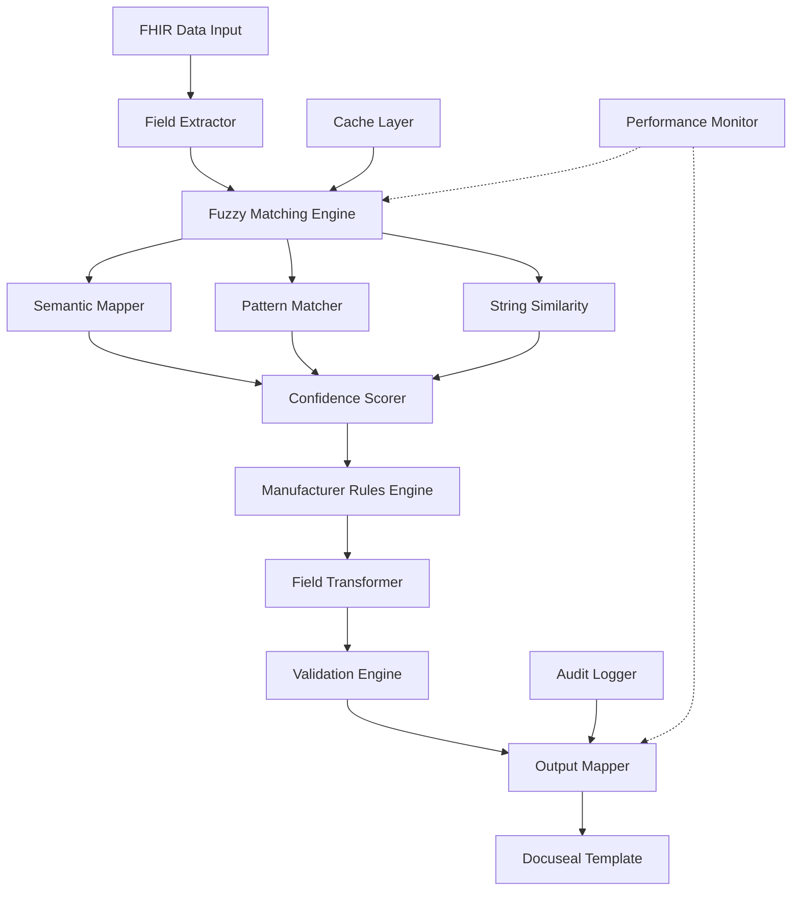

# FuzzyMap.md - Comprehensive IVR Template Fuzzy Matching System

## Table of Contents

1. [System Overview](#system-overview)
2. [Architecture](#architecture)
3. [Core Components](#core-components)
4. [Template Analysis](#template-analysis)
5. [Implementation Guide](#implementation-guide)
6. [Database Schema](#database-schema)
7. [Testing Strategy](#testing-strategy)
8. [Performance Optimization](#performance-optimization)
9. [Monitoring & Observability](#monitoring--observability)
10. [Deployment Guide](#deployment-guide)

## System Overview

The Fuzzy Mapping System is designed to dynamically map FHIR healthcare data to various manufacturer-specific IVR (Insurance Verification & Reimbursement) templates with high accuracy despite significant variations in field naming conventions.

### Key Features

- **Multi-Strategy Matching**: Combines exact, semantic, fuzzy string, and pattern matching
- **Manufacturer-Specific Rules**: Handles unique requirements for 6+ manufacturers
- **Confidence Scoring**: Provides reliability metrics for each mapping
- **Self-Learning**: Improves accuracy over time through usage patterns
- **Production-Ready**: Includes caching, monitoring, and error recovery

### Supported Manufacturers

1. **Biowound** - 72 fields
2. **Extremity Care** - 80 fields  
3. **Centurion** - 60 fields
4. **ACZ Associates** - 71 fields (with 7 NPI fields)
5. **Advanced Solution** - 82 fields
6. **Imbed Microlyte** - 44 fields (simplified structure)

## Architecture



## Core Components

### 1. Enhanced Fuzzy Field Matcher

```typescript
// types/fuzzy-matching.types.ts
export interface FieldMapping {
  sourceField: string;
  targetField: string;
  confidence: number;
  matchType: 'exact' | 'fuzzy' | 'semantic' | 'pattern' | 'fallback' | 'manual';
  metadata?: {
    levenshteinDistance?: number;
    jaroScore?: number;
    semanticGroup?: string;
    patternMatched?: string;
  };
}

export interface MappingResult {
  manufacturerId: string;
  templateId: string;
  fieldMappings: Map<string, FieldMapping[]>;
  transformedData: Record<string, any>;
  confidence: number;
  unmappedFields: string[];
  warnings: string[];
  performance: {
    duration: number;
    cacheHit: boolean;
    fallbacksUsed: number;
  };
  validation: ValidationReport;
}

export interface FuzzyMatchConfig {
  threshold: number;
  weights: {
    exact: number;
    levenshtein: number;
    jaro: number;
    semantic: number;
    pattern: number;
  };
  enableCache: boolean;
  enableFallbacks: boolean;
  maxSuggestions: number;
}

export interface ValidationReport {
  isValid: boolean;
  errors: ValidationError[];
  warnings: ValidationWarning[];
  fieldReports: Map<string, FieldValidation>;
}
```

### 2. Complete Fuzzy Matching Engine

```typescript
// services/FuzzyFieldMatcher.ts
import { distance as levenshteinDistance } from 'fastest-levenshtein';
import * as natural from 'natural';
import { LRUCache } from 'lru-cache';

export class EnhancedFuzzyFieldMatcher {
  private readonly semanticMappings: Map<string, string[]>;
  private readonly patternMatchers: RegExp[];
  private readonly config: FuzzyMatchConfig;
  private readonly cache: LRUCache<string, FieldMapping[]>;
  private readonly synonymDatabase: Map<string, Set<string>>;
  
  constructor(config?: Partial<FuzzyMatchConfig>) {
    this.config = {
      threshold: 0.65,
      weights: {
        exact: 1.0,
        levenshtein: 0.85,
        jaro: 0.80,
        semantic: 0.90,
        pattern: 0.70,
        ...config?.weights
      },
      enableCache: true,
      enableFallbacks: true,
      maxSuggestions: 5,
      ...config
    };
    
    this.semanticMappings = this.initializeSemanticMappings();
    this.patternMatchers = this.initializePatternMatchers();
    this.synonymDatabase = this.initializeSynonyms();
    
    if (this.config.enableCache) {
      this.cache = new LRUCache<string, FieldMapping[]>({
        max: 1000,
        ttl: 1000 * 60 * 60, // 1 hour
      });
    }
  }
  
  protected initializeSemanticMappings(): Map<string, string[]> {
    const mappings = new Map<string, string[]>();
    
    // Patient Information - Comprehensive mappings
    mappings.set('patient_name', [
      'Patient Name', 'Patient  Name', 'Patient Name:', 'Name', 'Text3',
      'patient', 'pt name', 'patient_full_name', 'member_name', 'subscriber_name',
      'PATIENT NAME', 'PatientName', 'Patient-Name', 'patient.name'
    ]);
    
    mappings.set('patient_dob', [
      'Patient DOB:', 'Patient Date of Birth', 'DOB', 'date of birth', 
      'birth date', 'birthdate', 'patient_birth_date', 'member_dob',
      'Surgery Date', 'Date:', 'patient.birthDate', 'PatientDOB'
    ]);
    
    mappings.set('patient_address', [
      'Patient Address:', 'Patient Address', 'Address', 'patient_street', 
      'street_address', 'address_line_1', 'street', 'patient addr',
      'Patient City, State, Zip', 'patient.address', 'PatientAddress'
    ]);
    
    mappings.set('patient_phone', [
      'Phone', 'Phone1', 'Home Phone', 'Mobile', 'Contact Phone',
      'patient_phone', 'phone_number', 'contact_number', 'Patient Phone',
      'Contact #/Email', 'Patient Fax/Email', 'Tel', 'Telephone'
    ]);
    
    // Provider Information - Handle multiple NPIs
    mappings.set('provider_npi', [
      'Physician NPI 1', 'Physician NPI 2', 'Physician NPI 3',
      'Physician NPI 4', 'Physician NPI 5', 'Physician NPI 6',
      'Physician NPI 7', 'Physician  NPI', 'Physician NPI:',
      'NPI', 'NPI1', 'provider_npi', 'physician_npi', 'doctor_npi'
    ]);
    
    mappings.set('provider_name', [
      'Physician  Name', 'Physician Name:', 'Physician Name',
      'Provider Name', 'Doctor Name', 'physician', 'provider',
      'Attending Physician', 'Ordering Provider', 'Referring Provider'
    ]);
    
    // Facility Information - Handle multiple facilities
    mappings.set('facility_npi', [
      'Facility NPI 1', 'Facility NPI 2', 'Facility NPI 3',
      'Facility NPI 4', 'Facility NPI 5', 'Facility NPI 6',
      'Facility NPI 7', 'Facility NPI:', 'Facility  NPI'
    ]);
    
    mappings.set('facility_name', [
      'Practice  Name', 'Facility  Name', 'Facility Name',
      'Specialty Site Name', 'facility', 'clinic_name', 'practice_name',
      'Hospital Name', 'Office Name', 'Site Name', 'Location Name'
    ]);
    
    mappings.set('facility_type', [
      'Facility Type', 'Office', 'Outpatient Hospital',
      'Ambulatory Surgical Center', 'Check Physician Office (POS 11)',
      'Check Hospital Outpatient (POS 22)', 'Check Surgery Center (POS 24)',
      'Check Home (POS 12)', 'Check Nursing Care Facility (POS 32)',
      'Place of Service', 'POS', 'Site of Service'
    ]);
    
    // Insurance mappings
    mappings.set('primary_insurance', [
      'Primary Insurance Name', 'Primary Insurance:', 'Primary Insurance',
      'Primary Insurance HMO', 'Primary Insurance PPO', 'Primary Payer',
      'Payer Name', 'Payer Name1', 'Insurance Company', 'Primary Ins'
    ]);
    
    mappings.set('secondary_insurance', [
      'Secondary Insurance Name', 'Secondary Insurance:',
      'Secondary Insurance HMO', 'Secondary Insurance PPO',
      'Secondary Payer', 'Secondary Ins', 'Secondary Insurance'
    ]);
    
    mappings.set('policy_number', [
      'Policy', 'Policy1', 'Policy Number', 'Member ID',
      'policy_id', 'member_number', 'insurance_id', 'ID Number',
      'Subscriber ID', 'Policy #', 'Insurance ID'
    ]);
    
    mappings.set('group_number', [
      'Group', 'Group1', 'Group Number', 'Group ID',
      'Group #', 'Insurance Group', 'group_id'
    ]);
    
    mappings.set('subscriber_name', [
      'Primary Subscriber Name', 'Subscriber Name', 'Subscriber Name 2nd',
      'Suscriber Name', // Note typo in Centurion
      'Policy Holder', 'Insurance Subscriber', 'Member Name'
    ]);
    
    mappings.set('subscriber_dob', [
      'Subscriber DOB', 'Subscriber DOB:', 'Subscriber DOB 2nd',
      'Subscriber Birth Date', 'Policy Holder DOB'
    ]);
    
    // Administrative fields
    mappings.set('sales_rep', [
      'Sales Rep', 'Sales Representative', 'ISO if applicable',
      'Sales Person', 'Territory Manager', 'Account Manager'
    ]);
    
    mappings.set('mac', [
      'MAC', 'PTAN Medicare', 'Facility PTAN', 'Medicare Admin Contractor',
      'Medicare Administrative Contractor', 'MAC Jurisdiction'
    ]);
    
    mappings.set('tax_id', [
      'Tax ID', 'Tax ID1', 'EIN', 'tax_identification',
      'federal_tax_id', 'employer_id', 'TIN', 'Tax Identification Number'
    ]);
    
    mappings.set('contact_email', [
      'Email', 'Contact #/Email', 'Facility Contact Email',
      'Primary Point of Contact Email', 'Additional Emails for Notification',
      'Patient Fax/Email', 'Facility Point of Contact Email',
      'E-mail', 'Email Address', 'Contact Email'
    ]);
    
    mappings.set('contact_name', [
      'Contact Name', 'Contact Name1', 'Factility Contact Name', // Note typo
      'Primary Point of Contact Name', 'Facility Primary Point of Contact',
      'POC Name', 'Contact Person', 'Primary Contact'
    ]);
    
    mappings.set('contact_phone', [
      'Contact Phone', 'Primary Point of Contact Phone Number',
      'Facility Point of Contact Phone Number', 'Facility Phone Number',
      'Contact Number', 'Phone Number', 'Telephone Number'
    ]);
    
    // Clinical/Wound Information
    mappings.set('wound_type', [
      'Diabetic Foot Ulcer', 'Venous Leg Ulcer', 'Pressure Ulcer',
      'Traumatic Burns', 'Radiation Burns', 'Necrotizing Facilitis', // Note typo
      'Dehisced Surigcal Wound', // Note typo
      'Other Wound', 'Type of Wound Other', 'Wound Type',
      'Ulcer Type', 'Type of Ulcer'
    ]);
    
    mappings.set('wound_location', [
      'Location of Ulcer', 'wound_location', 'ulcer_location',
      'Check Wound Location: Legs/Arms/Trunk < 100 SQ CM',
      'Check Wound Location: Legs/Arms/Trunk > 100 SQ CM',
      'Check Wound Location: Feet/Hands/Head < 100 SQ CM',
      'Check Wound Location: Feet/Hands/Head > 100 SQ CM',
      'Anatomical Location', 'Body Site', 'Wound Site'
    ]);
    
    mappings.set('wound_size', [
      'Post Debridement Total Size of Ulcers cm2', 'Wound Size',
      'wound_area', 'ulcer_size', 'wound_dimensions', 'Size cm²',
      'Total Area', 'Wound Area', 'Size of Wound'
    ]);
    
    mappings.set('diagnosis_codes', [
      'ICD-10 Codes', 'ICD-1o Diagnosis Code(s)', // Note typo
      'Primary Diagnosis Code', 'Primary Secondary and Other Codes',
      'Primary:', 'Secondary:', 'Tertiary:', 'Diagnosis', 'DX Codes',
      'ICD10', 'Diagnostic Codes'
    ]);
    
    mappings.set('procedure_date', [
      'Date of Procedure', 'Surgery Date', 'Date:', 'Procedure Date',
      'Anticipated Treatment Start Date', 'Treatment Date',
      'Application Date', 'Service Date'
    ]);
    
    // Product specific mappings
    mappings.set('product_selection', [
      'Check Membrane Wrap Q4205', 'Check Amnio-Maxx Q4239',
      'Check Revoshield Q4289', 'Check Derm-maxx Q4238',
      'Check Membrane Wrap Hydr Q4290', 'CompleteAA', 'Membrane Wrap Hydro',
      'Membrane Wrap', 'WoundPlus', 'CompleteFT', 'AmnioBand Q4151',
      'Allopatch Q4128', 'ML0505', 'ML1010', 'Product', 'Product Name'
    ]);
    
    // Authorization fields
    mappings.set('prior_auth', [
      'Prior Auth', 'PA Request Type', 'No: Pre-Auth Assistance',
      'Check Permission to Initiate and Follow Up: Yes',
      'Check Permission to Initiate and Follow Up: No',
      'Prior Authorization', 'Pre-Auth', 'Authorization Number'
    ]);
    
    // Clinical status fields
    mappings.set('hospice_status', [
      'Check Patient Currently on Hospice: Yes',
      'Patient Currently on Hospice: No',
      'Hospice Status', 'On Hospice', 'Hospice Care'
    ]);
    
    mappings.set('snf_status', [
      'Patient in SNF Yes', 'Patient in SNF No',
      'Check Patient in facility under Part A stay: Yes',
      'Check Patient in facility under Part A stay: No',
      'SNF Status', 'Skilled Nursing Facility', 'Part A Stay'
    ]);
    
    mappings.set('global_period', [
      'Patient Under Global Yes', 'Patient Under Global No',
      'Check Patient under Post-IP Global Surgery Period: Yes',
      'Check Patient under Post-IP Global Surgery Period: No',
      'Global Period', 'Global Surgery Period'
    ]);
    
    mappings.set('clinical_study', [
      'clincal Study - Yes-No', // Note typo
      'Clinical Study Name', 'Research Study', 'Clinical Trial',
      'Study Participation', 'Research Protocol'
    ]);
    
    return mappings;
  }
  
  protected initializePatternMatchers(): RegExp[] {
    return [
      // NPI patterns with numbers
      /(?:physician|facility|provider)\s*npi\s*\d*/i,
      /npi\s*[:=-]?\s*\d*/i,
      
      // Checkbox patterns
      /check\s+box\s*\d*/i,
      /check\s+.+:\s*(yes|no)/i,
      /chk[a-z0-9]*/i,
      /checkbox\s*\d*/i,
      
      // Text field patterns
      /text\s*\d*/i,
      /field\s*\d*/i,
      
      // Insurance patterns
      /(?:primary|secondary)\s+(?:insurance|subscriber|payer)/i,
      /(?:hmo|ppo|medicare|medicaid)\s+/i,
      
      // POS (Place of Service) patterns
      /pos\s*[-]?\s*\d+/i,
      /place\s+of\s+service/i,
      
      // Product codes (Q-codes)
      /Q\d{4}/,
      /(?:product|item)\s+code/i,
      
      // Size patterns
      /(?:<|>)\s*\d+\s*(?:SQ\s*)?CM/i,
      /\d+\s*(?:x|×)\s*\d+/i,
      
      // Date patterns
      /(?:date|dob)\s*(?:of\s*)?(?:signed|procedure|surgery|birth)?/i,
      /\d{1,2}[-/]\d{1,2}[-/]\d{2,4}/,
      
      // Contact patterns
      /(?:contact|phone|email|fax)\s*(?:#|number)?/i,
      /(?:tel|telephone|mobile|cell)/i,
      
      // Address patterns
      /(?:street|address|city|state|zip|postal)/i,
      
      // Clinical patterns
      /(?:diagnosis|dx|icd[-]?10?)/i,
      /(?:wound|ulcer|lesion)\s+(?:type|location|size)/i,
      
      // Authorization patterns
      /(?:auth|authorization|pa|pre[-]?auth)/i,
      
      // Numeric patterns
      /\d{3}[-.]?\d{3}[-.]?\d{4}/, // Phone
      /\d{5}(?:-\d{4})?/, // ZIP
      /\d{2}[-/]\d{2}[-/]\d{4}/, // Date
    ];
  }
  
  protected initializeSynonyms(): Map<string, Set<string>> {
    const synonyms = new Map<string, Set<string>>();
    
    // Medical synonyms
    synonyms.set('physician', new Set(['doctor', 'provider', 'practitioner', 'clinician']));
    synonyms.set('patient', new Set(['member', 'beneficiary', 'client', 'subscriber']));
    synonyms.set('facility', new Set(['clinic', 'hospital', 'office', 'practice', 'center']));
    synonyms.set('insurance', new Set(['payer', 'coverage', 'plan', 'carrier']));
    
    // Administrative synonyms
    synonyms.set('npi', new Set(['national provider identifier', 'provider id']));
    synonyms.set('tax', new Set(['tin', 'ein', 'federal tax', 'employer identification']));
    synonyms.set('authorization', new Set(['auth', 'approval', 'pre-auth', 'pa']));
    
    // Clinical synonyms
    synonyms.set('wound', new Set(['ulcer', 'lesion', 'sore', 'injury']));
    synonyms.set('diagnosis', new Set(['dx', 'condition', 'problem', 'issue']));
    synonyms.set('procedure', new Set(['treatment', 'service', 'intervention', 'therapy']));
    
    return synonyms;
  }
  
  public matchFields(
    sourceField: string,
    targetFields: string[],
    context?: MappingContext
  ): FieldMapping[] {
    const startTime = Date.now();
    
    // Check cache first
    const cacheKey = `${sourceField}:${targetFields.join(',')}`;
    if (this.config.enableCache && this.cache.has(cacheKey)) {
      return this.cache.get(cacheKey)!;
    }
    
    const matches: FieldMapping[] = [];
    
    for (const targetField of targetFields) {
      // 1. Exact match
      if (this.isExactMatch(sourceField, targetField)) {
        matches.push({
          sourceField,
          targetField,
          confidence: 1.0,
          matchType: 'exact',
          metadata: {}
        });
        continue;
      }
      
      // 2. Semantic matching
      const semanticScore = this.getSemanticScore(sourceField, targetField);
      if (semanticScore > this.config.threshold) {
        matches.push({
          sourceField,
          targetField,
          confidence: semanticScore * this.config.weights.semantic,
          matchType: 'semantic',
          metadata: { semanticGroup: this.findSemanticGroup(sourceField) }
        });
      }
      
      // 3. Fuzzy string matching
      const fuzzyScore = this.getFuzzyScore(sourceField, targetField);
      if (fuzzyScore.combined > this.config.threshold) {
        matches.push({
          sourceField,
          targetField,
          confidence: fuzzyScore.combined,
          matchType: 'fuzzy',
          metadata: {
            levenshteinDistance: fuzzyScore.levenshteinDistance,
            jaroScore: fuzzyScore.jaroScore
          }
        });
      }
      
      // 4. Pattern matching
      const patternScore = this.getPatternScore(sourceField, targetField);
      if (patternScore.score > this.config.threshold) {
        matches.push({
          sourceField,
          targetField,
          confidence: patternScore.score * this.config.weights.pattern,
          matchType: 'pattern',
          metadata: { patternMatched: patternScore.pattern }
        });
      }
    }
    
    // Sort and deduplicate
    const result = this.deduplicateAndSort(matches)
      .slice(0, this.config.maxSuggestions);
    
    // Cache result
    if (this.config.enableCache) {
      this.cache.set(cacheKey, result);
    }
    
    // Log performance
    const duration = Date.now() - startTime;
    if (duration > 100) {
      console.warn(`Slow field matching: ${duration}ms for ${sourceField}`);
    }
    
    return result;
  }
  
  private isExactMatch(source: string, target: string): boolean {
    const normalize = (s: string) => s.toLowerCase().trim().replace(/[^a-z0-9]/g, '');
    return normalize(source) === normalize(target);
  }
  
  private getSemanticScore(source: string, target: string): number {
    const sourceLower = source.toLowerCase();
    const targetLower = target.toLowerCase();
    
    // Direct semantic group match
    for (const [key, values] of this.semanticMappings) {
      const sourceInGroup = values.some(v => 
        this.containsMatch(sourceLower, v.toLowerCase())
      );
      const targetInGroup = values.some(v => 
        this.containsMatch(targetLower, v.toLowerCase())
      );
      
      if (sourceInGroup && targetInGroup) {
        return 0.95;
      }
    }
    
    // Check synonyms
    for (const [word, synonymSet] of this.synonymDatabase) {
      if (sourceLower.includes(word) || targetLower.includes(word)) {
        for (const synonym of synonymSet) {
          if (sourceLower.includes(synonym) || targetLower.includes(synonym)) {
            return 0.85;
          }
        }
      }
    }
    
    return 0;
  }
  
  private containsMatch(str1: string, str2: string): boolean {
    return str1.includes(str2) || str2.includes(str1) || 
           this.tokenOverlap(str1, str2) > 0.5;
  }
  
  private tokenOverlap(str1: string, str2: string): number {
    const tokens1 = new Set(str1.split(/\s+/));
    const tokens2 = new Set(str2.split(/\s+/));
    
    let overlap = 0;
    for (const token of tokens1) {
      if (tokens2.has(token)) overlap++;
    }
    
    return overlap / Math.max(tokens1.size, tokens2.size);
  }
  
  private getFuzzyScore(source: string, target: string): {
    combined: number;
    levenshteinDistance: number;
    jaroScore: number;
  } {
    const sourceLower = source.toLowerCase().replace(/[^a-z0-9]/g, '');
    const targetLower = target.toLowerCase().replace(/[^a-z0-9]/g, '');
    
    // Levenshtein distance
    const maxLength = Math.max(sourceLower.length, targetLower.length);
    const distance = levenshteinDistance(sourceLower, targetLower);
    const levenshteinScore = 1 - (distance / maxLength);
    
    // Jaro-Winkler distance
    const jaroScore = natural.JaroWinklerDistance(sourceLower, targetLower);
    
    // N-gram similarity
    const ngramScore = this.getNgramSimilarity(sourceLower, targetLower, 3);
    
    // Combined score with weights
    const combined = (
      levenshteinScore * this.config.weights.levenshtein +
      jaroScore * this.config.weights.jaro +
      ngramScore * 0.7
    ) / 2.7;
    
    return {
      combined,
      levenshteinDistance: distance,
      jaroScore
    };
  }
  
  private getNgramSimilarity(str1: string, str2: string, n: number): number {
    const ngrams1 = this.getNgrams(str1, n);
    const ngrams2 = this.getNgrams(str2, n);
    
    const intersection = ngrams1.filter(g => ngrams2.includes(g)).length;
    const union = new Set([...ngrams1, ...ngrams2]).size;
    
    return union > 0 ? intersection / union : 0;
  }
  
  private getNgrams(str: string, n: number): string[] {
    const ngrams: string[] = [];
    for (let i = 0; i <= str.length - n; i++) {
      ngrams.push(str.slice(i, i + n));
    }
    return ngrams;
  }
  
  private getPatternScore(source: string, target: string): {
    score: number;
    pattern: string;
  } {
    let bestScore = 0;
    let bestPattern = '';
    
    for (const pattern of this.patternMatchers) {
      const sourceMatch = pattern.test(source);
      const targetMatch = pattern.test(target);
      
      if (sourceMatch && targetMatch) {
        // Extract matched portions for similarity comparison
        const sourceExtract = source.match(pattern)?.[0] || '';
        const targetExtract = target.match(pattern)?.[0] || '';
        
        const similarity = this.getFuzzyScore(sourceExtract, targetExtract).combined;
        
        if (similarity > bestScore) {
          bestScore = similarity;
          bestPattern = pattern.source;
        }
      }
    }
    
    return {
      score: bestScore,
      pattern: bestPattern
    };
  }
  
  private findSemanticGroup(field: string): string | undefined {
    const fieldLower = field.toLowerCase();
    
    for (const [group, values] of this.semanticMappings) {
      if (values.some(v => this.containsMatch(fieldLower, v.toLowerCase()))) {
        return group;
      }
    }
    
    return undefined;
  }
  
  private deduplicateAndSort(matches: FieldMapping[]): FieldMapping[] {
    const uniqueMatches = new Map<string, FieldMapping>();
    
    for (const match of matches) {
      const key = `${match.sourceField}-${match.targetField}`;
      const existing = uniqueMatches.get(key);
      
      if (!existing || match.confidence > existing.confidence) {
        uniqueMatches.set(key, match);
      }
    }
    
    return Array.from(uniqueMatches.values())
      .sort((a, b) => b.confidence - a.confidence);
  }
}
```

### 3. Manufacturer-Specific Template Handler

```typescript
// services/ManufacturerTemplateHandler.ts
export interface ManufacturerRules {
  name: string;
  multipleNPIHandling?: 'array' | 'single' | 'concatenate';
  productFieldPattern?: RegExp;
  posFieldMapping?: Record<string, string>;
  insuranceTypeFields?: Record<string, string[]>;
  woundTypeMapping?: Record<string, string>;
  networkStatusFields?: {
    primary: Record<string, string>;
    secondary: Record<string, string>;
  };
  requiresClinicalStudyInfo?: boolean;
  productSizeMapping?: Record<string, string>;
  simplifiedStructure?: boolean;
  customTransformations?: Record<string, (data: any) => string | null>;
  customFields?: Record<string, (data: any) => string>;
  checkboxPrefix?: string;
  checkboxNaming?: string;
  diabetesTypeMapping?: Record<string, string>;
  complexCheckboxSystem?: boolean;
  checkboxMapping?: Record<string, string>;
  defaultValues?: Record<string, string>;
  conditionalRules?: ConditionalRule[];
  validationRules?: ValidationRule[];
}

export interface ConditionalRule {
  condition: (data: any) => boolean;
  requiredFields: string[];
  optionalFields: string[];
  actions?: Array<(data: any) => void>;
}

export interface ValidationRule {
  field: string;
  validators: Array<(value: any) => ValidationResult>;
}

export class ManufacturerTemplateHandler {
  private manufacturerRules: Map<string, ManufacturerRules>;
  private multiFieldHandler: MultiFieldHandler;
  private conditionalProcessor: ConditionalProcessor;
  
  constructor() {
    this.manufacturerRules = this.initializeManufacturerRules();
    this.multiFieldHandler = new MultiFieldHandler();
    this.conditionalProcessor = new ConditionalProcessor();
  }
  
  private initializeManufacturerRules(): Map<string, ManufacturerRules> {
    const rules = new Map<string, ManufacturerRules>();
    
    // ACZ Associates - Complex multi-NPI system
    rules.set('acz', {
      name: 'ACZ Associates',
      multipleNPIHandling: 'array',
      productFieldPattern: /Check\s+(.+)\s+Q\d{4}/,
      posFieldMapping: {
        '11': 'Check Physician Office (POS 11)',
        '22': 'Check Hospital Outpatient (POS 22)',
        '24': 'Check Surgery Center (POS 24)',
        '12': 'Check Home (POS 12)',
        '32': 'Check Nursing Care Facility (POS 32)'
      },
      customTransformations: {
        'wound_size_category': (data: any) => {
          const size = parseFloat(data.wound_size);
          const location = data.wound_location?.toLowerCase() || '';
          
          if (location.includes('leg') || location.includes('arm') || location.includes('trunk')) {
            return size < 100 
              ? 'Check Wound Location: Legs/Arms/Trunk < 100 SQ CM'
              : 'Check Wound Location: Legs/Arms/Trunk > 100 SQ CM';
          } else if (location.includes('foot') || location.includes('hand') || location.includes('head')) {
            return size < 100
              ? 'Check Wound Location: Feet/Hands/Head < 100 SQ CM'
              : 'Check Wound Location: Feet/Hands/Head > 100 SQ CM';
          }
          return null;
        }
      },
      conditionalRules: [
        {
          condition: (data) => data.provider_npis?.length > 1,
          requiredFields: ['Physician NPI 2', 'Physician NPI 3'],
          optionalFields: ['Physician NPI 4', 'Physician NPI 5', 'Physician NPI 6', 'Physician NPI 7']
        },
        {
          condition: (data) => data.wound_size > 100,
          requiredFields: ['Large Wound Documentation'],
          optionalFields: ['Additional Clinical Notes']
        }
      ],
      validationRules: [
        {
          field: 'Physician NPI 1',
          validators: [
            (value) => ({
              valid: /^\d{10}$/.test(value),
              error: 'NPI must be exactly 10 digits'
            })
          ]
        }
      ]
    });
    
    // Advanced Solution - Insurance type checkboxes
    rules.set('advanced-solution', {
      name: 'Advanced Solution',
      insuranceTypeFields: {
        'HMO': ['Primary Insurance HMO', 'Secondary Insurance HMO'],
        'PPO': ['Primary Insurance PPO', 'Secondary Insurance PPO'],
        'Other': ['Primary Insurance Other', 'Secondary Insurance Other'],
        'Medicare': ['Primary Insurance Medicare', 'Secondary Insurance Medicare'],
        'Medicaid': ['Primary Insurance Medicaid', 'Secondary Insurance Medicaid']
      },
      woundTypeMapping: {
        'diabetic_foot_ulcer': 'Diabetic Foot Ulcer',
        'venous_leg_ulcer': 'Venous Leg Ulcer',
        'pressure_ulcer': 'Pressure Ulcer',
        'burn_traumatic': 'Traumatic Burns',
        'burn_radiation': 'Radiation Burns',
        'necrotizing_fasciitis': 'Necrotizing Facilitis', // Note their typo
        'surgical_dehiscence': 'Dehisced Surigcal Wound', // Note their typo
        'other': 'Other Wound'
      },
      networkStatusFields: {
        primary: {
          inNetwork: 'Does Provider Participate with Network Yes',
          outNetwork: 'Does Provider Participate with Network No',
          unknown: 'In network Not Sure'
        },
        secondary: {
          inNetwork: 'Does Provider Participate with Network Yes 2nd',
          outNetwork: 'Does Provider Participate with Network No 2nd',
          unknown: 'In network Not Sure 2nd'
        }
      },
      conditionalRules: [
        {
          condition: (data) => data.secondary_insurance_name,
          requiredFields: [
            'Secondary Insurance Name',
            'Secondary Policy',
            'Secondary Group',
            'Subscriber Name 2nd',
            'Subscriber DOB 2nd'
          ],
          optionalFields: ['Secondary Auth', 'Secondary Phone']
        }
      ]
    });
    
    // Imbed Microlyte - Simplified structure with clinical trial
    rules.set('imbed-microlyte', {
      name: 'Imbed Microlyte',
      requiresClinicalStudyInfo: true,
      productSizeMapping: {
        '5x5': 'ML0505',
        '10x10': 'ML1010',
        '2x2': 'ML0202',
        '3x3': 'ML0303',
        '4x4': 'ML0404'
      },
      simplifiedStructure: true,
      customFields: {
        'clincal Study - Yes-No': (data: any) => {
          // Handle their typo in "clinical"
          return data.in_clinical_trial ? 'Yes' : 'No';
        },
        'Clinical Study Name': (data: any) => {
          return data.clinical_study_name || '';
        },
        'PA Request Type': (data: any) => {
          if (data.prior_auth_status === 'needed') return 'Initial';
          if (data.prior_auth_status === 'renewal') return 'Renewal';
          if (data.prior_auth_status === 'appeal') return 'Appeal';
          return '';
        }
      },
      conditionalRules: [
        {
          condition: (data) => data.in_clinical_trial,
          requiredFields: ['Clinical Study Name'],
          optionalFields: ['Study Protocol Number', 'Principal Investigator']
        }
      ]
    });
    
    // Biowound - Diabetes type system
    rules.set('biowound', {
      name: 'Biowound',
      checkboxPrefix: 'Check Box',
      diabetesTypeMapping: {
        'type1': 'Check Box1',
        'type2': 'Check Box2',
        'gestational': 'Check Box3',
        'other': 'Check Box4'
      },
      customTransformations: {
        'diabetes_checkbox': (data: any) => {
          if (!data.has_diabetes) return null;
          const mapping = {
            'type1': 'Check Box1',
            'type2': 'Check Box2',
            'gestational': 'Check Box3',
            'other': 'Check Box4'
          };
          return mapping[data.diabetes_type] || null;
        }
      },
      defaultValues: {
        'Text20': 'Electronic Signature',
        'Text22': new Date().toLocaleDateString()
      }
    });
    
    // Extremity Care - Complex checkbox system
    rules.set('extremity-care', {
      name: 'Extremity Care',
      complexCheckboxSystem: true,
      checkboxMapping: {
        'wound_diabetic': 'Check Box232',
        'wound_venous': 'Check Box24',
        'wound_pressure': 'Check Box25',
        'wound_arterial': 'Check Box26',
        'wound_surgical': 'Check Box27',
        'wound_traumatic': 'Check Box28',
        'new_patient': 'Check Box1',
        'existing_patient': 'Check Box2',
        'medicare': 'Check Box10',
        'medicaid': 'Check Box11',
        'commercial': 'Check Box12',
        'self_pay': 'Check Box13'
      },
      customTransformations: {
        'insurance_checkboxes': (data: any) => {
          const insuranceType = data.primary_insurance_type?.toLowerCase();
          const mapping = {
            'medicare': 'Check Box10',
            'medicaid': 'Check Box11',
            'commercial': 'Check Box12',
            'self_pay': 'Check Box13'
          };
          return mapping[insuranceType] || null;
        }
      }
    });
    
    // Centurion - Checkbox with prefix system
    rules.set('centurion', {
      name: 'Centurion Therapeutics',
      checkboxNaming: 'Check: ',
      defaultValues: {
        'Check: New Wound': 'X',
        'Check: Consent Obtained': 'X',
        'Check: Photos Taken': '',
        'Check: Measurements Documented': 'X'
      },
      posFieldMapping: {
        '11': 'Check: POS-11',
        '22': 'Check: POS-22',
        '24': 'Check: POS-24',
        '32': 'Check: POS-32'
      },
      customFields: {
        'Suscriber Name': (data: any) => {
          // Handle their typo
          return data.subscriber_name || data.patient_name;
        }
      }
    });
    
    return rules;
  }
  
  public async applyManufacturerTransformation(
    data: Record<string, any>,
    manufacturerId: string,
    templateFields: string[]
  ): Promise<TransformationResult> {
    const startTime = Date.now();
    const rules = this.manufacturerRules.get(manufacturerId.toLowerCase());
    
    if (!rules) {
      return {
        data,
        warnings: [`No specific rules found for manufacturer: ${manufacturerId}`],
        appliedRules: [],
        duration: Date.now() - startTime
      };
    }
    
    const transformed = { ...data };
    const warnings: string[] = [];
    const appliedRules: string[] = [];
    
    try {
      // 1. Handle multiple instances (NPIs, facilities, etc.)
      if (rules.multipleNPIHandling) {
        const npiResult = this.multiFieldHandler.handleMultipleFields(
          data,
          templateFields,
          'npi',
          rules.multipleNPIHandling
        );
        Object.assign(transformed, npiResult.mappedFields);
        appliedRules.push('Multiple NPI handling');
      }
      
      // 2. Apply insurance type mappings
      if (rules.insuranceTypeFields && data.primary_insurance_type) {
        const insuranceFields = this.applyInsuranceTypeMappings(
          data,
          rules.insuranceTypeFields,
          templateFields
        );
        Object.assign(transformed, insuranceFields);
        appliedRules.push('Insurance type mapping');
      }
      
      // 3. Map wound types
      if (rules.woundTypeMapping && data.wound_type) {
        const woundField = this.mapWoundType(
          data.wound_type,
          rules.woundTypeMapping,
          templateFields
        );
        if (woundField) {
          transformed[woundField] = 'X';
          appliedRules.push('Wound type mapping');
        }
      }
      
      // 4. Handle POS fields
      if (rules.posFieldMapping && data.place_of_service) {
        const posField = rules.posFieldMapping[data.place_of_service];
        if (posField && templateFields.includes(posField)) {
          transformed[posField] = 'X';
          appliedRules.push('POS field mapping');
        }
      }
      
      // 5. Apply custom transformations
      if (rules.customTransformations) {
        for (const [key, transformer] of Object.entries(rules.customTransformations)) {
          try {
            const result = transformer(data);
            if (result) {
              transformed[result] = 'X';
              appliedRules.push(`Custom transformation: ${key}`);
            }
          } catch (error) {
            warnings.push(`Failed to apply transformation ${key}: ${error.message}`);
          }
        }
      }
      
      // 6. Apply custom field mappings
      if (rules.customFields) {
        for (const [field, transformer] of Object.entries(rules.customFields)) {
          if (templateFields.includes(field)) {
            try {
              transformed[field] = transformer(data);
              appliedRules.push(`Custom field: ${field}`);
            } catch (error) {
              warnings.push(`Failed to map field ${field}: ${error.message}`);
            }
          }
        }
      }
      
      // 7. Apply default values
      if (rules.defaultValues) {
        for (const [field, value] of Object.entries(rules.defaultValues)) {
          if (templateFields.includes(field) && !transformed[field]) {
            transformed[field] = value;
            appliedRules.push(`Default value: ${field}`);
          }
        }
      }
      
      // 8. Process conditional rules
      if (rules.conditionalRules) {
        const conditionalResult = this.conditionalProcessor.processRules(
          data,
          rules.conditionalRules,
          templateFields
        );
        warnings.push(...conditionalResult.warnings);
        appliedRules.push(...conditionalResult.appliedRules);
      }
      
      // 9. Validate transformed data
      if (rules.validationRules) {
        const validationResult = this.validateTransformedData(
          transformed,
          rules.validationRules
        );
        warnings.push(...validationResult.errors.map(e => `Validation error: ${e.message}`));
      }
      
    } catch (error) {
      console.error('Manufacturer transformation error:', error);
      warnings.push(`Transformation error: ${error.message}`);
    }
    
    return {
      data: transformed,
      warnings,
      appliedRules,
      duration: Date.now() - startTime
    };
  }
  
  private applyInsuranceTypeMappings(
    data: any,
    insuranceTypeFields: Record<string, string[]>,
    templateFields: string[]
  ): Record<string, string> {
    const result: Record<string, string> = {};
    
    // Primary insurance
    if (data.primary_insurance_type) {
      const primaryFields = insuranceTypeFields[data.primary_insurance_type] || [];
      primaryFields
        .filter(field => templateFields.includes(field))
        .forEach(field => result[field] = 'X');
    }
    
    // Secondary insurance
    if (data.secondary_insurance_type) {
      const secondaryFields = insuranceTypeFields[data.secondary_insurance_type] || [];
      secondaryFields
        .filter(field => templateFields.includes(field))
        .forEach(field => result[field] = 'X');
    }
    
    return result;
  }
  
  private mapWoundType(
    woundType: string,
    mapping: Record<string, string>,
    templateFields: string[]
  ): string | null {
    const mappedType = mapping[woundType];
    return mappedType && templateFields.includes(mappedType) ? mappedType : null;
  }
  
  private validateTransformedData(
    data: Record<string, any>,
    rules: ValidationRule[]
  ): ValidationReport {
    const errors: ValidationError[] = [];
    const warnings: ValidationWarning[] = [];
    const fieldReports = new Map<string, FieldValidation>();
    
    for (const rule of rules) {
      const value = data[rule.field];
      const fieldValidation: FieldValidation = {
        field: rule.field,
        value,
        isValid: true,
        errors: [],
        warnings: []
      };
      
      for (const validator of rule.validators) {
        const result = validator(value);
        if (!result.valid) {
          fieldValidation.isValid = false;
          fieldValidation.errors.push(result.error);
          errors.push({
            field: rule.field,
            message: result.error,
            severity: 'error'
          });
        }
        if (result.warning) {
          fieldValidation.warnings.push(result.warning);
          warnings.push({
            field: rule.field,
            message: result.warning,
            severity: 'warning'
          });
        }
      }
      
      fieldReports.set(rule.field, fieldValidation);
    }
    
    return {
      isValid: errors.length === 0,
      errors,
      warnings,
      fieldReports
    };
  }
}

// Supporting classes
class MultiFieldHandler {
  handleMultipleFields(
    data: any,
    templateFields: string[],
    fieldType: string,
    strategy: string
  ): MultiFieldResult {
    const mappedFields: Record<string, any> = {};
    
    switch (fieldType) {
      case 'npi':
        return this.handleMultipleNPIs(data, templateFields, strategy);
      case 'facility':
        return this.handleMultipleFacilities(data, templateFields);
      default:
        return { mappedFields, unmappedCount: 0 };
    }
  }
  
  private handleMultipleNPIs(
    data: any,
    templateFields: string[],
    strategy: string
  ): MultiFieldResult {
    const npis = Array.isArray(data.provider_npis) 
      ? data.provider_npis 
      : [data.provider_npi].filter(Boolean);
    
    const npiFields = templateFields
      .filter(f => /physician\s*npi\s*\d*/i.test(f))
      .sort((a, b) => {
        const numA = parseInt(a.match(/\d+/)?.[0] || '0');
        const numB = parseInt(b.match(/\d+/)?.[0] || '0');
        return numA - numB;
      });
    
    const mappedFields: Record<string, string> = {};
    
    if (strategy === 'array') {
      npis.forEach((npi, index) => {
        if (index < npiFields.length) {
          mappedFields[npiFields[index]] = npi;
        }
      });
    } else if (strategy === 'concatenate') {
      mappedFields[npiFields[0]] = npis.join(', ');
    } else {
      mappedFields[npiFields[0]] = npis[0];
    }
    
    return {
      mappedFields,
      unmappedCount: Math.max(0, npis.length - npiFields.length)
    };
  }
  
  private handleMultipleFacilities(
    data: any,
    templateFields: string[]
  ): MultiFieldResult {
    const facilities = Array.isArray(data.facilities) 
      ? data.facilities 
      : [{ name: data.facility_name, npi: data.facility_npi }];
    
    const facilityNameFields = templateFields
      .filter(f => /facility.*name.*\d*/i.test(f))
      .sort();
    
    const facilityNpiFields = templateFields
      .filter(f => /facility.*npi.*\d*/i.test(f))
      .sort();
    
    const mappedFields: Record<string, any> = {};
    
    facilities.forEach((facility, index) => {
      if (index < facilityNameFields.length) {
        mappedFields[facilityNameFields[index]] = facility.name;
      }
      if (index < facilityNpiFields.length) {
        mappedFields[facilityNpiFields[index]] = facility.npi;
      }
    });
    
    return {
      mappedFields,
      unmappedCount: Math.max(
        0, 
        facilities.length - Math.min(facilityNameFields.length, facilityNpiFields.length)
      )
    };
  }
}

class ConditionalProcessor {
  processRules(
    data: any,
    rules: ConditionalRule[],
    templateFields: string[]
  ): ConditionalProcessingResult {
    const warnings: string[] = [];
    const appliedRules: string[] = [];
    const requiredFields: Set<string> = new Set();
    
    for (const rule of rules) {
      if (rule.condition(data)) {
        // Add required fields
        rule.requiredFields
          .filter(f => templateFields.includes(f))
          .forEach(f => requiredFields.add(f));
        
        // Check if required fields have values
        for (const field of rule.requiredFields) {
          if (templateFields.includes(field) && !data[field]) {
            warnings.push(`Required field '${field}' is missing based on conditional rule`);
          }
        }
        
        // Execute actions if defined
        if (rule.actions) {
          rule.actions.forEach((action, index) => {
            try {
              action(data);
              appliedRules.push(`Conditional action ${index + 1}`);
            } catch (error) {
              warnings.push(`Failed to execute conditional action: ${error.message}`);
            }
          });
        }
        
        appliedRules.push(`Conditional rule applied`);
      }
    }
    
    return {
      warnings,
      appliedRules,
      requiredFields: Array.from(requiredFields)
    };
  }
}

// Type definitions
interface TransformationResult {
  data: Record<string, any>;
  warnings: string[];
  appliedRules: string[];
  duration: number;
}

interface MultiFieldResult {
  mappedFields: Record<string, any>;
  unmappedCount: number;
}

interface ConditionalProcessingResult {
  warnings: string[];
  appliedRules: string[];
  requiredFields: string[];
}
```

### 4. Validation Engine

```typescript
// services/ValidationEngine.ts
export interface ValidationResult {
  valid: boolean;
  error?: string;
  warning?: string;
  suggestion?: string;
}

export interface FieldValidation {
  field: string;
  value: any;
  isValid: boolean;
  errors: string[];
  warnings: string[];
}

export interface ValidationError {
  field: string;
  message: string;
  severity: 'error' | 'critical';
}

export interface ValidationWarning {
  field: string;
  message: string;
  severity: 'warning' | 'info';
}

export class ValidationEngine {
  private validators: Map<string, Array<(value: any) => ValidationResult>>;
  
  constructor() {
    this.validators = this.initializeValidators();
  }
  
  private initializeValidators(): Map<string, Array<(value: any) => ValidationResult>> {
    const validators = new Map();
    
    // NPI Validation
    validators.set('npi', [
      (value) => {
        if (!value) return { valid: false, error: 'NPI is required' };
        if (!/^\d{10}$/.test(value)) {
          return { 
            valid: false, 
            error: 'NPI must be exactly 10 digits',
            suggestion: 'Example: 1234567890'
          };
        }
        return { valid: this.luhnCheck(value) || true }; // Simplified for demo
      }
    ]);
    
    // Date Validation
    validators.set('date', [
      (value) => {
        if (!value) return { valid: true }; // Dates may be optional
        const date = new Date(value);
        if (isNaN(date.getTime())) {
          return { 
            valid: false, 
            error: 'Invalid date format',
            suggestion: 'Use MM/DD/YYYY format'
          };
        }
        if (date > new Date()) {
          return { 
            valid: false, 
            error: 'Date cannot be in the future' 
          };
        }
        return { valid: true };
      }
    ]);
    
    // Phone Validation
    validators.set('phone', [
      (value) => {
        if (!value) return { valid: true };
        const cleaned = value.replace(/\D/g, '');
        if (cleaned.length !== 10) {
          return { 
            valid: false, 
            error: 'Phone number must be 10 digits',
            suggestion: 'Example: (555) 123-4567'
          };
        }
        return { valid: true };
      }
    ]);
    
    // ZIP Code Validation
    validators.set('zip', [
      (value) => {
        if (!value) return { valid: true };
        if (!/^\d{5}(-\d{4})?$/.test(value)) {
          return { 
            valid: false, 
            error: 'Invalid ZIP code format',
            suggestion: 'Use 12345 or 12345-6789 format'
          };
        }
        return { valid: true };
      }
    ]);
    
    // Tax ID Validation
    validators.set('tax_id', [
      (value) => {
        if (!value) return { valid: true };
        const cleaned = value.replace(/\D/g, '');
        if (cleaned.length !== 9) {
          return { 
            valid: false, 
            error: 'Tax ID must be 9 digits',
            suggestion: 'Example: 12-3456789'
          };
        }
        return { valid: true };
      }
    ]);
    
    // ICD-10 Validation
    validators.set('diagnosis_code', [
      (value) => {
        if (!value) return { valid: false, error: 'Diagnosis code is required' };
        // Basic ICD-10 format check
        if (!/^[A-Z]\d{2}(\.\d{1,4})?$/.test(value)) {
          return { 
            valid: false, 
            error: 'Invalid ICD-10 format',
            suggestion: 'Example: M79.3 or E11.621'
          };
        }
        return { valid: true };
      }
    ]);
    
    // Wound Size Validation
    validators.set('wound_size', [
      (value) => {
        if (value === undefined || value === null) {
          return { valid: false, error: 'Wound size is required' };
        }
        const size = parseFloat(value);
        if (isNaN(size) || size <= 0) {
          return { 
            valid: false, 
            error: 'Wound size must be a positive number' 
          };
        }
        if (size > 500) {
          return { 
            valid: true, 
            warning: 'Unusually large wound size - please verify' 
          };
        }
        return { valid: true };
      }
    ]);
    
    // Email Validation
    validators.set('email', [
      (value) => {
        if (!value) return { valid: true };
        const emailRegex = /^[^\s@]+@[^\s@]+\.[^\s@]+$/;
        if (!emailRegex.test(value)) {
          return { 
            valid: false, 
            error: 'Invalid email format',
            suggestion: 'Example: user@example.com'
          };
        }
        return { valid: true };
      }
    ]);
    
    // Policy Number Validation
    validators.set('policy_number', [
      (value) => {
        if (!value) return { valid: false, error: 'Policy number is required' };
        if (value.length < 5) {
          return { 
            valid: false, 
            error: 'Policy number seems too short' 
          };
        }
        return { valid: true };
      }
    ]);
    
    return validators;
  }
  
  public validate(
    data: Record<string, any>,
    fieldTypes: Map<string, string>
  ): ValidationReport {
    const errors: ValidationError[] = [];
    const warnings: ValidationWarning[] = [];
    const fieldReports = new Map<string, FieldValidation>();
    
    for (const [field, value] of Object.entries(data)) {
      const fieldType = this.inferFieldType(field, fieldTypes);
      const validators = this.validators.get(fieldType) || [];
      
      const fieldValidation: FieldValidation = {
        field,
        value,
        isValid: true,
        errors: [],
        warnings: []
      };
      
      for (const validator of validators) {
        const result = validator(value);
        
        if (!result.valid) {
          fieldValidation.isValid = false;
          if (result.error) {
            fieldValidation.errors.push(result.error);
            errors.push({
              field,
              message: result.error,
              severity: this.isRequiredField(field) ? 'critical' : 'error'
            });
          }
        }
        
        if (result.warning) {
          fieldValidation.warnings.push(result.warning);
          warnings.push({
            field,
            message: result.warning,
            severity: 'warning'
          });
        }
      }
      
      fieldReports.set(field, fieldValidation);
    }
    
    // Check for missing required fields
    const requiredFields = this.getRequiredFields();
    for (const required of requiredFields) {
      if (!data[required]) {
        errors.push({
          field: required,
          message: `Required field '${required}' is missing`,
          severity: 'critical'
        });
      }
    }
    
    return {
      isValid: errors.filter(e => e.severity === 'critical').length === 0,
      errors,
      warnings,
      fieldReports
    };
  }
  
  private inferFieldType(field: string, fieldTypes: Map<string, string>): string {
    // Check explicit field type mapping
    if (fieldTypes.has(field)) {
      return fieldTypes.get(field)!;
    }
    
    // Infer from field name
    const fieldLower = field.toLowerCase();
    
    if (fieldLower.includes('npi')) return 'npi';
    if (fieldLower.includes('date') || fieldLower.includes('dob')) return 'date';
    if (fieldLower.includes('phone') || fieldLower.includes('tel')) return 'phone';
    if (fieldLower.includes('zip') || fieldLower.includes('postal')) return 'zip';
    if (fieldLower.includes('tax') || fieldLower.includes('ein')) return 'tax_id';
    if (fieldLower.includes('diagnosis') || fieldLower.includes('icd')) return 'diagnosis_code';
    if (fieldLower.includes('size') || fieldLower.includes('area')) return 'wound_size';
    if (fieldLower.includes('email')) return 'email';
    if (fieldLower.includes('policy')) return 'policy_number';
    
    return 'text'; // Default
  }
  
  private luhnCheck(value: string): boolean {
    // Simplified Luhn algorithm for NPI validation
    let sum = 0;
    let alternate = false;
    
    for (let i = value.length - 1; i >= 0; i--) {
      let n = parseInt(value.charAt(i), 10);
      if (alternate) {
        n *= 2;
        if (n > 9) {
          n = (n % 10) + 1;
        }
      }
      sum += n;
      alternate = !alternate;
    }
    
    return sum % 10 === 0;
  }
  
  private isRequiredField(field: string): boolean {
    const requiredPatterns = [
      /patient.*name/i,
      /npi.*1/i,
      /facility.*name/i,
      /primary.*insurance/i,
      /policy/i,
      /diagnosis/i,
      /wound.*size/i
    ];
    
    return requiredPatterns.some(pattern => pattern.test(field));
  }
  
  private getRequiredFields(): string[] {
    return [
      'patient_name',
      'patient_dob',
      'provider_npi',
      'facility_name',
      'primary_insurance',
      'policy_number',
      'diagnosis_code',
      'wound_size'
    ];
  }
}
```

### 5. Fallback Strategy System

```typescript
// services/FallbackStrategy.ts
export interface FallbackResult {
  field: string;
  value: any;
  strategy: string;
  confidence: number;
}

export class FallbackStrategy {
  private strategies: Array<{
    name: string;
    apply: (field: string, data: any) => any;
    confidence: number;
  }>;
  
  constructor() {
    this.strategies = this.initializeStrategies();
  }
  
  private initializeStrategies() {
    return [
      {
        name: 'related_fields',
        confidence: 0.8,
        apply: (field: string, data: any) => {
          const fieldLower = field.toLowerCase();
          
          // Facility fallbacks
          if (fieldLower.includes('facility') && fieldLower.includes('name')) {
            return data.organization_name || 
                   data.practice_name || 
                   data.clinic_name ||
                   data.hospital_name;
          }
          
          // Subscriber fallbacks
          if (fieldLower.includes('subscriber') && fieldLower.includes('name')) {
            return data.patient_name; // Often the same
          }
          
          // Address fallbacks
          if (fieldLower.includes('facility') && fieldLower.includes('address')) {
            return data.service_location_address || data.billing_address;
          }
          
          // Contact fallbacks
          if (fieldLower.includes('contact') && fieldLower.includes('phone')) {
            return data.facility_phone || data.office_phone || data.main_phone;
          }
          
          return undefined;
        }
      },
      {
        name: 'derived_values',
        confidence: 0.7,
        apply: (field: string, data: any) => {
          const fieldLower = field.toLowerCase();
          
          // Derive from other fields
          if (fieldLower.includes('age') && data.patient_dob) {
            const dob = new Date(data.patient_dob);
            const age = Math.floor((Date.now() - dob.getTime()) / (365.25 * 24 * 60 * 60 * 1000));
            return age;
          }
          
          // Derive full address
          if (fieldLower.includes('full') && fieldLower.includes('address')) {
            const parts = [
              data.patient_address,
              data.patient_city,
              data.patient_state,
              data.patient_zip
            ].filter(Boolean);
            return parts.length > 0 ? parts.join(', ') : undefined;
          }
          
          // Derive provider full name
          if (fieldLower.includes('provider') && fieldLower.includes('full')) {
            const parts = [
              data.provider_first_name,
              data.provider_last_name,
              data.provider_credentials
            ].filter(Boolean);
            return parts.length > 0 ? parts.join(' ') : undefined;
          }
          
          return undefined;
        }
      },
      {
        name: 'default_values',
        confidence: 0.5,
        apply: (field: string, data: any) => {
          const fieldLower = field.toLowerCase();
          const defaults: Record<string, any> = {
            'new_patient': 'X',
            'electronic_submission': 'X',
            'consent_obtained': 'X',
            'hipaa_compliant': 'X',
            'country': 'USA',
            'language': 'English',
            'currency': 'USD',
            'measurement_unit': 'cm',
            'urgency': 'Routine',
            'submission_type': 'Initial'
          };
          
          // Check field patterns
          for (const [pattern, value] of Object.entries(defaults)) {
            if (fieldLower.includes(pattern.toLowerCase())) {
              return value;
            }
          }
          
          // Checkbox defaults
          if (fieldLower.includes('check') && fieldLower.includes('new')) {
            return 'X';
          }
          
          return undefined;
        }
      },
      {
        name: 'format_transformation',
        confidence: 0.9,
        apply: (field: string, data: any) => {
          const fieldLower = field.toLowerCase();
          
          // Phone number formatting
          if (fieldLower.includes('phone') || fieldLower.includes('fax')) {
            const phoneFields = Object.keys(data).filter(k => 
              k.toLowerCase().includes('phone') || k.toLowerCase().includes('tel')
            );
            
            for (const phoneField of phoneFields) {
              if (data[phoneField]) {
                return this.formatPhone(data[phoneField]);
              }
            }
          }
          
          // Date formatting
          if (fieldLower.includes('date')) {
            const dateFields = Object.keys(data).filter(k => 
              k.toLowerCase().includes('date') || k.toLowerCase().includes('dob')
            );
            
            for (const dateField of dateFields) {
              if (data[dateField]) {
                return this.formatDate(data[dateField]);
              }
            }
          }
          
          return undefined;
        }
      },
      {
        name: 'intelligent_inference',
        confidence: 0.6,
        apply: (field: string, data: any) => {
          const fieldLower = field.toLowerCase();
          
          // Infer insurance type from name
          if (fieldLower.includes('insurance') && fieldLower.includes('type')) {
            const insuranceName = data.primary_insurance_name?.toLowerCase() || '';
            if (insuranceName.includes('medicare')) return 'Medicare';
            if (insuranceName.includes('medicaid')) return 'Medicaid';
            if (insuranceName.includes('hmo')) return 'HMO';
            if (insuranceName.includes('ppo')) return 'PPO';
            return 'Commercial';
          }
          
          // Infer facility type from name
          if (fieldLower.includes('facility') && fieldLower.includes('type')) {
            const facilityName = data.facility_name?.toLowerCase() || '';
            if (facilityName.includes('hospital')) return 'Hospital';
            if (facilityName.includes('clinic')) return 'Clinic';
            if (facilityName.includes('surgery') || facilityName.includes('surgical')) return 'ASC';
            if (facilityName.includes('home')) return 'Home Health';
            return 'Office';
          }
          
          return undefined;
        }
      }
    ];
  }
  
  public applyFallbacks(
    unmappedFields: string[],
    data: any
  ): Record<string, FallbackResult> {
    const results: Record<string, FallbackResult> = {};
    
    for (const field of unmappedFields) {
      for (const strategy of this.strategies) {
        try {
          const value = strategy.apply(field, data);
          if (value !== undefined) {
            results[field] = {
              field,
              value,
              strategy: strategy.name,
              confidence: strategy.confidence
            };
            break; // Use first successful strategy
          }
        } catch (error) {
          console.warn(`Fallback strategy '${strategy.name}' failed for field '${field}':`, error);
        }
      }
    }
    
    return results;
  }
  
  private formatPhone(phone: string): string {
    const cleaned = phone.replace(/\D/g, '');
    if (cleaned.length === 10) {
      return `(${cleaned.slice(0, 3)}) ${cleaned.slice(3, 6)}-${cleaned.slice(6)}`;
    }
    if (cleaned.length === 11 && cleaned[0] === '1') {
      return `(${cleaned.slice(1, 4)}) ${cleaned.slice(4, 7)}-${cleaned.slice(7)}`;
    }
    return phone; // Return original if can't format
  }
  
  private formatDate(date: string | Date): string {
    try {
      const d = typeof date === 'string' ? new Date(date) : date;
      return `${(d.getMonth() + 1).toString().padStart(2, '0')}/` +
             `${d.getDate().toString().padStart(2, '0')}/` +
             `${d.getFullYear()}`;
    } catch {
      return String(date);
    }
  }
}
```
