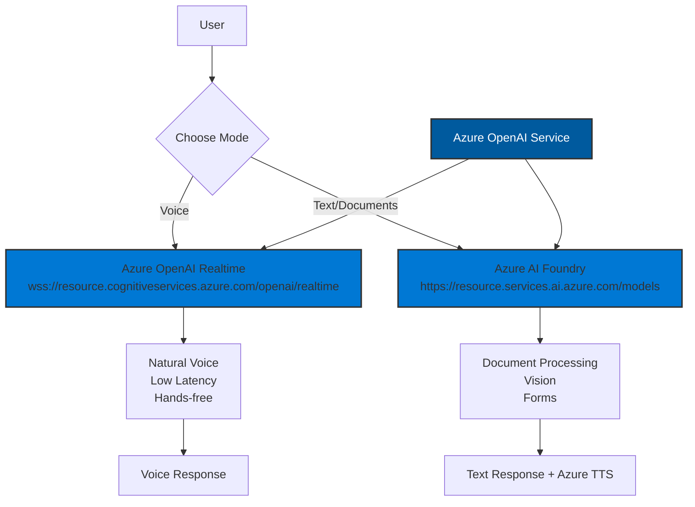

# Hybrid AI Architecture: Voice + Text

## Overview

This application implements a hybrid AI system using Azure OpenAI Services:
- **Azure OpenAI Realtime API** for natural voice conversations (hands-free)
- **Azure AI Foundry (GPT-4o)** for text chat and document processing

## Unified Azure Architecture

Azure now supports the Realtime API through a preview endpoint! This means we can use Azure for both voice and text modes:

1. **Voice Mode**: Azure OpenAI Realtime endpoint (`/openai/realtime`)
2. **Text Mode**: Azure AI Foundry standard endpoint (`/models`)

## Architecture Flow



## Implementation Details

### 1. Voice Mode (Azure OpenAI Realtime)

**Endpoint**: `POST /api/v1/ai/realtime/session`

Creates a WebSocket session for real-time voice interaction using Azure:

```javascript
// Get session configuration from backend (includes auth headers)
const response = await fetch('/api/v1/ai/realtime/session');
const config = await response.json();

// Frontend connects to Azure OpenAI Realtime WebSocket
// Note: Azure WebSocket authentication requires custom implementation
// as browsers don't support custom headers on WebSocket connections
const ws = new WebSocket(config.websocket_url);

ws.onopen = () => {
  // Send session configuration
  ws.send(JSON.stringify(config.session_config));
};
```

**Note**: Azure WebSocket authentication requires special handling since browsers don't allow custom headers on WebSocket connections. Options include:
1. Using a proxy server that adds the `api-key` header
2. Token-based authentication in the query string
3. Using Azure's SignalR service as a proxy

**Features**:
- Natural conversation flow
- ~300ms latency
- Interruption handling
- Server-side voice activity detection (VAD)

**Limitations**:
- No file uploads
- No vision capabilities
- No markdown forms

### 2. Text Mode (Azure AI Foundry)

**Endpoint**: `POST /api/v1/ai/chat`

Uses Azure-deployed GPT-4o for text-based interactions:

```php
$client = new ChatCompletionsClient(
    endpoint: "https://<resource>.services.ai.azure.com/models",
    credential: new AzureKeyCredential($apiKey)
);

$response = $client->complete([
    'messages' => $messages,
    'model' => 'gpt-4o'
]);
```

**Features**:
- Document upload and processing
- Vision capabilities (analyze images)
- Markdown form generation
- Client tool execution

### 3. Text-to-Speech (Azure Speech Services)

For text mode responses, we use Azure Neural voices:

```php
$speechService->textToSpeech($text, [
    'voice' => 'en-US-JennyNeural',
    'rate' => '0%',
    'pitch' => '0%'
]);
```

## Mode Switching

Users can seamlessly switch between modes:

**Endpoint**: `POST /api/v1/ai/switch-mode`

```json
{
  "from_mode": "voice",
  "to_mode": "text",
  "reason": "user_wants_to_upload_document"
}
```

## Frontend Integration

The frontend maintains both connections:

```typescript
interface AIMode {
  current: 'voice' | 'text';
  voiceSession?: {
    ws: WebSocket;
    sessionId: string;
  };
  textSession?: {
    conversationHistory: Message[];
  };
}
```

## Security Considerations

1. **API Keys**: Never expose OpenAI API keys to frontend
2. **Ephemeral Tokens**: Generate short-lived tokens for WebSocket auth
3. **HIPAA Compliance**: Maintain PHI separation in both modes
4. **Audit Logging**: Track all AI interactions

## Configuration

### Environment Variables

```env
# OpenAI (for Realtime API)
OPENAI_API_KEY=sk-...

# Azure AI Foundry (for GPT-4o)
AZURE_OPENAI_ENDPOINT=https://resource.openai.azure.com/
AZURE_OPENAI_API_KEY=...
AZURE_OPENAI_DEPLOYMENT_NAME=gpt-4o

# Azure Speech Services (for TTS)
AZURE_SPEECH_KEY=...
AZURE_SPEECH_REGION=eastus
```

## Usage Examples

### Starting a Voice Conversation

```javascript
// Request voice session
const response = await fetch('/api/v1/ai/realtime/session', {
  method: 'POST',
  body: JSON.stringify({ voice: 'alloy' })
});

const { websocket_url, session_config } = await response.json();

// Connect WebSocket
const ws = new WebSocket(websocket_url);
ws.onopen = () => {
  ws.send(JSON.stringify(session_config));
};
```

### Switching to Text for Document Upload

```javascript
// User says: "I need to upload an insurance card"
// AI responds: "I'll switch to text mode so you can upload the document"

await fetch('/api/v1/ai/switch-mode', {
  method: 'POST',
  body: JSON.stringify({
    from_mode: 'voice',
    to_mode: 'text',
    session_id: currentSession.id
  })
});
```

## Best Practices

1. **Start in Voice Mode** for hands-free experience
2. **Auto-switch to Text** when users mention documents
3. **Maintain Context** when switching modes
4. **Graceful Fallbacks** if voice unavailable
5. **Clear Mode Indicators** in UI

## Future Enhancements

1. **Unified Context**: Share conversation history between modes
2. **Smart Mode Selection**: AI suggests optimal mode
3. **Background Processing**: Continue voice while processing documents
4. **Multi-Modal Responses**: Voice descriptions of uploaded images 