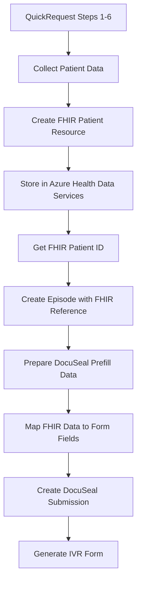

# Azure Health Data Services Best Practices Plan
## MSC Wound Care Distribution Platform

*Generated: {{ date('Y-m-d H:i:s') }}*

---

## 🚨 **CRITICAL MIGRATION REQUIREMENT**

**Azure API for FHIR will be retired on September 30, 2026**

- **Migration Deadline**: September 30, 2026
- **New Deployments Blocked**: Starting April 1, 2025
- **Target**: Azure Health Data Services FHIR® service
- **Status**: Currently using Azure API for FHIR (requires migration)

---

## 📋 **Current Implementation Assessment**

### ✅ **What's Working Well**
```yaml
Current Setup:
  FHIR Endpoint: medexchangefhir-fhirserver.fhir.azurehealthcareapis.com
  FHIR Version: 4.0.1 (R4) ✅ Compliant
  Authentication: OAuth 2.0 with Microsoft Entra ID ✅
  PHI Separation: Azure (PHI) + Supabase (operational) ✅
  Patient Creation: Functional ✅
  Access Tokens: Working ✅
```

### ⚠️ **Areas Requiring Attention**
```yaml
Migration Requirements:
  - Service Migration: Azure API for FHIR → Azure Health Data Services
  - Authentication: May need updates for new service
  - Endpoint URLs: Will change with migration
  - API Features: Some new capabilities available
  - Monitoring: Enhanced observability features
```

---

## 🎯 **Migration Strategy (Priority 1)**

### **Phase 1: Assessment & Planning (Q1 2025)**
```bash
# 1. Environment Assessment
□ Audit current FHIR resource usage
□ Document API dependencies
□ Review authentication flows
□ Identify custom extensions
□ Test data export capabilities

# 2. Migration Preparation
□ Set up Azure Health Data Services workspace
□ Configure new FHIR service instance
□ Test authentication with new service
□ Validate API compatibility
□ Plan data migration strategy
```

### **Phase 2: Parallel Deployment (Q2 2025)**
```bash
# 1. Infrastructure Setup
□ Deploy Azure Health Data Services
□ Configure workspace and FHIR service
□ Set up access policies and RBAC
□ Configure networking and firewall rules
□ Implement monitoring and logging

# 2. Application Updates
□ Update configuration management
□ Modify FhirService.php for new endpoints
□ Test authentication flows
□ Validate patient CRUD operations
□ Update environment variables
```

### **Phase 3: Data Migration (Q3 2025)**
```bash
# 1. Data Export/Import
□ Export existing FHIR resources
□ Validate data integrity
□ Import to new service
□ Verify referential integrity
□ Test application functionality

# 2. Testing & Validation
□ End-to-end testing
□ Performance validation
□ Security assessment
□ User acceptance testing
□ Rollback procedures
```

### **Phase 4: Cutover (Q4 2025)**
```bash
# 1. Production Migration
□ Schedule maintenance window
□ Execute final data sync
□ Switch DNS/endpoints
□ Monitor system health
□ Validate all integrations

# 2. Post-Migration
□ Decommission old service
□ Update documentation
□ Train support teams
□ Performance optimization
□ Security audit
```

---

## 🛡️ **Security & Compliance Best Practices**

### **Authentication & Authorization**
```typescript
// Recommended: Client Credentials Flow for Service-to-Service
interface AzureAuthConfig {
  tenantId: string;
  clientId: string;
  clientSecret: string; // Use Azure Key Vault
  scope: string; // "https://YOUR-FHIR-SERVICE.fhir.azurehealthcareapis.com/.default"
}

// Enhanced token management
class FhirAuthService {
  private async getAccessToken(): Promise<string> {
    // Use cached tokens with proper refresh logic
    // Implement token rotation
    // Monitor token expiration
    // Handle authentication failures gracefully
  }
}
```

### **HIPAA Compliance Checklist**
```yaml
✅ Current Compliance Status:
  - PHI Encryption at Rest: Yes
  - PHI Encryption in Transit: Yes
  - Access Logging: Yes
  - Role-Based Access: Yes
  - Data Residency: Azure US regions
  - Audit Trails: Comprehensive

📋 Migration Compliance Requirements:
  - [ ] Validate new service HIPAA compliance
  - [ ] Update DPA/BAA agreements
  - [ ] Review data processing locations
  - [ ] Audit access controls
  - [ ] Validate encryption standards
  - [ ] Test breach notification procedures
```

---

## 🔧 **Technical Implementation Updates**

### **Updated FhirService Configuration**
```php
// config/services.php - Enhanced configuration
'azure_health_data' => [
    'workspace_name' => env('AZURE_HEALTH_WORKSPACE_NAME'),
    'fhir_service_name' => env('AZURE_HEALTH_FHIR_SERVICE_NAME'),
    'fhir_endpoint' => env('AZURE_HEALTH_FHIR_ENDPOINT'),
    'tenant_id' => env('AZURE_TENANT_ID'),
    'client_id' => env('AZURE_CLIENT_ID'),
    'client_secret' => env('AZURE_CLIENT_SECRET'),
    'api_version' => env('AZURE_HEALTH_API_VERSION', '2022-06-01'),
    'retry_config' => [
        'max_attempts' => 3,
        'backoff_strategy' => 'exponential',
        'initial_delay_ms' => 1000,
    ],
    'caching' => [
        'enabled' => true,
        'ttl_seconds' => 300,
        'cache_driver' => 'redis',
    ],
],
```

### **Enhanced FHIR Service Implementation**
```php
// app/Services/FhirService.php - Best practices implementation
class FhirService
{
    private function makeAuthenticatedRequest(string $method, string $endpoint, array $data = []): array
    {
        $attempt = 0;
        $maxAttempts = 3;
        
        while ($attempt < $maxAttempts) {
            try {
                $token = $this->getValidAccessToken();
                
                $response = Http::timeout(30)
                    ->retry(3, 1000)
                    ->withHeaders([
                        'Authorization' => "Bearer {$token}",
                        'Content-Type' => 'application/fhir+json',
                        'Accept' => 'application/fhir+json',
                        'User-Agent' => 'MSC-WoundCare/1.0',
                    ])
                    ->send($method, $endpoint, $data);
                    
                if ($response->successful()) {
                    return $response->json();
                }
                
                // Handle specific HTTP errors
                if ($response->status() === 401) {
                    $this->clearTokenCache();
                    $attempt++;
                    continue;
                }
                
                throw new FhirException("FHIR API error: " . $response->body(), $response->status());
                
            } catch (ConnectionException $e) {
                $attempt++;
                if ($attempt >= $maxAttempts) {
                    throw new FhirException("Connection failed after {$maxAttempts} attempts: " . $e->getMessage());
                }
                sleep(pow(2, $attempt)); // Exponential backoff
            }
        }
    }
}
```

---

## 📊 **Performance & Monitoring**

### **Recommended Monitoring Setup**
```yaml
Azure Monitor Configuration:
  Metrics:
    - Request latency
    - Error rates
    - Token refresh frequency
    - Resource creation rates
    - Storage usage
    
  Alerts:
    - High error rate (>5%)
    - Slow response time (>2s)
    - Authentication failures
    - Rate limit approaching
    - Service unavailability
    
  Dashboards:
    - FHIR API Performance
    - Authentication Health
    - Resource Usage Trends
    - Error Analysis
    - Compliance Metrics
```

### **Performance Optimization**
```php
// Implement request batching
class FhirBatchService
{
    public function batchCreatePatients(array $patients): array
    {
        $bundle = [
            'resourceType' => 'Bundle',
            'type' => 'transaction',
            'entry' => array_map(function($patient) {
                return [
                    'request' => [
                        'method' => 'POST',
                        'url' => 'Patient'
                    ],
                    'resource' => $patient
                ];
            }, $patients)
        ];
        
        return $this->executeBundle($bundle);
    }
}
```

---

## 🔄 **Data Flow Validation**

### **QuickRequest → FHIR → DocuSeal Flow**


### **Data Mapping Verification**
```javascript
// Verify data flow integrity
const validateDataFlow = async () => {
  // 1. Form data collection ✅
  const formData = getQuickRequestFormData();
  
  // 2. FHIR patient creation ✅
  const fhirPatient = await createFhirPatient(formData);
  
  // 3. Episode creation with FHIR reference ✅
  const episode = await createEpisode(fhirPatient.id);
  
  // 4. DocuSeal prefill mapping ✅
  const prefillData = mapFhirToDocuSeal(fhirPatient, formData);
  
  // 5. Template resolution ✅
  const template = await resolveTemplate(manufacturerId);
  
  return { fhirPatient, episode, prefillData, template };
};
```

---

## 📋 **Action Items & Timeline**

### **Immediate Actions (Next 30 Days)**
```bash
□ Complete Azure Health Data Services assessment
□ Request Azure Health Data Services workspace
□ Update documentation with migration plan
□ Set up development environment for testing
□ Schedule stakeholder meeting for migration planning
```

### **Short-term (Next 90 Days)**
```bash
□ Deploy test Azure Health Data Services instance
□ Update FhirService for dual-service support
□ Implement configuration switching mechanism
□ Test patient creation/retrieval with new service
□ Validate DocuSeal integration with new FHIR data
```

### **Long-term (Next 12 Months)**
```bash
□ Complete full migration to Azure Health Data Services
□ Implement enhanced monitoring and observability
□ Optimize performance with new service features
□ Update all documentation and procedures
□ Conduct security and compliance audit
```

---

## ✅ **Success Metrics**

```yaml
Migration Success Criteria:
  Technical:
    - Zero data loss during migration
    - <1s average FHIR API response time
    - 99.9% service availability
    - All integrations functional
    
  Compliance:
    - HIPAA compliance maintained
    - All audit requirements met
    - PHI security validated
    - Regulatory approvals obtained
    
  Operational:
    - User workflows unchanged
    - Performance improved or maintained
    - Support processes updated
    - Training completed
```

---

*This document should be reviewed monthly and updated as Azure Health Data Services evolves.* 
