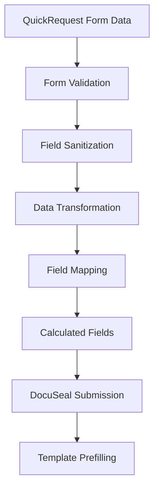

# DocuSeal Field Mapping & Validation Guide
## MSC Wound Care Distribution Platform

*Generated: {{ date('Y-m-d H:i:s') }}*

---

## 📋 **Overview**

This document outlines the comprehensive field mapping between QuickRequest form data and DocuSeal template fields, ensuring complete and accurate prefilling of IVR forms.

---

## 🗺️ **Field Mapping Structure**

### **Patient Information**
```yaml
Source Fields → DocuSeal Fields:
  patient_first_name → patient_first_name, patient_full_name
  patient_last_name → patient_last_name, patient_full_name
  patient_dob → patient_dob (formatted YYYY-MM-DD)
  patient_gender → patient_gender (Male/Female)
  patient_member_id → patient_member_id
  patient_address_line1 → patient_address_line1, patient_address, patient_full_address
  patient_address_line2 → patient_address_line2, patient_address, patient_full_address
  patient_city → patient_city, patient_full_address
  patient_state → patient_state, patient_full_address
  patient_zip → patient_zip, patient_full_address
  patient_phone → patient_phone (formatted)
  patient_email → patient_email (validated)
```

### **Provider Information**
```yaml
Source Fields → DocuSeal Fields:
  provider_name → provider_name
  provider_npi → provider_npi
  provider_credentials → provider_credentials
  facility_name → facility_name
  facility_address → facility_address
```

### **Clinical Information**
```yaml
Source Fields → DocuSeal Fields:
  wound_type → wound_type
  wound_location → wound_location
  wound_size_length → wound_size_length, wound_size, total_wound_area
  wound_size_width → wound_size_width, wound_size, total_wound_area
  wound_size_depth → wound_size_depth, wound_size
  wound_onset_date → wound_onset_date, wound_duration_days
  failed_conservative_treatment → failed_conservative_treatment (Yes/No)
  treatment_tried → treatment_tried
  current_dressing → current_dressing
  expected_service_date → expected_service_date
```

### **Insurance Information**
```yaml
Source Fields → DocuSeal Fields:
  primary_insurance_name → primary_insurance, primary_insurance_name
  primary_member_id → primary_member_id
  primary_plan_type → primary_plan_type
  primary_payer_phone → primary_payer_phone (formatted)
  has_secondary_insurance → has_secondary_insurance (Yes/No)
  secondary_insurance_name → secondary_insurance, secondary_insurance_name
  secondary_member_id → secondary_member_id
```

### **Product Information**
```yaml
Source Fields → DocuSeal Fields:
  selected_product_name → selected_product_name
  selected_product_code → selected_product_code
  selected_product_manufacturer → selected_product_manufacturer, manufacturer_name
  product_quantity → product_quantity, total_product_quantity
  product_size → product_size
  selected_products → selected_products_list (formatted string)
```

### **Shipping Information**
```yaml
Source Fields → DocuSeal Fields:
  shipping_same_as_patient → shipping_same_as_patient (Yes/No)
  shipping_address_line1 → shipping_address_line1, shipping_address, shipping_full_address
  shipping_address_line2 → shipping_address_line2, shipping_address, shipping_full_address
  shipping_city → shipping_city, shipping_full_address
  shipping_state → shipping_state, shipping_full_address
  shipping_zip → shipping_zip, shipping_full_address
  delivery_notes → delivery_notes
```

---

## 🔧 **Data Transformation Functions**

### **Text Sanitization**
```php
// Removes HTML tags, trims whitespace, handles arrays
function sanitizeTextValue($value): string
```

### **Date Formatting**
```php
// Converts to YYYY-MM-DD format, handles various input formats
function formatDate($date): string
```

### **Phone Number Formatting**
```php
// Formats 10-digit numbers as (XXX) XXX-XXXX
function formatPhoneNumber($phone): string
```

### **Boolean Conversion**
```php
// Converts various boolean representations to "Yes"/"No"
function formatBoolean($value): string
```

### **Address Combination**
```php
// Combines address components into formatted strings
function formatFullAddress($formData): string
```

### **Measurement Formatting**
```php
// Formats numeric measurements with proper units
function formatMeasurement($value): string
```

---

## 📊 **Enhanced Field Features**

### **Calculated Fields**
```yaml
Derived Fields:
  patient_full_name: "First Last" combination
  patient_full_address: Complete formatted address
  shipping_full_address: Complete shipping address (with fallback to patient address)
  wound_size: "Length x Width x Depth cm" formatted string
  total_wound_area: "Length × Width cm²" calculation
  wound_duration_days: Days between onset and submission
  total_product_quantity: Sum of all selected product quantities
  selected_products_list: Formatted list of all products with quantities
  urgency_level: High/Medium/Low based on clinical factors
```

### **Metadata Fields**
```yaml
System Fields:
  submission_date: Current date (YYYY-MM-DD)
  submission_timestamp: Full timestamp
  episode_id: Episode reference
  patient_fhir_id: Azure FHIR patient ID
  organization_name: Submitting organization
```

---

## ✅ **Validation Rules**

### **Required Field Validation**
```javascript
Critical Fields (Must be Present):
  - patient_first_name
  - patient_last_name
  - patient_dob
  - provider_name
  - wound_type
  - primary_insurance_name
```

### **Format Validation**
```javascript
Field Format Rules:
  - Email: Must pass filter_var(FILTER_VALIDATE_EMAIL)
  - Phone: Must be 10 digits (formatted automatically)
  - Date: Must parse with Carbon::parse()
  - Boolean: Converted to "Yes"/"No" strings
  - Numeric: Validated and formatted appropriately
```

### **Business Logic Validation**
```javascript
Business Rules:
  - Shipping address defaults to facility address
  - Gender codes (M/F) expanded to full words (Male/Female)
  - Wound area calculated only if both length and width provided
  - Product list formatted with quantities and sizes
  - Urgency determined by multiple clinical factors
```

---

## 🔄 **Data Flow Process**

### **Step-by-Step Flow**


### **Error Handling**
```php
Error Handling Strategy:
  1. Invalid dates → Empty string (graceful degradation)
  2. Invalid phone → Raw value (user can correct)
  3. Invalid email → Empty string (validation in form)
  4. Missing data → Empty string (no errors thrown)
  5. Array values → JSON encoded or formatted appropriately
```

---

## 🧪 **Testing & Validation**

### **Field Mapping Tests**
```bash
# Run comprehensive field mapping test
php tests/Manual/DocuSealDataFlowTest.php

# Test specific manufacturer templates
php artisan tinker --execute="
  \$controller = new App\Http\Controllers\QuickRequestController(...);
  \$result = \$controller->getManufacturerTemplateId('BioWound Solutions', 1);
  echo 'Template ID: ' . \$result;
"
```

### **Validation Checklist**
```yaml
Pre-Production Checklist:
  □ All critical fields mapped correctly
  □ Date formatting consistent (YYYY-MM-DD)
  □ Phone numbers formatted properly
  □ Boolean values converted to Yes/No
  □ Address fields combined appropriately
  □ Product information complete
  □ Insurance details properly formatted
  □ Calculated fields working correctly
  □ Error handling graceful
  □ No PHI in logs
```

---

## 📈 **Performance Optimization**

### **Efficient Mapping**
```php
Optimization Strategies:
  1. Single-pass field processing
  2. Lazy calculation of computed fields
  3. Minimal string operations
  4. Efficient array handling
  5. Caching of formatted values
```

### **Memory Management**
```php
Memory Considerations:
  - Process fields in order of complexity
  - Clean up intermediate values
  - Use references for large data structures
  - Avoid duplicate field storage
```

---

## 🔍 **Debugging & Troubleshooting**

### **Common Issues**
```yaml
Issue: Missing field values in DocuSeal
Solution: Check field name mapping and source data availability

Issue: Incorrect date formatting
Solution: Verify Carbon::parse() compatibility with input format

Issue: Phone number not formatted
Solution: Ensure 10-digit numeric input after cleaning

Issue: Boolean fields showing raw values
Solution: Verify formatBoolean() is being called

Issue: Address fields incomplete
Solution: Check all address components are available in source data
```

### **Debug Logging**
```php
// Comprehensive logging without PHI exposure
Log::info('DocuSeal field mapping completed', [
    'total_fields' => count($mappedFields),
    'has_patient_name' => !empty($mappedFields['patient_first_name']),
    'has_wound_info' => !empty($mappedFields['wound_type']),
    'has_insurance' => !empty($mappedFields['primary_insurance']),
    'has_products' => !empty($mappedFields['selected_product_name'])
]);
```

---

## 🚀 **Best Practices**

### **Data Quality**
```yaml
Best Practices:
  1. Always sanitize input data
  2. Provide meaningful defaults
  3. Handle edge cases gracefully
  4. Validate before transformation
  5. Log mapping completion (not data)
  6. Test with real-world data
  7. Monitor field utilization
  8. Update mapping as templates evolve
```

### **Security Considerations**
```yaml
Security Guidelines:
  1. Never log PHI data
  2. Sanitize all input fields
  3. Validate email addresses
  4. Strip HTML/script tags
  5. Use secure field transmission
  6. Audit field access
  7. Implement field-level permissions
  8. Monitor for data leakage
```

---

*This documentation should be updated whenever field mappings change or new DocuSeal templates are added.* 
