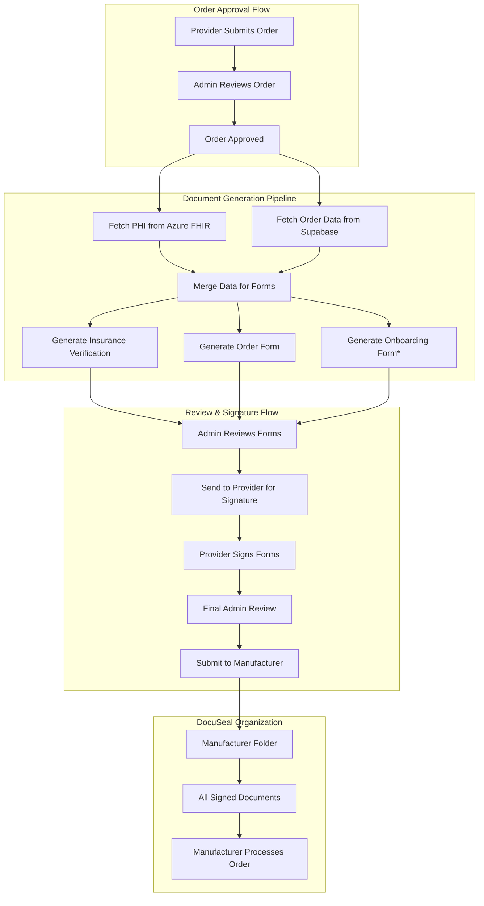

# MSC-MVP DocuSeal Integration: Complete Workflow Documentation

This comprehensive guide details the end-to-end DocuSeal integration for the MSC-MVP Wound Care Platform, covering the complete workflow from order approval through manufacturer delivery.

## 1. Architecture Overview



## 2. Database Schema Extensions

### 2.1 New Supabase Tables

```sql
-- DocuSeal form templates management
CREATE TABLE docuseal_templates (
    id UUID PRIMARY KEY DEFAULT gen_random_uuid(),
    template_name VARCHAR NOT NULL,
    docuseal_template_id VARCHAR NOT NULL UNIQUE,
    manufacturer_id UUID REFERENCES manufacturers(id),
    document_type VARCHAR NOT NULL CHECK (document_type IN ('InsuranceVerification', 'OrderForm', 'OnboardingForm')),
    is_default BOOLEAN DEFAULT false,
    field_mappings JSONB NOT NULL,
    is_active BOOLEAN DEFAULT true,
    created_at TIMESTAMP WITH TIME ZONE DEFAULT now(),
    updated_at TIMESTAMP WITH TIME ZONE DEFAULT now()
);

-- DocuSeal submissions tracking
CREATE TABLE docuseal_submissions (
    id UUID PRIMARY KEY DEFAULT gen_random_uuid(),
    order_id UUID NOT NULL REFERENCES orders(id),
    docuseal_submission_id VARCHAR NOT NULL UNIQUE,
    docuseal_template_id VARCHAR NOT NULL,
    document_type VARCHAR NOT NULL,
    status VARCHAR NOT NULL DEFAULT 'pending',
    folder_id VARCHAR NOT NULL, -- Manufacturer folder ID
    document_url VARCHAR,
    signing_url VARCHAR,
    metadata JSONB,
    created_at TIMESTAMP WITH TIME ZONE DEFAULT now(),
    updated_at TIMESTAMP WITH TIME ZONE DEFAULT now(),
    completed_at TIMESTAMP WITH TIME ZONE
);

-- DocuSeal folder management (for manufacturers)
CREATE TABLE docuseal_folders (
    id UUID PRIMARY KEY DEFAULT gen_random_uuid(),
    manufacturer_id UUID NOT NULL REFERENCES manufacturers(id),
    docuseal_folder_id VARCHAR NOT NULL UNIQUE,
    folder_name VARCHAR NOT NULL,
    delivery_endpoint VARCHAR, -- Manufacturer's API endpoint
    delivery_credentials_encrypted TEXT, -- Encrypted credentials
    is_active BOOLEAN DEFAULT true,
    created_at TIMESTAMP WITH TIME ZONE DEFAULT now(),
    updated_at TIMESTAMP WITH TIME ZONE DEFAULT now()
);

-- Extend orders table
ALTER TABLE orders ADD COLUMN docuseal_generation_status VARCHAR DEFAULT 'not_started';
ALTER TABLE orders ADD COLUMN docuseal_folder_id VARCHAR;
ALTER TABLE orders ADD COLUMN manufacturer_delivery_status VARCHAR DEFAULT 'pending';
```

### 2.2 Indexes for Performance

```sql
CREATE INDEX idx_docuseal_submissions_order_id ON docuseal_submissions(order_id);
CREATE INDEX idx_docuseal_submissions_status ON docuseal_submissions(status);
CREATE INDEX idx_docuseal_submissions_document_type ON docuseal_submissions(document_type);
CREATE INDEX idx_docuseal_folders_manufacturer_id ON docuseal_folders(manufacturer_id);
```

## 3. Data Flow & Service Architecture

### 3.1 Order Approval Event Handler

```typescript
// services/order-approval-handler.ts
export class OrderApprovalHandler {
  constructor(
    private fhirService: FhirService,
    private docuSealService: DocuSealService,
    private orderService: OrderService
  ) {}

  async handleOrderApproval(orderId: string): Promise<void> {
    try {
      // 1. Update order status
      await this.orderService.updateStatus(orderId, 'approved');
      
      // 2. Trigger document generation
      await this.generateDocuments(orderId);
      
      // 3. Notify admin for review
      await this.notifyAdminForReview(orderId);
      
    } catch (error) {
      await this.handleError(orderId, error);
    }
  }

  private async generateDocuments(orderId: string): Promise<void> {
    // Get order data from Supabase
    const order = await this.orderService.getOrderWithDetails(orderId);
    
    // Get PHI data from FHIR
    const phiData = await this.fhirService.getOrderPHI(order);
    
    // Merge data for form population
    const formData = await this.mergeOrderAndPHIData(order, phiData);
    
    // Generate each required form
    await this.generateRequiredForms(order, formData);
  }
}
```

### 3.2 FHIR Data Retrieval Service

```typescript
// services/fhir-service.ts
export class FhirService {
  async getOrderPHI(order: Order): Promise<OrderPHIData> {
    const patientData = await this.getPatientData(order.patient_fhir_id);
    const coverageData = await this.getCoverageData(order.azure_coverage_fhir_id);
    const clinicalData = await this.getClinicalData(order.azure_order_checklist_fhir_id);
    
    return {
      patient: {
        name: this.formatPatientName(patientData),
        dateOfBirth: patientData.birthDate,
        address: this.formatAddress(patientData.address?.[0]),
        phone: this.extractPhone(patientData.telecom),
        email: this.extractEmail(patientData.telecom),
        memberId: this.extractMemberId(patientData.identifier),
        medicalRecordNumber: this.extractMRN(patientData.identifier)
      },
      coverage: {
        planName: coverageData.class?.[0]?.name,
        payerName: coverageData.payor?.[0]?.display,
        effectiveDate: coverageData.period?.start,
        copay: this.extractCopay(coverageData.costToBeneficiary),
        deductible: this.extractDeductible(coverageData.costToBeneficiary)
      },
      clinical: this.processClinicalData(clinicalData)
    };
  }

  private async getPatientData(patientFhirId: string): Promise<Patient> {
    const response = await this.fhirClient.get(`/Patient/${patientFhirId}`);
    return response.data;
  }
}
```

### 3.3 DocuSeal Integration Service

```typescript
// services/docuseal-service.ts
export class DocuSealService {
  private baseUrl = process.env.DOCUSEAL_API_URL;
  private apiKey = process.env.DOCUSEAL_API_KEY;

  async generateInsuranceVerificationForm(
    order: Order, 
    formData: FormData
  ): Promise<DocuSealSubmission> {
    
    const template = await this.getTemplate(
      order.manufacturer_id, 
      'InsuranceVerification'
    );
    
    const submission = await this.createSubmission({
      template_id: template.docuseal_template_id,
      submitters: [
        {
          email: await this.getAdminEmail(),
          role: 'reviewer'
        },
        {
          email: order.provider_email,
          role: 'signer'
        }
      ],
      prefill_data: {
        // Patient Information
        patient_name: formData.patient.name,
        patient_dob: formData.patient.dateOfBirth,
        patient_address: formData.patient.address,
        medical_record_number: formData.patient.medicalRecordNumber,
        member_id: formData.patient.memberId,
        
        // Insurance Information
        insurance_plan: formData.coverage.planName,
        payer_name: formData.coverage.payerName,
        effective_date: formData.coverage.effectiveDate,
        copay_amount: formData.coverage.copay,
        deductible_amount: formData.coverage.deductible,
        
        // Eligibility Verification Results
        eligibility_status: order.eligibility_status,
        eligibility_checked_date: order.eligibility_checked_at,
        pre_auth_required: order.pre_auth_required_determination,
        pre_auth_number: order.pre_auth_number,
        
        // Provider Information
        provider_name: order.provider_name,
        provider_npi: order.provider_npi,
        facility_name: order.facility_name,
        facility_npi: order.facility_npi,
        
        // Order Information
        order_id: order.id,
        service_date: order.expected_service_date,
        products_summary: this.formatProductsSummary(order.order_items)
      },
      metadata: {
        order_id: order.id,
        document_type: 'InsuranceVerification',
        folder_id: await this.getManufacturerFolderId(order.manufacturer_id),
        generated_by: 'system',
        generated_at: new Date().toISOString()
      },
      redirect_url: `${process.env.APP_URL}/admin/orders/${order.id}/documents`
    });

    // Store submission record
    await this.storeSubmissionRecord(order.id, submission, 'InsuranceVerification');
    
    return submission;
  }

  async generateOrderForm(order: Order, formData: FormData): Promise<DocuSealSubmission> {
    const template = await this.getTemplate(order.manufacturer_id, 'OrderForm');
    
    const submission = await this.createSubmission({
      template_id: template.docuseal_template_id,
      submitters: [
        {
          email: await this.getAdminEmail(),
          role: 'reviewer'
        },
        {
          email: order.provider_email,
          role: 'signer'
        }
      ],
      prefill_data: {
        // Order Details
        order_id: order.id,
        order_date: order.created_at,
        expected_service_date: order.expected_service_date,
        
        // Patient Information (limited)
        patient_reference_id: order.patient_fhir_id,
        
        // Products
        ...this.formatProductsForOrderForm(order.order_items),
        
        // Clinical Justification
        primary_diagnosis: formData.clinical.primaryDiagnosis,
        wound_type: formData.clinical.woundType,
        wound_duration: formData.clinical.woundDuration,
        conservative_care_summary: formData.clinical.conservativeCareSummary,
        
        // Provider Attestation
        provider_name: order.provider_name,
        provider_signature_required: true,
        medical_necessity_attestation: true,
        
        // Facility Information
        facility_name: order.facility_name,
        facility_address: order.facility_address,
        ship_to_address: order.shipping_address
      },
      metadata: {
        order_id: order.id,
        document_type: 'OrderForm',
        folder_id: await this.getManufacturerFolderId(order.manufacturer_id)
      },
      redirect_url: `${process.env.APP_URL}/admin/orders/${order.id}/documents`
    });

    await this.storeSubmissionRecord(order.id, submission, 'OrderForm');
    return submission;
  }

  async generateOnboardingForm(order: Order, formData: FormData): Promise<DocuSealSubmission | null> {
    // Check if onboarding is needed (new provider or new product line)
    const needsOnboarding = await this.checkOnboardingRequired(
      order.provider_id, 
      order.manufacturer_id
    );
    
    if (!needsOnboarding) {
      return null;
    }

    const template = await this.getTemplate(order.manufacturer_id, 'OnboardingForm');
    
    const submission = await this.createSubmission({
      template_id: template.docuseal_template_id,
      submitters: [
        {
          email: await this.getAdminEmail(),
          role: 'reviewer'
        },
        {
          email: order.provider_email,
          role: 'signer'
        }
      ],
      prefill_data: {
        // Provider Information
        provider_name: order.provider_name,
        provider_npi: order.provider_npi,
        provider_specialty: formData.provider.specialty,
        provider_credentials: formData.provider.credentials,
        provider_license_numbers: formData.provider.licenseNumbers,
        
        // Facility Information
        facility_name: order.facility_name,
        facility_npi: order.facility_npi,
        facility_address: order.facility_address,
        facility_type: order.facility_type,
        
        // Business Information
        tax_id: formData.facility.taxId, // This will be encrypted
        billing_contact: formData.facility.billingContact,
        shipping_preferences: formData.facility.shippingPreferences,
        
        // Manufacturer Agreement
        product_lines_requested: this.getProductLines(order.order_items),
        training_required: true,
        compliance_acknowledgment: true
      },
      metadata: {
        order_id: order.id,
        document_type: 'OnboardingForm',
        folder_id: await this.getManufacturerFolderId(order.manufacturer_id)
      },
      redirect_url: `${process.env.APP_URL}/admin/orders/${order.id}/documents`
    });

    await this.storeSubmissionRecord(order.id, submission, 'OnboardingForm');
    return submission;
  }

  private async createSubmission(data: any): Promise<DocuSealSubmission> {
    const response = await fetch(`${this.baseUrl}/submissions`, {
      method: 'POST',
      headers: {
        'Authorization': `Bearer ${this.apiKey}`,
        'Content-Type': 'application/json'
      },
      body: JSON.stringify(data)
    });

    if (!response.ok) {
      throw new Error(`DocuSeal API error: ${response.statusText}`);
    }

    return response.json();
  }
}
```

## 4. Admin Review Interface

### 4.1 Document Review Component

```typescript
// components/admin/DocumentReview.tsx
'use client';

import { useState, useEffect } from 'react';
import { Button } from '@/components/ui/button';
import { Card, CardContent, CardHeader, CardTitle } from '@/components/ui/card';
import { Badge } from '@/components/ui/badge';

interface DocumentReviewProps {
  orderId: string;
}

export function DocumentReview({ orderId }: DocumentReviewProps) {
  const [submissions, setSubmissions] = useState<DocuSealSubmission[]>([]);
  const [loading, setLoading] = useState(true);

  useEffect(() => {
    loadSubmissions();
  }, [orderId]);

  const loadSubmissions = async () => {
    try {
      const response = await fetch(`/api/admin/orders/${orderId}/documents`);
      const data = await response.json();
      setSubmissions(data.submissions);
    } catch (error) {
      console.error('Failed to load submissions:', error);
    } finally {
      setLoading(false);
    }
  };

  const handleReviewDocument = async (submissionId: string) => {
    // Get signing URL from DocuSeal
    const response = await fetch(`/api/docuseal/submissions/${submissionId}/signing-url`, {
      method: 'POST',
      headers: { 'Content-Type': 'application/json' },
      body: JSON.stringify({ 
        email: await getCurrentUserEmail(),
        role: 'reviewer' 
      })
    });
    
    const { signing_url } = await response.json();
    
    // Open in embedded iframe or new window
    window.open(signing_url, '_blank');
  };

  const handleSendToProvider = async () => {
    try {
      await fetch(`/api/admin/orders/${orderId}/send-to-provider`, {
        method: 'POST'
      });
      
      // Refresh submissions to show updated status
      await loadSubmissions();
      
      // Show success notification
      toast.success('Documents sent to provider for signature');
    } catch (error) {
      toast.error('Failed to send documents to provider');
    }
  };

  if (loading) {
    return <div>Loading documents...</div>;
  }

  const allReviewed = submissions.every(s => s.admin_reviewed);
  const readyToSend = allReviewed && submissions.every(s => s.status === 'admin_approved');

  return (
    <div className="space-y-6">
      <div className="flex justify-between items-center">
        <h2 className="text-2xl font-bold">Document Review</h2>
        {readyToSend && (
          <Button onClick={handleSendToProvider}>
            Send to Provider for Signature
          </Button>
        )}
      </div>

      <div className="grid gap-4">
        {submissions.map((submission) => (
          <Card key={submission.id}>
            <CardHeader>
              <div className="flex justify-between items-center">
                <CardTitle>{submission.document_type}</CardTitle>
                <Badge variant={getStatusVariant(submission.status)}>
                  {submission.status}
                </Badge>
              </div>
            </CardHeader>
            <CardContent>
              <div className="flex justify-between items-center">
                <div>
                  <p className="text-sm text-gray-600">
                    Created: {new Date(submission.created_at).toLocaleDateString()}
                  </p>
                  {submission.document_url && (
                    <a 
                      href={submission.document_url} 
                      target="_blank" 
                      className="text-blue-600 hover:underline"
                    >
                      View Document
                    </a>
                  )}
                </div>
                <div className="space-x-2">
                  <Button 
                    variant="outline" 
                    onClick={() => handleReviewDocument(submission.docuseal_submission_id)}
                  >
                    Review & Sign
                  </Button>
                </div>
              </div>
            </CardContent>
          </Card>
        ))}
      </div>
    </div>
  );
}
```

### 4.2 API Routes for Document Management

```typescript
// app/api/admin/orders/[orderId]/documents/route.ts
import { NextRequest, NextResponse } from 'next/server';
import { getOrderDocuments } from '@/lib/docuseal';

export async function GET(
  request: NextRequest,
  { params }: { params: { orderId: string } }
) {
  try {
    const { orderId } = params;
    
    // Get all submissions for this order
    const submissions = await getOrderDocuments(orderId);
    
    return NextResponse.json({ submissions });
  } catch (error) {
    return NextResponse.json(
      { error: 'Failed to fetch documents' }, 
      { status: 500 }
    );
  }
}

// app/api/admin/orders/[orderId]/send-to-provider/route.ts
export async function POST(
  request: NextRequest,
  { params }: { params: { orderId: string } }
) {
  try {
    const { orderId } = params;
    
    // Get all submissions for this order
    const submissions = await getOrderDocuments(orderId);
    
    // Verify all are admin-approved
    const allApproved = submissions.every(s => s.status === 'admin_approved');
    if (!allApproved) {
      return NextResponse.json(
        { error: 'All documents must be reviewed and approved first' },
        { status: 400 }
      );
    }
    
    // Generate provider signing URLs and send notifications
    await sendDocumentsToProvider(orderId);
    
    // Update order status
    await updateOrderStatus(orderId, 'pending_provider_signature');
    
    return NextResponse.json({ success: true });
  } catch (error) {
    return NextResponse.json(
      { error: 'Failed to send documents to provider' },
      { status: 500 }
    );
  }
}
```

## 5. Provider Signature Interface

### 5.1 Provider Document Signing Component

```typescript
// components/provider/DocumentSigning.tsx
'use client';

export function DocumentSigning({ orderId }: { orderId: string }) {
  const [submissions, setSubmissions] = useState<DocuSealSubmission[]>([]);
  const [signingUrl, setSigningUrl] = useState<string | null>(null);

  const handleSignDocument = async (submissionId: string) => {
    try {
      const response = await fetch(`/api/docuseal/submissions/${submissionId}/signing-url`, {
        method: 'POST',
        headers: { 'Content-Type': 'application/json' },
        body: JSON.stringify({
          email: await getCurrentUserEmail(),
          role: 'signer'
        })
      });
      
      const { signing_url } = await response.json();
      setSigningUrl(signing_url);
    } catch (error) {
      toast.error('Failed to get signing URL');
    }
  };

  return (
    <div className="space-y-6">
      <h2 className="text-2xl font-bold">Documents Requiring Signature</h2>
      
      {signingUrl ? (
        <div className="w-full h-screen">
          <iframe 
            src={signingUrl} 
            className="w-full h-full border-0"
            title="Document Signing"
          />
        </div>
      ) : (
        <div className="grid gap-4">
          {submissions.map((submission) => (
            <Card key={submission.id}>
              <CardHeader>
                <CardTitle>{submission.document_type}</CardTitle>
              </CardHeader>
              <CardContent>
                <div className="flex justify-between items-center">
                  <div>
                    <p className="text-sm text-gray-600">
                      Status: {submission.status}
                    </p>
                  </div>
                  <Button onClick={() => handleSignDocument(submission.docuseal_submission_id)}>
                    Sign Document
                  </Button>
                </div>
              </CardContent>
            </Card>
          ))}
        </div>
      )}
    </div>
  );
}
```

## 6. Webhook Handler

### 6.1 DocuSeal Webhook Processing

```typescript
// app/api/webhooks/docuseal/route.ts
import { NextRequest, NextResponse } from 'next/server';
import { verifyDocuSealWebhook } from '@/lib/docuseal';

export async function POST(request: NextRequest) {
  try {
    const body = await request.text();
    const signature = request.headers.get('x-docuseal-signature');
    
    // Verify webhook signature
    if (!verifyDocuSealWebhook(body, signature)) {
      return NextResponse.json({ error: 'Invalid signature' }, { status: 401 });
    }
    
    const event = JSON.parse(body);
    
    switch (event.event_type) {
      case 'submission.completed':
        await handleSubmissionCompleted(event.data);
        break;
        
      case 'submission.viewed':
        await handleSubmissionViewed(event.data);
        break;
        
      case 'submission.signed':
        await handleSubmissionSigned(event.data);
        break;
        
      default:
        console.log(`Unhandled webhook event: ${event.event_type}`);
    }
    
    return NextResponse.json({ received: true });
  } catch (error) {
    console.error('Webhook processing error:', error);
    return NextResponse.json({ error: 'Processing failed' }, { status: 500 });
  }
}

async function handleSubmissionCompleted(data: any) {
  // Update submission status
  await updateSubmissionStatus(data.id, 'completed');
  
  // Check if all documents for the order are completed
  const orderId = await getOrderIdFromSubmission(data.id);
  const allSubmissions = await getOrderDocuments(orderId);
  
  const allCompleted = allSubmissions.every(s => s.status === 'completed');
  
  if (allCompleted) {
    // All documents signed, ready for manufacturer delivery
    await processManufacturerDelivery(orderId);
  }
}

async function handleSubmissionSigned(data: any) {
  // Update submission status
  await updateSubmissionStatus(data.id, 'signed');
  
  // Log the signing event
  await logSigningEvent(data);
  
  // Send notification to admin if this was provider signature
  const submission = await getSubmissionById(data.id);
  if (submission.current_signer_role === 'provider') {
    await notifyAdminOfProviderSignature(submission.order_id);
  }
}
```

## 7. Manufacturer Delivery System

### 7.1 Automatic Delivery Processing

```typescript
// services/manufacturer-delivery-service.ts
export class ManufacturerDeliveryService {
  async processManufacturerDelivery(orderId: string): Promise<void> {
    try {
      const order = await this.orderService.getOrderWithDetails(orderId);
      const manufacturerFolder = await this.getManufacturerFolder(order.manufacturer_id);
      
      // Generate final document package
      const documentPackage = await this.generateDocumentPackage(orderId);
      
      // Deliver to manufacturer
      if (manufacturerFolder.delivery_endpoint) {
        await this.deliverToManufacturerAPI(manufacturerFolder, documentPackage);
      } else {
        await this.deliverViaEmail(manufacturerFolder, documentPackage);
      }
      
      // Update order status
      await this.orderService.updateStatus(orderId, 'submitted_to_manufacturer');
      
    } catch (error) {
      await this.handleDeliveryError(orderId, error);
    }
  }

  private async generateDocumentPackage(orderId: string): Promise<DocumentPackage> {
    const submissions = await this.docuSealService.getOrderSubmissions(orderId);
    const order = await this.orderService.getOrderWithDetails(orderId);
    
    // Get folder export from DocuSeal
    const folderId = order.docuseal_folder_id;
    const folderExport = await this.docuSealService.exportFolder(folderId);
    
    return {
      order_id: orderId,
      documents: submissions.map(s => ({
        type: s.document_type,
        url: s.document_url,
        signed_at: s.completed_at
      })),
      package_url: folderExport.download_url,
      generated_at: new Date().toISOString()
    };
  }

  private async deliverToManufacturerAPI(
    folder: ManufacturerFolder, 
    packageData: DocumentPackage
  ): Promise<void> {
    
    const credentials = await this.decryptCredentials(folder.delivery_credentials_encrypted);
    
    const response = await fetch(folder.delivery_endpoint, {
      method: 'POST',
      headers: {
        'Content-Type': 'application/json',
        'Authorization': `Bearer ${credentials.api_key}`,
        'X-Manufacturer-ID': folder.manufacturer_id
      },
      body: JSON.stringify({
        order_data: packageData,
        metadata: {
          msc_order_id: packageData.order_id,
          delivery_timestamp: new Date().toISOString(),
          document_count: packageData.documents.length
        }
      })
    });

    if (!response.ok) {
      throw new Error(`Manufacturer API delivery failed: ${response.statusText}`);
    }
  }
}
```

## 8. Error Handling & Compliance

### 8.1 Comprehensive Error Management

```typescript
// services/docuseal-error-handler.ts
export class DocuSealErrorHandler {
  async handleDocumentGenerationError(orderId: string, error: Error): Promise<void> {
    // Log error with context
    await this.logError({
      order_id: orderId,
      error_type: 'document_generation',
      error_message: error.message,
      stack_trace: error.stack,
      timestamp: new Date().toISOString()
    });
    
    // Update order status
    await this.orderService.updateStatus(orderId, 'document_generation_failed');
    
    // Notify administrators
    await this.notificationService.notifyAdmins({
      type: 'document_generation_error',
      order_id: orderId,
      error: error.message
    });
    
    // Implement retry logic for transient errors
    if (this.isRetryableError(error)) {
      await this.scheduleRetry(orderId, 'generate_documents');
    }
  }

  async handleWebhookError(webhookData: any, error: Error): Promise<void> {
    await this.logError({
      webhook_data: webhookData,
      error_type: 'webhook_processing',
      error_message: error.message,
      timestamp: new Date().toISOString()
    });
    
    // Store webhook for manual processing
    await this.storeFailedWebhook(webhookData, error);
  }

  private isRetryableError(error: Error): boolean {
    const retryablePatterns = [
      /network/i,
      /timeout/i,
      /rate limit/i,
      /temporary/i,
      /503/,
      /502/,
      /500/
    ];
    
    return retryablePatterns.some(pattern => 
      pattern.test(error.message)
    );
  }
}
```

### 8.2 HIPAA Compliance Monitoring

```typescript
// services/hipaa-compliance-service.ts
export class HIPAAComplianceService {
  async auditDocumentGeneration(orderId: string, submissions: DocuSealSubmission[]): Promise<void> {
    // Log PHI access
    await this.auditService.logPHIAccess({
      order_id: orderId,
      access_type: 'document_generation',
      phi_types: ['patient_demographics', 'coverage_information', 'clinical_data'],
      accessed_by: 'system',
      purpose: 'insurance_verification_and_order_processing',
      timestamp: new Date().toISOString()
    });
    
    // Validate PHI handling
    await this.validatePHIHandling(submissions);
    
    // Generate compliance report entry
    await this.generateComplianceEntry(orderId, submissions);
  }

  private async validatePHIHandling(submissions: DocuSealSubmission[]): Promise<void> {
    for (const submission of submissions) {
      // Verify no PHI is stored in metadata
      if (this.containsPHI(submission.metadata)) {
        throw new Error(`PHI detected in submission metadata: ${submission.id}`);
      }
      
      // Verify proper DocuSeal security settings
      await this.verifyDocuSealSecurity(submission);
    }
  }
}
```

## 9. Testing Strategy

### 9.1 Integration Tests

```typescript
// __tests__/integration/docuseal-workflow.test.ts
describe('DocuSeal Integration Workflow', () => {
  beforeEach(async () => {
    await setupTestDatabase();
    await setupMockDocuSealAPI();
  });

  it('should generate all required documents when order is approved', async () => {
    // Setup test order
    const order = await createTestOrder({
      manufacturer_id: 'test-manufacturer',
      patient_fhir_id: 'test-patient',
      azure_coverage_fhir_id: 'test-coverage'
    });
    
    // Mock FHIR responses
    mockFHIRResponses();
    
    // Approve order
    await orderApprovalHandler.handleOrderApproval(order.id);
    
    // Verify submissions were created
    const submissions = await getOrderDocuments(order.id);
    expect(submissions).toHaveLength(3); // Insurance, Order, Onboarding
    expect(submissions.map(s => s.document_type)).toContain('InsuranceVerification');
    expect(submissions.map(s => s.document_type)).toContain('OrderForm');
    expect(submissions.map(s => s.document_type)).toContain('OnboardingForm');
  });

  it('should handle webhook events correctly', async () => {
    const webhookData = {
      event_type: 'submission.completed',
      data: { id: 'test-submission-id' }
    };
    
    const response = await POST(createMockRequest(webhookData));
    expect(response.status).toBe(200);
    
    // Verify submission status updated
    const submission = await getSubmissionById('test-submission-id');
    expect(submission.status).toBe('completed');
  });

  it('should deliver to manufacturer when all documents signed', async () => {
    // Setup completed order
    const order = await createCompletedTestOrder();
    
    // Process delivery
    await manufacturerDeliveryService.processManufacturerDelivery(order.id);
    
    // Verify delivery
    expect(mockManufacturerAPI.deliveryCalls).toHaveLength(1);
    
    // Verify order status updated
    const updatedOrder = await getOrderById(order.id);
    expect(updatedOrder.status).toBe('submitted_to_manufacturer');
  });
});
```

## 10. Deployment & Configuration

### 10.1 Environment Variables

```bash
# DocuSeal Configuration
DOCUSEAL_API_URL=https://api.docuseal.com/api/v1
DOCUSEAL_API_KEY=your_docuseal_api_key
DOCUSEAL_WEBHOOK_SECRET=your_webhook_secret

# Application URLs
APP_URL=https://your-app.com
DOCUSEAL_REDIRECT_BASE_URL=https://your-app.com/admin/orders

# Manufacturer Integration
MANUFACTURER_DELIVERY_ENABLED=true
MANUFACTURER_API_TIMEOUT=30000

# Error Handling
DOCUSEAL_RETRY_ATTEMPTS=3
DOCUSEAL_RETRY_DELAY_MS=5000
```

### 10.2 Initial Data Setup

```sql
-- Insert default templates
INSERT INTO docuseal_templates (template_name, docuseal_template_id, document_type, is_default, field_mappings) VALUES
('Default Insurance Verification', 'tmpl_insurance_default', 'InsuranceVerification', true, '{
  "patient_name": "patient_name",
  "patient_dob": "patient_dob",
  "insurance_plan": "insurance_plan",
  "eligibility_status": "eligibility_status"
}'),
('Default Order Form', 'tmpl_order_default', 'OrderForm', true, '{
  "order_id": "order_id",
  "provider_name": "provider_name",
  "products_summary": "products_summary"
}'),
('Default Onboarding Form', 'tmpl_onboarding_default', 'OnboardingForm', true, '{
  "provider_name": "provider_name",
  "facility_name": "facility_name",
  "provider_npi": "provider_npi"
}');

-- Insert manufacturer folders
INSERT INTO docuseal_folders (manufacturer_id, docuseal_folder_id, folder_name) 
SELECT id, CONCAT('folder_', LOWER(REPLACE(name, ' ', '_'))), CONCAT(name, ' Orders')
FROM manufacturers;
```

This comprehensive documentation provides a complete implementation guide for integrating DocuSeal into the MSC-MVP Wound Care Platform, covering all aspects from order approval through manufacturer delivery while maintaining HIPAA compliance and proper error handling.