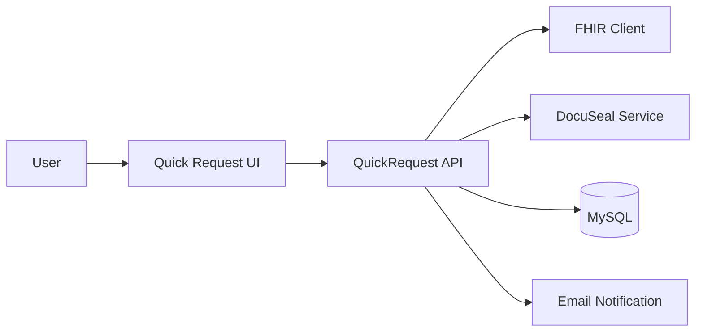
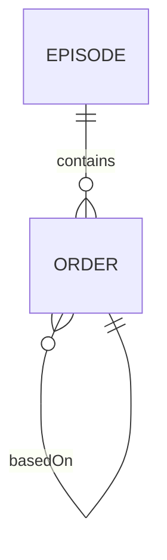
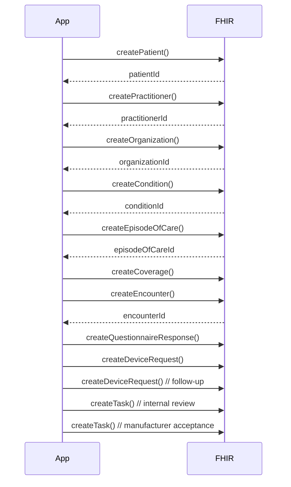

# Quick Request Workflow Design

This document outlines the end-to-end Quick Request workflow for initiating an episode of care, submitting initial and follow-up orders, persisting FHIR resources, generating DocuSeal PDFs, and handling admin approval.

## 1. Introduction & Overview
**Purpose:** Enable office managers and providers to open new episodes, place orders, and manage follow-ups under a unified workflow.  
**Scope:**  
- UI Flow and component steps  
- Data model & persistence  
- API specification under `/api/v1/quick-request`  
- FHIR resource orchestration (core flow)  
- DocuSeal integration for insurance verification  
- Admin approval via FHIR Task and PDF attachment  
- Testing strategy

## 2. User Interface Flow
The quick request UI is composed of five steps, each driven by a React component:
1. **Step 1 – Patient & Insurance** (`Step2PatientInsurance`)  
   - Capture patient demographics, provider, facility, insurance details  
2. **Step 2 – Clinical & Billing** (`Step4ClinicalBilling`)  
   - Collect clinical diagnosis codes, wound details, CPT codes, place of service  
3. **Step 3 – Product Selection** (`Step5ProductSelection`)  
   - Select one or more wound care products and quantities  
4. **Step 4 – DocuSeal IVR** (`Step7DocuSealIVR`)  
   - Generate and display pre-filled IVR form fields based on FHIR data  
5. **Step 5 – Review & Submit** (`Step6ReviewSubmit`)  
   - Final review, sign-off, and submit the quick request  

## 3. Data Model & Persistence

**Episode Entity** ([`app/Models/Episode.php`](app/Models/Episode.php:1))  
- `id` (UUID, PK)  
- `patient_fhir_id` (UUID)  
- `practitioner_fhir_id` (UUID)  
- `organization_fhir_id` (UUID)  
- `status` (ENUM: draft, pending_review, manufacturer_review, completed)  
- `created_at`, `updated_at`  

**Order Entity** ([`app/Models/Order.php`](app/Models/Order.php:1))  
- `id` (UUID, PK)  
- `episode_id` (UUID, FK → episodes.id)  
- `based_on` (UUID, FK → orders.id, nullable)  
- `type` (ENUM: initial, follow_up)  
- `details` (JSON payload of selected products)  
- `created_at`, `updated_at`  

**Relationships:**  
- `Episode` hasMany `Order`  
- `Order` belongsTo `Episode`  
- `Order` belongsTo `Order` (for follow-ups)  

**Migrations:**  
- create_episodes_table  
- create_orders_table  

## 4. API Specification
| Method | Endpoint                                        | Controller                                   | Description                         |
| ------ | ----------------------------------------------- | -------------------------------------------- | ----------------------------------- |
| POST   | `/api/v1/quick-request/episodes`                | QuickRequestEpisodeController@store          | Create new episode + initial order  |
| GET    | `/api/v1/quick-request/episodes/{episode}`      | QuickRequestEpisodeController@show           | Retrieve episode and orders         |
| POST   | `/api/v1/quick-request/episodes/{episode}/orders` | QuickRequestOrderController@store           | Add initial or follow-up order      |
| GET    | `/api/v1/quick-request/episodes/{episode}/orders` | QuickRequestOrderController@index           | List orders for an episode          |
| POST   | `/api/v1/quick-request/episodes/{episode}/approve` | QuickRequestEpisodeController@approve       | Internal approval workflow (Task)    |

Request and response schemas are defined in [`app/Http/Requests/Api/V1/QuickRequest`](app/Http/Requests/Api/V1/QuickRequest:1).

## 5. FHIR Integration Sequence
The core FHIR orchestration uses these resources in order:
1. `Patient` → returns `patientId`  
2. `Practitioner` (lookup or create) → returns `practitionerId`  
3. `Organization` → returns `organizationId`  
4. `Condition` → returns `conditionId`  
5. `EpisodeOfCare` (links Patient, Practitioner, Organization) → returns `episodeOfCareId`  
6. `Coverage` for primary (and secondary) insurance (link to EpisodeOfCare)  
7. `Encounter` (link to EpisodeOfCare, Patient, Practitioner, Organization) → returns `encounterId`  
8. `QuestionnaireResponse` (link to Encounter, Patient, EpisodeOfCare)  
9. `DeviceRequest` for each initial and follow-up order (links to Encounter, Patient, Practitioner)  
10. `Task` resources for internal review and manufacturer acceptance  

**Error Handling & Best Practices:**  
- Retry each FHIR call up to 3 times with exponential backoff  
- Log failures without blocking user flow  
- Ensure referential integrity via FHIR `reference` fields  

## 6. DocuSeal Integration Design
- **Template Selection:** Choose form under `docs/ivr-forms/{ManufacturerName}` based on `manufacturer_id`  
- **Field Mappings:** Map extracted FHIR data and order details to DocuSeal placeholders  
- **PDF Generation:** Use `DocuSealService::generatePdf($template, $fields)`  
- **Storage:** Save PDF to `storage/app/public/insurance-verifications/`  
- **Attachment:** Link PDF via polymorphic [`DocumentReference`](app/Models/DocuSeal/Document.php:1) to `Episode`  

## 7. Admin Approval Flow
**FHIR Task workflow:**  
1. Internal review Task (`requester`=care team, `recipient`=physician/office manager)  
2. Manufacturer acceptance Task (`recipient`=manufacturer contact)  
3. Order form PDF sent after manufacturer acceptance  

**State Transitions (`Episode.status`):**  
- `draft` → `pending_review` → `manufacturer_review` → `completed`  
- UI: badge, dashboard list, real-time notifications via broadcasting  
- Email: send [`app/Mail/ManufacturerApprovalMail.php`](app/Mail/ManufacturerApprovalMail.php:1)  

## 8. Testing Strategy
**Unit Tests:**  
- Models: `EpisodeTest`, `OrderTest`  
- Controllers: `QuickRequestEpisodeTest`, `QuickRequestOrderTest` with mocked FHIR + DocuSeal clients  

**Integration Tests:**  
- API flows: `php artisan test --filter=QuickRequest`  
- PDF generation: assert PDF contains key fields (`smalot/pdfparser`)  
- FHIR orchestration: use `Http::fake()` for FHIR endpoint calls  

**End-to-End Tests:**  
- Simulate full UI flow with Cypress or Dusk  
- Verify FHIR resources in test FHIR service  
- Validate DocuSeal PDF upload and email notifications  

**Compliance & Monitoring:**  
- Ensure FHIR calls use correct headers and content type (`application/fhir+json`)  
- Audit logs for Task and DocumentReference creation  

---
*This design spec will guide implementation of the Quick Request workflow in the wound care portal.*