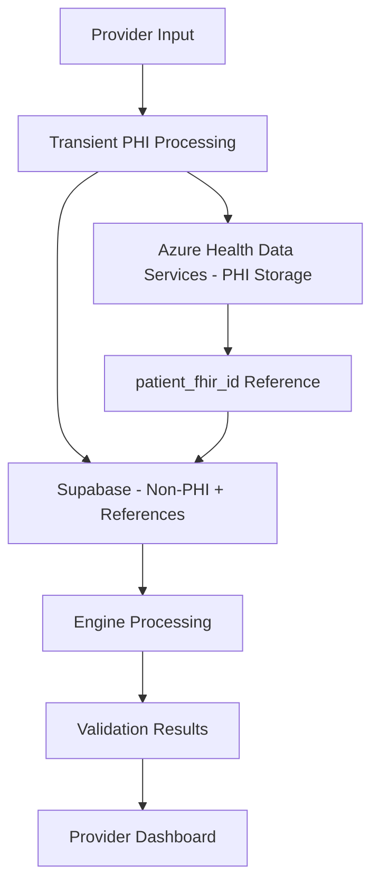

# MSC-MVP Product Request Flow Implementation Plan

## 📋 Overview

Based on the MSC-MVP documentation analysis, the Provider Portal product request flow is a **6-step guided workflow** that integrates multiple intelligent engines while maintaining strict PHI separation. This plan outlines the complete implementation strategy.

## 🏗️ Architecture Foundation

### Data Flow Strategy


### PHI Handling Protocol
- **Transient Processing**: PHI only exists temporarily during API calls
- **Referential Storage**: Only FHIR IDs stored in Supabase
- **Secure Retrieval**: PHI fetched from Azure HDS only when needed

## 🔄 Step-by-Step Implementation Plan

### Step 1: Patient Information Entry
**Purpose**: Capture patient demographics and payer information

**Frontend Components**:
```typescript
// apps/web/src/components/provider/patient-info-form.tsx
interface PatientInfoForm {
  // Non-PHI fields for Supabase
  facilityId: string;
  providerId: string;
  expectedServiceDate: string;
  payerName: string;
  payerId: string;
  
  // PHI fields (transient only)
  patientApiInput: {
    memberId: string;
    firstName: string;
    lastName: string;
    dob: string;
    gender: string;
  };
}
```

**Backend Services**:
```typescript
// packages/health-data/src/services/patient-service.ts
class PatientService {
  async createPatientRecord(
    patientData: PatientApiInput, 
    facilityId: string
  ): Promise<{
    patientFhirId: string;
    patientDisplayId: string;
  }> {
    // 1. Create FHIR Patient resource in Azure HDS
    const patientFhirId = await this.createFhirPatient(patientData);
    
    // 2. Generate sequential display ID
    const patientDisplayId = await this.generateSequentialDisplayId(
      patientData.firstName, 
      patientData.lastName,
      facilityId
    );
    
    // 3. Return identifiers for Supabase storage
    return {
      patientFhirId,
      patientDisplayId // "JoSm001" format for UI display
    };
  }

  private generateInitials(firstName: string, lastName: string): string {
    // Extract first 2 letters of each name, handle edge cases
    const cleanFirst = firstName.trim().replace(/[^a-zA-Z]/g, '');
    const cleanLast = lastName.trim().replace(/[^a-zA-Z]/g, '');
    
    if (cleanFirst.length < 2 || cleanLast.length < 2) {
      // Fallback for short names or special characters
      const firstInit = cleanFirst.length > 0 ? cleanFirst.substring(0, Math.min(2, cleanFirst.length)).padEnd(2, 'X') : 'XX';
      const lastInit = cleanLast.length > 0 ? cleanLast.substring(0, Math.min(2, cleanLast.length)).padEnd(2, 'X') : 'XX';
      return `${firstInit}${lastInit}`.toUpperCase();
    }
    
    const firstInit = cleanFirst.substring(0, 2).toUpperCase();
    const lastInit = cleanLast.substring(0, 2).toUpperCase();
    return `${firstInit}${lastInit}`;
  }

  private async generateSequentialDisplayId(
    firstName: string, 
    lastName: string, 
    facilityId: string
  ): Promise<string> {
    const baseInitials = this.generateInitials(firstName, lastName);
    
    // Get or create sequence record for this initials+facility combo
    const sequence = await this.getNextSequenceNumber(baseInitials, facilityId);
    
    // Format as "JoSm001"
    return `${baseInitials}${sequence.toString().padStart(3, '0')}`;
  }

  private async getNextSequenceNumber(
    baseInitials: string, 
    facilityId: string
  ): Promise<number> {
    // Atomic increment of sequence number
    const result = await supabase.rpc('increment_patient_sequence', {
      p_facility_id: facilityId,
      p_initials_base: baseInitials
    });
    
    return result.data;
  }
}
```

**Database Function for Atomic Sequence Generation**:
```sql
-- SQL function for atomic sequence increment
CREATE OR REPLACE FUNCTION increment_patient_sequence(
  p_facility_id UUID,
  p_initials_base VARCHAR(4)
) RETURNS INTEGER AS $
DECLARE
  current_seq INTEGER;
BEGIN
  -- Insert or update sequence record atomically
  INSERT INTO patient_display_sequences (facility_id, initials_base, next_sequence)
  VALUES (p_facility_id, p_initials_base, 2)
  ON CONFLICT (facility_id, initials_base)
  DO UPDATE SET 
    next_sequence = patient_display_sequences.next_sequence + 1,
    updated_at = now()
  RETURNING next_sequence - 1 INTO current_seq;
  
  RETURN current_seq;
END;
$ LANGUAGE plpgsql;

**UI Benefits**:
- **Order Lists**: Display "JoSm001" instead of "Patient FHIR-ID-123"
- **Search/Filter**: Quick visual identification without AHDS calls
- **Provider Recognition**: Familiar patient identification pattern with sequential clarity
- **Privacy Protection**: No age information that could enable identification
- **Collision Resolution**: Clear differentiation between patients with same initials

**Data Persistence**:
- **Azure HDS**: Complete Patient FHIR resource with demographics
- **Supabase**: Order record with `patient_fhir_id` reference only

### Step 2: Clinical Assessment Documentation
**Purpose**: Capture wound-specific clinical data with dynamic forms

**Form Engine**:
```typescript
// packages/clinical-assessment/src/forms/dynamic-wound-form.tsx
interface WoundAssessmentForm {
  woundType: 'DFU' | 'VLU' | 'PU' | 'TW' | 'AU' | 'OTHER';
  // Dynamic fields based on wound type
  dfuFields?: DiabeticFootUlcerFields;
  vluFields?: VenousLegUlcerFields;
  // ... other wound types
}

// Real-time MSC Assist integration
const useAssessmentGuidance = (currentField: string, context: any) => {
  // Provide contextual help during form completion
}
```

**Clinical Data Storage**:
- **Azure HDS**: 
  - Condition resources (diagnoses, wound characteristics)
  - Observation resources (measurements, lab values)
  - DocumentReference (clinical photos, assessments)
- **Supabase**: Reference IDs only (`azure_order_checklist_fhir_id`)

### Step 3: Product Selection with AI Recommendations
**Purpose**: Intelligent product recommendations based on clinical context

**Product Recommendation Engine Integration**:
```typescript
// packages/product-recommendation/src/services/recommendation-service.ts
class ProductRecommendationService {
  async getRecommendations(context: ClinicalContext): Promise<ProductRecommendation[]> {
    // 1. Analyze wound characteristics
    // 2. Apply recommendation rules from msc_product_recommendation_rules
    // 3. Rank products by clinical appropriateness
    // 4. Include pricing and sizing guidance
  }
}
```

**Product Catalog Integration**:
- Source: `msc_products` table in Supabase
- Features: Filtering, search, detailed product cards
- AI Guidance: Size recommendations, application techniques

### Step 4: Validation & Eligibility (Automated)
**Purpose**: Real-time MAC validation and insurance eligibility checking

**MAC Validation Engine**:
```typescript
// packages/mac-validation/src/services/validation-service.ts
class MacValidationService {
  async validateOrder(orderContext: OrderContext): Promise<ValidationResult> {
    // 1. Determine MAC jurisdiction from facility location
    // 2. Apply validation rules based on diagnosis + product codes
    // 3. Check documentation completeness
    // 4. Return actionable warnings/errors
  }
}
```

**Eligibility Engine**:
```typescript
// packages/eligibility/src/services/eligibility-service.ts
class EligibilityService {
  async checkEligibility(
    patientInfo: PatientApiInput, 
    serviceDate: string
  ): Promise<EligibilityResult> {
    // 1. Route to appropriate payer API (Optum/Availity/Office Ally)
    // 2. Perform eligibility check
    // 3. Store results summary in Supabase
    // 4. Create/update Coverage FHIR resource in Azure HDS
  }
}
```

**User Experience**:
- Real-time validation as user completes forms
- Clear visual indicators (green/yellow/red)
- Actionable guidance for resolving issues
- Automatic PA determination

### Step 5: Clinical Opportunities Review (Optional)
**Purpose**: Identify additional billable services using COE

**Clinical Opportunity Engine**:
```typescript
// packages/clinical-opportunity/src/services/coe-service.ts
class ClinicalOpportunityService {
  async scanOpportunities(orderContext: OrderContext): Promise<Opportunity[]> {
    // 1. Apply COE rules against clinical context
    // 2. Identify additional services (offloading, debridement, etc.)
    // 3. Calculate potential revenue
    // 4. Provide clinical rationale
  }
}
```

**Opportunity Presentation**:
- Optional step in workflow
- Clear value proposition (clinical + financial)
- One-click addition to current request
- Evidence-based rationale

### Step 6: Review & Submit
**Purpose**: Final review with comprehensive summary

**Order Summary Component**:
```typescript
// apps/web/src/components/provider/order-summary.tsx
interface OrderSummary {
  patientDisplay: {
    displayId: string; // "JoSm001" 
    facilityId: string; // For proper scoping
  };
  clinicalSummary: ClinicalSummaryType;
  selectedProducts: ProductSummary[];
  validationResults: ValidationSummary;
  eligibilityStatus: EligibilitySummary;
  estimatedCosts: CostSummary;
  clinicalOpportunities?: OpportunitySummary[];
}

// Usage in component
const OrderSummaryCard = ({ orderSummary }: { orderSummary: OrderSummary }) => {
  return (
    <Card>
      <CardHeader>
        <CardTitle>Order Summary for {orderSummary.patientDisplay.displayId}</CardTitle>
      </CardHeader>
      {/* Rest of summary content */}
    </Card>
  );
};
```

## 🔧 Technical Implementation Strategy

### 1. Patient Identification System
```typescript
// packages/health-data/src/types/patient-identifiers.ts
interface PatientDisplayInfo {
  patientFhirId: string; // Full AHDS reference
  patientInitials: string; // "JoSm" - UI display only
  dobMonth: number; // 1-12 for age context
  dobYear: number; // For age calculation
  ageYears: number; // Calculated field
}

// UI Helper function
const formatPatientDisplay = (patient: PatientDisplayInfo): string => {
  return `${patient.patientInitials} (${patient.ageYears})`;
  // Examples: "JoSm (65)", "MaJo (42)", "RoWi (78)"
};
```

**Implementation Considerations**:
- **HIPAA Compliance**: Requires legal review to confirm initials qualify as de-identified data
- **Collision Handling**: Multiple patients with same initials get numeric suffixes ("JoSm1", "JoSm2")
- **Fallback Strategy**: If initials deemed PHI, use sequential patient IDs ("P001", "P002")
- **Provider Preference**: Some providers may prefer last 4 of MRN if available
- **International Names**: Handle non-English characters and diacritical marks
- **Data Migration**: Existing orders need backfill process to generate patient identifiers
- **Small Population Risk**: In small facilities, initials + age might still be identifiable

### 6. Data Migration Strategy
```sql
-- Migration script for existing orders
UPDATE orders 
SET 
  patient_initials = generate_initials_from_fhir(patient_fhir_id),
  dob_year = extract_birth_year_from_fhir(patient_fhir_id)
WHERE patient_initials IS NULL;

-- Function to safely generate initials from existing FHIR data
CREATE OR REPLACE FUNCTION generate_initials_from_fhir(fhir_id VARCHAR)
RETURNS VARCHAR AS $
  -- Secure function that fetches names from AHDS and generates initials
  -- Implements proper error handling and fallbacks
$ LANGUAGE plpgsql SECURITY DEFINER;
```

### 3. State Management Architecture
```typescript
// apps/web/src/stores/request-store.ts
interface RequestState {
  currentStep: number;
  patientFhirId?: string; // Reference only
  patientDisplay?: {
    displayId: string; // "JoSm001"
    facilityId: string; // For proper scoping
  };
  orderData: NonPHIOrderData;
  validationResults?: ValidationResult;
  eligibilityResults?: EligibilityResult;
  selectedProducts: ProductSelection[];
  opportunities: Opportunity[];
}
```

### 2. API Route Structure
```typescript
// apps/web/src/app/api/v1/orders/route.ts
POST /api/v1/orders
- Creates order with PHI processing
- Returns order ID + patient_fhir_id

POST /api/v1/orders/{orderId}/validate-mac
- Runs MAC validation engine
- Updates order status

POST /api/v1/orders/{orderId}/eligibility-check
- Processes eligibility verification
- Creates Coverage FHIR resource

POST /api/v1/orders/{orderId}/scan-opportunities
- Runs Clinical Opportunity Engine
- Returns additional service suggestions
```

### 5. Real-time Updates & Patient Lists
```typescript
// Using Supabase Realtime for order status updates
const useOrderUpdates = (orderId: string) => {
  // Subscribe to order status changes
  // Update UI when validation/eligibility completes
}

// Provider order list with patient identification
const useProviderOrders = (providerId: string, facilityId: string) => {
  return useQuery({
    queryKey: ['provider-orders', providerId, facilityId],
    queryFn: async () => {
      // Returns orders with patient display IDs - no AHDS calls needed
      const orders = await supabase
        .from('orders')
        .select(`
          id,
          patient_display_id,
          expected_service_date,
          order_status,
          total_order_value,
          facility_id
        `)
        .eq('provider_id', providerId)
        .eq('facility_id', facilityId);
        
      return orders.map(order => ({
        ...order,
        patientDisplay: order.patient_display_id // "JoSm001"
      }));
    }
  });
};
```

**Performance Benefits**:
- Order lists load without Azure HDS API calls
- Faster provider dashboard rendering
- Reduced API costs and latency
- Better offline/low-connectivity experience

**Search & Filter Capabilities**:
```typescript
// Provider order search without PHI exposure
const searchOrders = async (searchTerm: string, providerId: string, facilityId: string) => {
  return supabase
    .from('orders')
    .select('*')
    .eq('provider_id', providerId)
    .eq('facility_id', facilityId)
    .or(`
      patient_display_id.ilike.%${searchTerm}%,
      order_status.ilike.%${searchTerm}%,
      id.ilike.%${searchTerm}%
    `);
};

// Search by initials portion (finds all patients with "JoSm" initials)
const searchByInitials = async (initials: string, facilityId: string) => {
  return supabase
    .from('orders')
    .select('*')
    .eq('facility_id', facilityId)
    .like('patient_display_id', `${initials}%`);
};

// Example searches:
// "JoSm" -> finds "JoSm001", "JoSm002", "JoSm003"
// "JoSm001" -> finds exact match
// "001" -> finds all patients with sequence 001
```

## 📊 Data Models Integration

### Order Record (Supabase)
```sql
-- From NON_PHI_DATA_MODELS.md
CREATE TABLE orders (
  id UUID PRIMARY KEY,
  patient_fhir_id VARCHAR INDEXED, -- Reference to Azure HDS
  patient_display_id VARCHAR(7), -- "JoSm001" format for UI identification
  provider_id UUID REFERENCES providers(provider_id),
  facility_id UUID REFERENCES facilities(facility_id),
  expected_service_date DATE NOT NULL,
  payer_name_submitted VARCHAR NOT NULL,
  eligibility_status ENUM DEFAULT 'not_checked',
  pre_auth_required_determination ENUM DEFAULT 'pending_determination',
  order_status ENUM NOT NULL,
  azure_order_checklist_fhir_id VARCHAR, -- Reference to clinical data
  total_order_value DECIMAL,
  acquiring_rep_id UUID REFERENCES msc_sales_reps(rep_id),
  -- ... other non-PHI fields
);

-- Sequence tracking table for patient display IDs
CREATE TABLE patient_display_sequences (
  id UUID PRIMARY KEY DEFAULT gen_random_uuid(),
  facility_id UUID REFERENCES facilities(facility_id),
  initials_base VARCHAR(4), -- "JoSm"
  next_sequence INTEGER DEFAULT 1,
  created_at TIMESTAMP WITH TIME ZONE NOT NULL DEFAULT now(),
  updated_at TIMESTAMP WITH TIME ZONE NOT NULL DEFAULT now(),
  UNIQUE(facility_id, initials_base)
);

-- Indexes for efficient patient identifier lookups
CREATE INDEX idx_orders_patient_display ON orders(patient_display_id);
CREATE INDEX idx_orders_facility_patient ON orders(facility_id, patient_display_id);
CREATE INDEX idx_patient_sequences_lookup ON patient_display_sequences(facility_id, initials_base);
```

### Patient Identification Strategy
**Purpose**: Enable UI identification without frequent AHDS calls

**Identification Pattern**:
```typescript
// Store minimal identifiers for UI display
interface PatientIdentifiers {
  patientFhirId: string; // Full reference to AHDS
  patientInitials: string; // "JoSm" for "John Smith" - for UI display only
  dobMonth: number; // Birth month only (1-12) for additional context
  dobYear: number; // Birth year for age calculation
}
```

**Compliance Considerations**:
- **Significantly Safer Approach**: Removes age/temporal information that could enable identification in small populations
- **Legal Review Still Required**: Verify with compliance team that initials alone qualify as de-identified data under HIPAA Safe Harbor provisions
- **Reduced Risk Profile**: Sequential IDs don't reveal patient demographics or timing patterns
- **Alternative Approaches if Initials Deemed PHI**:
  - Pure Sequential IDs: "P001", "P002", "P003" (removing initials entirely)
  - Random Patient Codes: "PAT-A1B2", "PAT-C3D4" 
  - Facility-specific numbering: "F1-001", "F2-001" (facility prefix + number)
  - Provider-Assigned Nicknames: Allow providers to set non-PHI identifiers
- **Audit Trail**: Log all patient identifier access for compliance reporting
- **Provider Training**: Educate providers on appropriate use of identification system
- **Regular Review**: Quarterly assessment of identifier uniqueness and privacy risk
- **Minimal Patient Consent Risk**: Sequential approach reduces identifiability concerns
- **Cross-Facility Privacy**: Same initials in different facilities have independent sequences
```

### FHIR Resources (Azure HDS)
```typescript
// From PHI_DATA_MODELS.md
interface PatientResource {
  resourceType: 'Patient';
  id: string; // This becomes patient_fhir_id
  identifier: Identifier[];
  name: HumanName[];
  birthDate: string;
  gender: string;
  // ... other PHI fields
}

interface DocumentReference {
  resourceType: 'DocumentReference';
  id: string; // This becomes azure_order_checklist_fhir_id
  subject: Reference; // Points to Patient
  content: Attachment[]; // Clinical assessment data
  // ... other clinical documentation
}
```

## 🧪 Testing Strategy

### Unit Tests
- Individual engine services (MAC, Eligibility, COE)
- Form validation logic
- PHI handling utilities
- **Sequential Patient ID System**:
  - Display ID generation with various name formats
  - Collision detection and sequential numbering
  - International character handling
  - Edge cases (short names, special characters)
  - Atomic sequence increment operations
  - Cross-facility sequence isolation

### Integration Tests
- Complete request flow end-to-end
- Engine interactions
- Data persistence verification
- **Patient Identification Workflow**:
  - Order creation with sequential patient display IDs
  - Order list display without AHDS calls
  - Search/filter functionality with display IDs
  - Collision handling across multiple patients
  - Facility-scoped sequence generation

### E2E Tests (Playwright)
- Provider journey from login to submission
- Error handling scenarios
- Cross-browser compatibility
- **Patient Identification UX**:
  - Order lists load quickly with patient display IDs
  - Patient selection and recognition flows
  - Provider workflow efficiency improvements
  - Search functionality for finding patients by initials or sequence

## 🚀 Deployment Phases

### Phase 1: Core Infrastructure (Weeks 1-2)
- Basic form components
- Order creation API
- PHI reference architecture
- **Patient identification system implementation** (pending compliance review)
- HIPAA compliance review for patient initials approach

### Phase 2: Engine Integration (Weeks 3-4)
- MAC Validation Engine
- Basic eligibility checking
- Product recommendation service
- **Finalize patient identification strategy** based on compliance feedback

### Phase 3: Advanced Features (Weeks 5-6)
- Clinical Opportunity Engine
- Real-time validation
- Enhanced UX with MSC Assist

### Phase 4: Polish & Testing (Weeks 7-8)
- Comprehensive testing
- Performance optimization
- Documentation completion

## 📋 Success Metrics

### Technical KPIs
- [ ] All 6 workflow steps functional
- [ ] PHI properly segregated (no PHI in Supabase)
- [ ] Sequential patient display ID system working ("JoSm001" format)
- [ ] Collision handling functional (automatic sequential numbering)
- [ ] Real-time validation working
- [ ] Engine integration complete
- [ ] Test coverage > 80%
- [ ] HIPAA compliance review completed for sequential display IDs

### User Experience KPIs
- [ ] < 10 minutes to complete typical request
- [ ] Clear validation feedback
- [ ] Intuitive product selection
- [ ] Patient lists load without AHDS calls (using display IDs)
- [ ] Provider can easily identify and search patients by display ID
- [ ] Mobile-responsive design

### Business KPIs
- [ ] MAC validation reduces claim denials
- [ ] Clinical opportunities increase revenue
- [ ] Provider adoption rate targets met

This implementation plan ensures the MSC-MVP product request flow delivers on the platform's vision of intelligent, compliant, and user-friendly wound care management while maintaining strict PHI separation and HIPAA compliance.