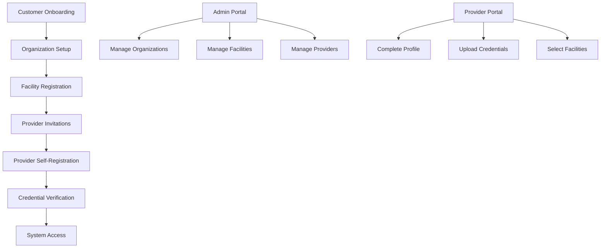

# Comprehensive Customer Management & Onboarding System

## 🏗️ System Architecture Overview



## 📊 Enhanced Database Schema for Onboarding

```php
// database/migrations/2025_01_28_000001_create_onboarding_tables.php
<?php

use Illuminate\Database\Migrations\Migration;
use Illuminate\Database\Schema\Blueprint;
use Illuminate\Support\Facades\Schema;

return new class extends Migration
{
    public function up(): void
    {
        // Organization onboarding tracking
        Schema::create('organization_onboarding', function (Blueprint $table) {
            $table->uuid('id')->primary();
            $table->unsignedInteger('organization_id')->unique();
            $table->enum('status', [
                'initiated',
                'basic_info_complete',
                'billing_setup_complete',
                'facilities_added',
                'providers_invited',
                'training_scheduled',
                'go_live',
                'completed'
            ])->default('initiated');
            $table->json('completed_steps')->default('[]');
            $table->json('pending_items')->default('[]');
            $table->unsignedInteger('onboarding_manager_id')->nullable();
            $table->timestamp('initiated_at');
            $table->timestamp('target_go_live_date')->nullable();
            $table->timestamp('actual_go_live_date')->nullable();
            $table->timestamp('completed_at')->nullable();
            $table->timestamps();
            
            $table->foreign('organization_id')->references('id')->on('organizations');
            $table->foreign('onboarding_manager_id')->references('id')->on('users');
            $table->index('status');
        });

        // Provider invitations and onboarding
        Schema::create('provider_invitations', function (Blueprint $table) {
            $table->uuid('id')->primary();
            $table->string('email');
            $table->string('first_name');
            $table->string('last_name');
            $table->string('invitation_token')->unique();
            $table->unsignedInteger('organization_id');
            $table->unsignedInteger('invited_by_user_id');
            $table->json('assigned_facilities')->default('[]');
            $table->json('assigned_roles')->default('[]');
            $table->enum('status', [
                'pending',
                'sent',
                'opened',
                'accepted',
                'expired',
                'cancelled'
            ])->default('pending');
            $table->timestamp('sent_at')->nullable();
            $table->timestamp('opened_at')->nullable();
            $table->timestamp('accepted_at')->nullable();
            $table->timestamp('expires_at');
            $table->unsignedInteger('created_user_id')->nullable();
            $table->timestamps();
            
            $table->foreign('organization_id')->references('id')->on('organizations');
            $table->foreign('invited_by_user_id')->references('id')->on('users');
            $table->foreign('created_user_id')->references('id')->on('users');
            $table->index(['email', 'organization_id']);
            $table->index('invitation_token');
            $table->index('status');
        });

        // Onboarding checklists
        Schema::create('onboarding_checklists', function (Blueprint $table) {
            $table->uuid('id')->primary();
            $table->morphs('entity'); // Can be used for organizations, facilities, or providers
            $table->string('checklist_type'); // 'organization', 'facility', 'provider'
            $table->json('items')->comment('Array of checklist items with status');
            $table->integer('total_items')->default(0);
            $table->integer('completed_items')->default(0);
            $table->decimal('completion_percentage', 5, 2)->default(0);
            $table->timestamp('last_activity_at')->nullable();
            $table->timestamps();
            
            $table->index(['entity_type', 'entity_id']);
            $table->index('checklist_type');
        });

        // Onboarding documents
        Schema::create('onboarding_documents', function (Blueprint $table) {
            $table->uuid('id')->primary();
            $table->morphs('entity'); // Can be organization, facility, or provider
            $table->string('document_type'); // 'w9', 'license', 'insurance', etc.
            $table->string('document_name');
            $table->string('file_path');
            $table->string('file_size');
            $table->string('mime_type');
            $table->enum('status', [
                'uploaded',
                'under_review',
                'approved',
                'rejected',
                'expired'
            ])->default('uploaded');
            $table->unsignedInteger('uploaded_by');
            $table->unsignedInteger('reviewed_by')->nullable();
            $table->timestamp('reviewed_at')->nullable();
            $table->text('review_notes')->nullable();
            $table->date('expiration_date')->nullable();
            $table->timestamps();
            
            $table->foreign('uploaded_by')->references('id')->on('users');
            $table->foreign('reviewed_by')->references('id')->on('users');
            $table->index(['entity_type', 'entity_id']);
            $table->index('document_type');
            $table->index('status');
        });
    }

    public function down(): void
    {
        Schema::dropIfExists('onboarding_documents');
        Schema::dropIfExists('onboarding_checklists');
        Schema::dropIfExists('provider_invitations');
        Schema::dropIfExists('organization_onboarding');
    }
};
```

## 🎯 Onboarding Service

```php
// app/Services/OnboardingService.php
namespace App\Services;

use App\Models\Organization;
use App\Models\User;
use App\Models\ProviderInvitation;
use App\Models\OnboardingChecklist;
use App\Mail\ProviderInvitationMail;
use Illuminate\Support\Facades\DB;
use Illuminate\Support\Facades\Mail;
use Illuminate\Support\Str;
use Carbon\Carbon;

class OnboardingService
{
    private array $organizationChecklist = [
        'basic_information' => 'Complete organization profile',
        'tax_documentation' => 'Upload W-9 or tax documents',
        'billing_setup' => 'Configure billing information',
        'insurance_verification' => 'Provide insurance documentation',
        'baa_agreement' => 'Sign Business Associate Agreement',
        'add_facilities' => 'Add at least one facility',
        'invite_providers' => 'Invite at least one provider',
        'admin_training' => 'Complete admin training',
        'provider_training' => 'Ensure providers complete training',
        'test_order' => 'Submit test order successfully'
    ];

    private array $facilityChecklist = [
        'basic_information' => 'Complete facility profile',
        'address_verification' => 'Verify facility address',
        'npi_validation' => 'Validate facility NPI if applicable',
        'service_capabilities' => 'Define services offered',
        'operating_hours' => 'Set operating hours',
        'insurance_accepted' => 'List accepted insurance',
        'mac_jurisdiction' => 'Confirm MAC jurisdiction',
        'contact_information' => 'Add facility contacts'
    ];

    private array $providerChecklist = [
        'personal_information' => 'Complete personal profile',
        'npi_verification' => 'Verify NPI number',
        'medical_license' => 'Upload medical license',
        'dea_registration' => 'Add DEA if applicable',
        'malpractice_insurance' => 'Upload insurance certificate',
        'facility_assignment' => 'Assign to facilities',
        'system_training' => 'Complete platform training',
        'ehr_integration' => 'Set up EHR preferences',
        'first_order' => 'Submit first order'
    ];

    /**
     * Initialize organization onboarding
     */
    public function initiateOrganizationOnboarding(Organization $organization, int $managerId): array
    {
        DB::beginTransaction();
        try {
            // Create onboarding record
            $onboarding = DB::table('organization_onboarding')->insert([
                'id' => Str::uuid(),
                'organization_id' => $organization->id,
                'status' => 'initiated',
                'completed_steps' => json_encode([]),
                'pending_items' => json_encode(array_keys($this->organizationChecklist)),
                'onboarding_manager_id' => $managerId,
                'initiated_at' => now(),
                'target_go_live_date' => now()->addDays(30),
                'created_at' => now(),
                'updated_at' => now()
            ]);

            // Create onboarding checklist
            $this->createChecklist($organization->id, 'organizations', 'organization', $this->organizationChecklist);

            // Send welcome email
            $this->sendOrganizationWelcomeEmail($organization);

            DB::commit();

            return [
                'success' => true,
                'message' => 'Onboarding initiated successfully',
                'onboarding_id' => $onboarding
            ];
        } catch (\Exception $e) {
            DB::rollBack();
            return [
                'success' => false,
                'message' => 'Failed to initiate onboarding: ' . $e->getMessage()
            ];
        }
    }

    /**
     * Invite providers to join organization
     */
    public function inviteProviders(array $providers, int $organizationId, int $invitedBy): array
    {
        $results = [
            'sent' => 0,
            'failed' => 0,
            'details' => []
        ];

        foreach ($providers as $provider) {
            try {
                $invitation = ProviderInvitation::create([
                    'id' => Str::uuid(),
                    'email' => $provider['email'],
                    'first_name' => $provider['first_name'],
                    'last_name' => $provider['last_name'],
                    'invitation_token' => Str::random(64),
                    'organization_id' => $organizationId,
                    'invited_by_user_id' => $invitedBy,
                    'assigned_facilities' => $provider['facilities'] ?? [],
                    'assigned_roles' => $provider['roles'] ?? ['provider'],
                    'status' => 'pending',
                    'expires_at' => now()->addDays(30)
                ]);

                // Send invitation email
                Mail::to($provider['email'])->queue(new ProviderInvitationMail($invitation));

                $invitation->update([
                    'status' => 'sent',
                    'sent_at' => now()
                ]);

                $results['sent']++;
                $results['details'][] = [
                    'email' => $provider['email'],
                    'status' => 'sent',
                    'invitation_id' => $invitation->id
                ];
            } catch (\Exception $e) {
                $results['failed']++;
                $results['details'][] = [
                    'email' => $provider['email'],
                    'status' => 'failed',
                    'error' => $e->getMessage()
                ];
            }
        }

        return $results;
    }

    /**
     * Handle provider self-registration from invitation
     */
    public function acceptProviderInvitation(string $token, array $registrationData): array
    {
        $invitation = ProviderInvitation::where('invitation_token', $token)
            ->where('status', 'sent')
            ->where('expires_at', '>', now())
            ->first();

        if (!$invitation) {
            return [
                'success' => false,
                'message' => 'Invalid or expired invitation'
            ];
        }

        DB::beginTransaction();
        try {
            // Create user account
            $user = User::create([
                'first_name' => $registrationData['first_name'] ?? $invitation->first_name,
                'last_name' => $registrationData['last_name'] ?? $invitation->last_name,
                'email' => $invitation->email,
                'password' => bcrypt($registrationData['password']),
                'role' => 'provider',
                'account_id' => $invitation->organization_id
            ]);

            // Create provider profile
            DB::table('provider_profiles')->insert([
                'provider_id' => $user->id,
                'npi' => $registrationData['npi'] ?? null,
                'verification_status' => 'pending',
                'created_at' => now(),
                'updated_at' => now()
            ]);

            // Assign to facilities
            foreach ($invitation->assigned_facilities as $facilityId) {
                DB::table('facility_user')->insert([
                    'user_id' => $user->id,
                    'facility_id' => $facilityId,
                    'is_primary_location' => false,
                    'can_order_for_facility' => true,
                    'start_date' => now(),
                    'created_at' => now(),
                    'updated_at' => now()
                ]);
            }

            // Create provider checklist
            $this->createChecklist($user->id, 'users', 'provider', $this->providerChecklist);

            // Update invitation
            $invitation->update([
                'status' => 'accepted',
                'accepted_at' => now(),
                'created_user_id' => $user->id
            ]);

            // Send welcome email
            $this->sendProviderWelcomeEmail($user);

            DB::commit();

            return [
                'success' => true,
                'message' => 'Registration successful',
                'user' => $user
            ];
        } catch (\Exception $e) {
            DB::rollBack();
            return [
                'success' => false,
                'message' => 'Registration failed: ' . $e->getMessage()
            ];
        }
    }

    /**
     * Update onboarding progress
     */
    public function updateOnboardingProgress(string $entityType, int $entityId, string $checklistItem, bool $completed = true): void
    {
        $checklist = OnboardingChecklist::where('entity_type', $entityType)
            ->where('entity_id', $entityId)
            ->first();

        if ($checklist) {
            $items = $checklist->items;
            if (isset($items[$checklistItem])) {
                $items[$checklistItem]['completed'] = $completed;
                $items[$checklistItem]['completed_at'] = $completed ? now()->toIso8601String() : null;
                
                $checklist->items = $items;
                $checklist->completed_items = collect($items)->where('completed', true)->count();
                $checklist->completion_percentage = ($checklist->completed_items / $checklist->total_items) * 100;
                $checklist->last_activity_at = now();
                $checklist->save();

                // Update organization onboarding status if applicable
                if ($entityType === 'organizations') {
                    $this->updateOrganizationOnboardingStatus($entityId);
                }
            }
        }
    }

    /**
     * Get onboarding dashboard data
     */
    public function getOnboardingDashboard(int $organizationId): array
    {
        $onboarding = DB::table('organization_onboarding')
            ->where('organization_id', $organizationId)
            ->first();

        if (!$onboarding) {
            return ['error' => 'No onboarding record found'];
        }

        // Get checklists
        $orgChecklist = $this->getChecklistStatus('organizations', $organizationId);
        $facilityChecklists = $this->getFacilityChecklists($organizationId);
        $providerChecklists = $this->getProviderChecklists($organizationId);

        // Get pending invitations
        $pendingInvitations = ProviderInvitation::where('organization_id', $organizationId)
            ->whereIn('status', ['pending', 'sent'])
            ->count();

        // Calculate overall progress
        $totalItems = $orgChecklist['total_items'] + 
                     $facilityChecklists->sum('total_items') + 
                     $providerChecklists->sum('total_items');
        
        $completedItems = $orgChecklist['completed_items'] + 
                         $facilityChecklists->sum('completed_items') + 
                         $providerChecklists->sum('completed_items');
        
        $overallProgress = $totalItems > 0 ? round(($completedItems / $totalItems) * 100, 1) : 0;

        return [
            'status' => $onboarding->status,
            'initiated_at' => $onboarding->initiated_at,
            'target_go_live_date' => $onboarding->target_go_live_date,
            'days_until_target' => Carbon::parse($onboarding->target_go_live_date)->diffInDays(now()),
            'overall_progress' => $overallProgress,
            'organization_checklist' => $orgChecklist,
            'facility_count' => $facilityChecklists->count(),
            'facilities_ready' => $facilityChecklists->where('completion_percentage', 100)->count(),
            'provider_count' => $providerChecklists->count(),
            'providers_ready' => $providerChecklists->where('completion_percentage', 100)->count(),
            'pending_invitations' => $pendingInvitations,
            'recent_activity' => $this->getRecentOnboardingActivity($organizationId)
        ];
    }

    private function createChecklist(int $entityId, string $entityType, string $checklistType, array $items): void
    {
        $checklistItems = [];
        foreach ($items as $key => $description) {
            $checklistItems[$key] = [
                'description' => $description,
                'completed' => false,
                'completed_at' => null,
                'required' => true
            ];
        }

        OnboardingChecklist::create([
            'id' => Str::uuid(),
            'entity_id' => $entityId,
            'entity_type' => $entityType,
            'checklist_type' => $checklistType,
            'items' => $checklistItems,
            'total_items' => count($items),
            'completed_items' => 0,
            'completion_percentage' => 0
        ]);
    }

    private function updateOrganizationOnboardingStatus(int $organizationId): void
    {
        $checklist = $this->getChecklistStatus('organizations', $organizationId);
        $newStatus = 'initiated';

        if ($checklist['items']['basic_information']['completed'] && 
            $checklist['items']['tax_documentation']['completed']) {
            $newStatus = 'basic_info_complete';
        }

        if ($newStatus === 'basic_info_complete' && 
            $checklist['items']['billing_setup']['completed']) {
            $newStatus = 'billing_setup_complete';
        }

        if ($newStatus === 'billing_setup_complete' && 
            $checklist['items']['add_facilities']['completed']) {
            $newStatus = 'facilities_added';
        }

        if ($newStatus === 'facilities_added' && 
            $checklist['items']['invite_providers']['completed']) {
            $newStatus = 'providers_invited';
        }

        if ($checklist['completion_percentage'] === 100) {
            $newStatus = 'completed';
        }

        DB::table('organization_onboarding')
            ->where('organization_id', $organizationId)
            ->update([
                'status' => $newStatus,
                'updated_at' => now()
            ]);
    }
}
```

## 🎯 Customer Management API Controllers

```php
// app/Http/Controllers/Api/V1/Admin/CustomerManagementController.php
namespace App\Http\Controllers\Api\V1\Admin;

use App\Http\Controllers\Controller;
use App\Services\CustomerManagementService;
use App\Services\OnboardingService;
use App\Services\NPIVerificationService;
use App\Http\Requests\CreateOrganizationRequest;
use App\Http\Requests\InviteProvidersRequest;
use App\Http\Resources\OrganizationResource;
use App\Http\Resources\ProviderResource;
use App\Models\Organization;
use Illuminate\Http\Request;
use Illuminate\Http\JsonResponse;

class CustomerManagementController extends Controller
{
    public function __construct(
        private CustomerManagementService $customerService,
        private OnboardingService $onboardingService,
        private NPIVerificationService $npiService
    ) {}

    /**
     * List all organizations with filtering
     */
    public function listOrganizations(Request $request): JsonResponse
    {
        $query = Organization::with(['facilities', 'salesRep']);

        // Apply filters
        if ($request->has('status')) {
            $query->where('status', $request->status);
        }

        if ($request->has('search')) {
            $query->where(function($q) use ($request) {
                $q->where('name', 'like', "%{$request->search}%")
                  ->orWhere('tax_id', 'like', "%{$request->search}%");
            });
        }

        $organizations = $query->paginate($request->get('per_page', 20));

        return response()->json([
            'organizations' => OrganizationResource::collection($organizations),
            'meta' => [
                'total' => $organizations->total(),
                'per_page' => $organizations->perPage(),
                'current_page' => $organizations->currentPage()
            ]
        ]);
    }

    /**
     * Create new organization and initiate onboarding
     */
    public function createOrganization(CreateOrganizationRequest $request): JsonResponse
    {
        DB::beginTransaction();
        try {
            // Create organization
            $organization = Organization::create($request->validated());

            // Initiate onboarding
            $onboarding = $this->onboardingService->initiateOrganizationOnboarding(
                $organization,
                auth()->id()
            );

            // Create primary contact user
            if ($request->has('primary_contact')) {
                $this->createPrimaryContact($organization, $request->primary_contact);
            }

            DB::commit();

            return response()->json([
                'organization' => new OrganizationResource($organization),
                'onboarding' => $onboarding,
                'message' => 'Organization created and onboarding initiated'
            ], 201);
        } catch (\Exception $e) {
            DB::rollBack();
            return response()->json([
                'error' => 'Failed to create organization',
                'message' => $e->getMessage()
            ], 500);
        }
    }

    /**
     * Get organization hierarchy with all details
     */
    public function getOrganizationHierarchy($organizationId): JsonResponse
    {
        $hierarchy = $this->customerService->getOrganizationHierarchy($organizationId);
        $onboarding = $this->onboardingService->getOnboardingDashboard($organizationId);
        $compliance = $this->customerService->getEnhancedComplianceMetrics($organizationId);

        return response()->json([
            'organization' => $hierarchy->first(),
            'onboarding' => $onboarding,
            'compliance' => $compliance,
            'summary' => [
                'total_facilities' => $hierarchy->first()->facilities->count(),
                'total_providers' => $hierarchy->first()->total_providers,
                'active_providers' => $hierarchy->first()->facilities->sum('provider_count'),
                'compliance_score' => $compliance['compliance_score']
            ]
        ]);
    }

    /**
     * Add facility to organization
     */
    public function addFacility(Request $request, $organizationId): JsonResponse
    {
        $request->validate([
            'name' => 'required|string|max:255',
            'facility_type' => 'required|in:clinic,hospital_outpatient,wound_center,asc',
            'group_npi' => 'nullable|digits:10',
            'address' => 'required|array',
            'address.street' => 'required|string',
            'address.city' => 'required|string',
            'address.state' => 'required|string|size:2',
            'address.zip' => 'required|string'
        ]);

        DB::beginTransaction();
        try {
            // Create facility
            $facility = Facility::create([
                'organization_id' => $organizationId,
                'name' => $request->name,
                'facility_type' => $request->facility_type,
                'group_npi' => $request->group_npi,
                'status' => 'active'
            ]);

            // Create address
            Address::create([
                'addressable_type' => 'facilities',
                'addressable_id' => $facility->id,
                'street_1' => $request->address['street'],
                'city' => $request->address['city'],
                'state_province' => $request->address['state'],
                'postal_code' => $request->address['zip'],
                'country_code' => 'US',
                'address_type' => 'physical'
            ]);

            // Verify NPI if provided
            if ($request->group_npi) {
                $npiResult = $this->npiService->verifyNPI($request->group_npi);
                if ($npiResult['valid']) {
                    $facility->update(['npi_verified' => true]);
                }
            }

            // Create facility checklist
            $this->onboardingService->createFacilityChecklist($facility);

            // Update organization onboarding progress
            $this->onboardingService->updateOnboardingProgress(
                'organizations',
                $organizationId,
                'add_facilities',
                true
            );

            DB::commit();

            return response()->json([
                'facility' => $facility->load('address'),
                'message' => 'Facility added successfully'
            ], 201);
        } catch (\Exception $e) {
            DB::rollBack();
            return response()->json([
                'error' => 'Failed to add facility',
                'message' => $e->getMessage()
            ], 500);
        }
    }

    /**
     * Invite providers to organization
     */
    public function inviteProviders(InviteProvidersRequest $request, $organizationId): JsonResponse
    {
        $results = $this->onboardingService->inviteProviders(
            $request->providers,
            $organizationId,
            auth()->id()
        );

        // Update onboarding progress if providers were invited
        if ($results['sent'] > 0) {
            $this->onboardingService->updateOnboardingProgress(
                'organizations',
                $organizationId,
                'invite_providers',
                true
            );
        }

        return response()->json([
            'results' => $results,
            'message' => "{$results['sent']} invitations sent, {$results['failed']} failed"
        ]);
    }

    /**
     * Get providers with their facility assignments
     */
    public function getProviders(Request $request): JsonResponse
    {
        $providers = $this->customerService->getProvidersWithFacilities(
            $request->get('organization_id'),
            $request->get('facility_id')
        );

        return response()->json([
            'providers' => $providers,
            'summary' => [
                'total' => $providers->count(),
                'verified' => $providers->where('verification_status', 'verified')->count(),
                'multi_facility' => $providers->where('facility_count', '>', 1)->count()
            ]
        ]);
    }

    /**
     * Assign provider to facility
     */
    public function assignProviderToFacility(Request $request, $providerId): JsonResponse
    {
        $request->validate([
            'facility_id' => 'required|exists:facilities,id',
            'is_primary' => 'boolean',
            'can_order' => 'boolean',
            'start_date' => 'date'
        ]);

        $success = $this->customerService->assignProviderToFacility([
            'provider_id' => $providerId,
            'facility_id' => $request->facility_id,
            'is_primary' => $request->get('is_primary', false),
            'can_order' => $request->get('can_order', true),
            'start_date' => $request->get('start_date', now())
        ]);

        if ($success) {
            // Update provider's checklist
            $this->onboardingService->updateOnboardingProgress(
                'users',
                $providerId,
                'facility_assignment',
                true
            );

            return response()->json([
                'message' => 'Provider assigned to facility successfully',
                'assignments' => $this->customerService->getProviderFacilityAssignments($providerId)
            ]);
        }

        return response()->json([
            'error' => 'Failed to assign provider to facility'
        ], 500);
    }

    /**
     * Get facility coverage report
     */
    public function getFacilityCoverageReport($organizationId): JsonResponse
    {
        $coverage = $this->customerService->getFacilityCoverageReport($organizationId);

        return response()->json([
            'coverage' => $coverage,
            'summary' => [
                'facilities_needing_providers' => $coverage->where('total_providers', '<', 2)->count(),
                'facilities_fully_covered' => $coverage->where('verified_providers', '>=', 2)->count(),
                'average_providers_per_facility' => round($coverage->avg('total_providers'), 1)
            ]
        ]);
    }

    /**
     * Get compliance dashboard
     */
    public function getComplianceReport(Request $request): JsonResponse
    {
        $organizationId = $request->get('organization_id');
        
        return response()->json([
            'compliance' => $this->customerService->getEnhancedComplianceMetrics($organizationId),
            'expiring_credentials' => $this->customerService->getExpiringCredentials(30),
            'pending_verifications' => $this->customerService->getPendingProviderVerifications(),
            'recent_activity' => $this->customerService->getRecentCustomerActivity(20)
        ]);
    }

    /**
     * Upload onboarding document
     */
    public function uploadDocument(Request $request): JsonResponse
    {
        $request->validate([
            'entity_type' => 'required|in:organizations,facilities,users',
            'entity_id' => 'required|integer',
            'document_type' => 'required|string',
            'document' => 'required|file|max:10240' // 10MB max
        ]);

        $file = $request->file('document');
        $path = $file->store('onboarding-documents/' . $request->entity_type, 's3');

        DB::table('onboarding_documents')->insert([
            'id' => Str::uuid(),
            'entity_type' => $request->entity_type,
            'entity_id' => $request->entity_id,
            'document_type' => $request->document_type,
            'document_name' => $file->getClientOriginalName(),
            'file_path' => $path,
            'file_size' => $file->getSize(),
            'mime_type' => $file->getMimeType(),
            'status' => 'uploaded',
            'uploaded_by' => auth()->id(),
            'created_at' => now(),
            'updated_at' => now()
        ]);

        // Update relevant checklist item based on document type
        $checklistItem = $this->mapDocumentTypeToChecklistItem($request->document_type);
        if ($checklistItem) {
            $this->onboardingService->updateOnboardingProgress(
                $request->entity_type,
                $request->entity_id,
                $checklistItem,
                true
            );
        }

        return response()->json([
            'message' => 'Document uploaded successfully',
            'path' => $path
        ]);
    }

    /**
     * Get onboarding status for organization
     */
    public function getOnboardingStatus($organizationId): JsonResponse
    {
        $dashboard = $this->onboardingService->getOnboardingDashboard($organizationId);

        return response()->json($dashboard);
    }

    private function mapDocumentTypeToChecklistItem(string $documentType): ?string
    {
        $mapping = [
            'w9' => 'tax_documentation',
            'insurance' => 'insurance_verification',
            'baa' => 'baa_agreement',
            'medical_license' => 'medical_license',
            'dea' => 'dea_registration',
            'malpractice' => 'malpractice_insurance'
        ];

        return $mapping[$documentType] ?? null;
    }
}
```

## 🎯 API Routes Summary

```php
// routes/api.php
Route::prefix('api/v1/admin')->middleware(['auth:sanctum', 'role:admin'])->group(function () {
    // Organization Management
    Route::get('/customers/organizations', [CustomerManagementController::class, 'listOrganizations']);
    Route::post('/customers/organizations', [CustomerManagementController::class, 'createOrganization']);
    Route::get('/customers/organizations/{id}', [CustomerManagementController::class, 'showOrganization']);
    Route::get('/customers/organizations/{id}/hierarchy', [CustomerManagementController::class, 'getOrganizationHierarchy']);
    Route::get('/customers/organizations/{id}/onboarding', [CustomerManagementController::class, 'getOnboardingStatus']);
    
    // Facility Management
    Route::post('/customers/organizations/{id}/facilities', [CustomerManagementController::class, 'addFacility']);
    Route::get('/customers/facilities', [CustomerManagementController::class, 'listFacilities']);
    Route::get('/customers/facilities/{id}/providers', [CustomerManagementController::class, 'getFacilityProviders']);
    Route::get('/customers/facilities/{id}/coverage', [CustomerManagementController::class, 'getFacilityCoverage']);
    
    // Provider Management
    Route::post('/customers/organizations/{id}/invite-providers', [CustomerManagementController::class, 'inviteProviders']);
    Route::get('/customers/providers', [CustomerManagementController::class, 'getProviders']);
    Route::get('/customers/providers/{id}/facilities', [CustomerManagementController::class, 'getProviderFacilities']);
    Route::post('/customers/providers/{id}/assign-facility', [CustomerManagementController::class, 'assignProviderToFacility']);
    Route::delete('/customers/providers/{id}/facilities/{facilityId}', [CustomerManagementController::class, 'removeProviderFromFacility']);
    Route::post('/customers/providers/{id}/verify-npi', [CustomerManagementController::class, 'verifyProviderNPI']);
    
    // Reports & Analytics
    Route::get('/customers/reports/compliance', [CustomerManagementController::class, 'getComplianceReport']);
    Route::get('/customers/reports/facility-coverage/{orgId}', [CustomerManagementController::class, 'getFacilityCoverageReport']);
    Route::get('/customers/reports/expiring-credentials', [CustomerManagementController::class, 'getExpiringCredentialsReport']);
    Route::get('/customers/reports/multi-facility-providers', [CustomerManagementController::class, 'getMultiFacilityProviders']);
    
    // Document Management
    Route::post('/customers/documents/upload', [CustomerManagementController::class, 'uploadDocument']);
    Route::get('/customers/documents/{id}', [CustomerManagementController::class, 'getDocument']);
    Route::post('/customers/documents/{id}/review', [CustomerManagementController::class, 'reviewDocument']);
});

// Provider Self-Service Routes
Route::prefix('api/v1')->group(function () {
    // Public invitation acceptance
    Route::get('/invitations/verify/{token}', [ProviderOnboardingController::class, 'verifyInvitation']);
    Route::post('/invitations/accept/{token}', [ProviderOnboardingController::class, 'acceptInvitation']);
    
    // Authenticated provider routes
    Route::middleware(['auth:sanctum', 'role:provider'])->group(function () {
        Route::get('/profile', [ProviderProfileController::class, 'show']);
        Route::put('/profile', [ProviderProfileController::class, 'update']);
        Route::post('/profile/verify-npi', [ProviderProfileController::class, 'verifyNPI']);
        Route::post('/profile/credentials', [ProviderProfileController::class, 'addCredential']);
        Route::post('/profile/documents', [ProviderProfileController::class, 'uploadDocument']);
        Route::get('/profile/onboarding-status', [ProviderProfileController::class, 'getOnboardingStatus']);
    });
});
```

## 🎨 Onboarding UI Flow

### Organization Onboarding Wizard

```tsx
// components/admin/onboarding/OrganizationOnboardingWizard.tsx
import React, { useState } from 'react';
import { Card, Stepper, Button, Form } from '@/components/ui';

const OnboardingSteps = [
  {
    id: 'organization',
    title: 'Organization Information',
    fields: ['name', 'tax_id', 'type', 'primary_contact']
  },
  {
    id: 'billing',
    title: 'Billing Setup',
    fields: ['billing_address', 'payment_method', 'billing_contact']
  },
  {
    id: 'facilities',
    title: 'Add Facilities',
    component: 'FacilityManager'
  },
  {
    id: 'providers',
    title: 'Invite Providers',
    component: 'ProviderInvitation'
  },
  {
    id: 'training',
    title: 'Schedule Training',
    component: 'TrainingScheduler'
  },
  {
    id: 'review',
    title: 'Review & Launch',
    component: 'OnboardingReview'
  }
];

export function OrganizationOnboardingWizard() {
  const [currentStep, setCurrentStep] = useState(0);
  const [formData, setFormData] = useState({});

  return (
    <div className="max-w-6xl mx-auto p-6">
      <Card className="mb-6">
        <h1 className="text-2xl font-bold mb-4">Welcome to MSC Wound Care Portal</h1>
        <p className="text-gray-600">Let's get your organization set up in just a few steps.</p>
      </Card>

      <Stepper currentStep={currentStep} steps={OnboardingSteps} />

      <Card className="mt-6">
        {/* Dynamic step content based on currentStep */}
        <StepContent 
          step={OnboardingSteps[currentStep]} 
          data={formData}
          onUpdate={setFormData}
        />

        <div className="flex justify-between mt-6">
          <Button
            variant="outline"
            onClick={() => setCurrentStep(prev => Math.max(0, prev - 1))}
            disabled={currentStep === 0}
          >
            Previous
          </Button>
          
          <Button
            onClick={() => setCurrentStep(prev => Math.min(OnboardingSteps.length - 1, prev + 1))}
            disabled={currentStep === OnboardingSteps.length - 1}
          >
            {currentStep === OnboardingSteps.length - 1 ? 'Complete Setup' : 'Next'}
          </Button>
        </div>
      </Card>
    </div>
  );
}
```

### Provider Self-Registration

```tsx
// components/provider/onboarding/ProviderRegistration.tsx
import React, { useEffect, useState } from 'react';
import { useParams } from 'react-router-dom';
import { Card, Form, Button, Alert } from '@/components/ui';

export function ProviderRegistration() {
  const { token } = useParams();
  const [invitation, setInvitation] = useState(null);
  const [loading, setLoading] = useState(true);

  useEffect(() => {
    // Verify invitation token
    fetch(`/api/v1/invitations/verify/${token}`)
      .then(res => res.json())
      .then(data => {
        setInvitation(data);
        setLoading(false);
      });
  }, [token]);

  if (loading) return <div>Verifying invitation...</div>;
  if (!invitation.valid) return <Alert>Invalid or expired invitation</Alert>;

  return (
    <div className="max-w-2xl mx-auto p-6">
      <Card>
        <h1 className="text-2xl font-bold mb-4">
          Welcome to {invitation.organization_name}!
        </h1>
        <p className="mb-6">
          You've been invited to join as a provider. Let's complete your registration.
        </p>

        <Form onSubmit={handleRegistration}>
          <div className="space-y-4">
            <Form.Input
              label="Email"
              value={invitation.email}
              disabled
            />
            
            <Form.Input
              label="Password"
              type="password"
              required
              minLength={8}
            />
            
            <Form.Input
              label="NPI Number"
              pattern="[0-9]{10}"
              required
              helperText="We'll verify this automatically"
            />
            
            <Form.Input
              label="Medical License Number"
              required
            />
            
            <Form.Select
              label="Medical License State"
              required
            >
              {/* State options */}
            </Form.Select>

            <Form.Checkbox
              label="I agree to the terms and conditions"
              required
            />
          </div>

          <Button type="submit" className="w-full mt-6">
            Complete Registration
          </Button>
        </Form>
      </Card>
    </div>
  );
}
```

This comprehensive system provides a complete customer management and onboarding solution with:

1. **Multi-level hierarchy** (Organizations → Facilities → Providers)
2. **Flexible provider assignments** (providers can work at multiple facilities)
3. **Automated onboarding workflows** with progress tracking
4. **Self-service provider registration** via email invitations
5. **Document management** for compliance
6. **Free NPI verification** integration
7. **Comprehensive reporting** for compliance and coverage
8. **RESTful APIs** for all operations

The system is designed to scale and can onboard organizations of any size while maintaining compliance and tracking requirements!
