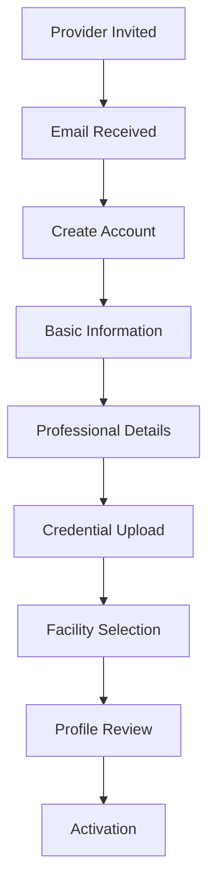
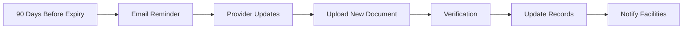

# Provider Profile Management Feature Documentation

**Version:** 1.0  
**Last Updated:** January 2025  
**Feature Status:** Production Ready

---

## 📋 Overview

The Provider Profile Management system enables healthcare providers to maintain comprehensive professional profiles, manage credentials, track facility relationships, and ensure compliance with regulatory requirements.

## 🎯 Key Features

### 1. **Comprehensive Profile Management**
- Personal and professional information
- Credential tracking and verification
- Multi-facility assignments
- Specialization management
- Contact preferences

### 2. **Credential Management**
- NPI verification and tracking
- DEA registration management
- State medical licenses
- Board certifications
- Malpractice insurance

### 3. **Document Repository**
- Secure document upload
- Expiration tracking
- Renewal reminders
- Version control
- Compliance monitoring

### 4. **Facility Relationships**
- Multiple facility assignments
- Primary facility designation
- Privilege tracking
- Schedule management
- Cross-organization support

## 🏗️ Technical Architecture

### Database Schema
```sql
-- Enhanced Users Table (Providers)
CREATE TABLE users (
    id BIGINT PRIMARY KEY,
    uuid VARCHAR(36) UNIQUE,
    email VARCHAR(255) UNIQUE,
    
    -- Personal Information
    first_name VARCHAR(100),
    last_name VARCHAR(100),
    title VARCHAR(20),
    suffix VARCHAR(20),
    
    -- Professional Information
    npi VARCHAR(10) UNIQUE,
    dea_number VARCHAR(20),
    medical_license_number VARCHAR(50),
    medical_license_state VARCHAR(2),
    
    -- Specializations
    primary_specialty VARCHAR(100),
    subspecialties JSON,
    
    -- Contact Information
    primary_phone VARCHAR(20),
    mobile_phone VARCHAR(20),
    preferred_contact_method ENUM('email', 'phone', 'text'),
    
    -- Status
    status ENUM('pending', 'active', 'suspended', 'inactive'),
    profile_complete BOOLEAN DEFAULT FALSE,
    
    -- Compliance
    last_credential_check DATE,
    next_renewal_date DATE,
    compliance_score INT DEFAULT 0,
    
    created_at TIMESTAMP,
    updated_at TIMESTAMP
);

-- Provider Credentials Table
CREATE TABLE provider_credentials (
    id BIGINT PRIMARY KEY,
    user_id BIGINT NOT NULL,
    credential_type ENUM('npi', 'dea', 'license', 'board_cert', 'insurance'),
    
    -- Credential Details
    credential_number VARCHAR(100),
    issuing_authority VARCHAR(255),
    issue_date DATE,
    expiration_date DATE,
    
    -- Verification
    is_verified BOOLEAN DEFAULT FALSE,
    verified_at TIMESTAMP,
    verification_source VARCHAR(100),
    
    -- Status
    status ENUM('active', 'expired', 'suspended', 'revoked'),
    
    -- Documents
    document_url VARCHAR(500),
    
    created_at TIMESTAMP,
    updated_at TIMESTAMP,
    
    INDEX idx_expiration (expiration_date),
    INDEX idx_user_type (user_id, credential_type)
);

-- Provider Documents Table
CREATE TABLE provider_documents (
    id BIGINT PRIMARY KEY,
    user_id BIGINT NOT NULL,
    document_type VARCHAR(50),
    document_name VARCHAR(255),
    
    -- Storage
    file_path VARCHAR(500),
    file_size INT,
    mime_type VARCHAR(100),
    
    -- Metadata
    expiration_date DATE,
    is_current BOOLEAN DEFAULT TRUE,
    version INT DEFAULT 1,
    
    -- Compliance
    requires_renewal BOOLEAN DEFAULT FALSE,
    renewal_period_days INT,
    
    uploaded_at TIMESTAMP,
    uploaded_by BIGINT,
    
    INDEX idx_user_docs (user_id, document_type)
);
```

### Service Architecture
```typescript
class ProviderProfileService {
  async updateProfile(userId: string, updates: ProfileUpdate): Promise<Profile> {
    // Validate updates
    await this.validateProfileData(updates);
    
    // Update profile
    const profile = await this.profileRepository.update(userId, updates);
    
    // Check completeness
    const isComplete = await this.checkProfileCompleteness(profile);
    if (isComplete && !profile.profile_complete) {
      await this.markProfileComplete(userId);
      await this.notificationService.sendProfileCompleteNotification(userId);
    }
    
    // Update compliance score
    await this.updateComplianceScore(userId);
    
    return profile;
  }
  
  async verifyCredential(credentialId: string): Promise<CredentialVerification> {
    const credential = await this.getCredential(credentialId);
    
    // Verify based on type
    let verification: VerificationResult;
    switch (credential.type) {
      case 'npi':
        verification = await this.npiService.verify(credential.number);
        break;
      case 'dea':
        verification = await this.deaService.verify(credential.number);
        break;
      case 'license':
        verification = await this.licenseService.verify(
          credential.number,
          credential.state
        );
        break;
    }
    
    // Update credential status
    await this.updateCredentialVerification(credentialId, verification);
    
    return verification;
  }
}
```

## 💻 User Interface

### Provider Dashboard
```tsx
const ProviderDashboard: React.FC = () => {
  const { profile, loading } = useProviderProfile();
  
  return (
    <Dashboard>
      <ProfileCompletionWidget percentage={profile.completionPercentage} />
      <CredentialStatusWidget credentials={profile.credentials} />
      <ExpirationAlertsWidget upcoming={profile.upcomingExpirations} />
      <FacilityAssignmentsWidget facilities={profile.facilities} />
    </Dashboard>
  );
};
```

### Profile Editor
```tsx
const ProfileEditor: React.FC = () => {
  return (
    <Form onSubmit={handleSave}>
      <Section title="Personal Information">
        <Input name="firstName" label="First Name" required />
        <Input name="lastName" label="Last Name" required />
        <Select name="title" label="Title" options={TITLE_OPTIONS} />
      </Section>
      
      <Section title="Professional Information">
        <NPIInput name="npi" onVerify={handleNPIVerify} />
        <Input name="deaNumber" label="DEA Number" />
        <LicenseInput name="medicalLicense" />
      </Section>
      
      <Section title="Specializations">
        <SpecialtySelector 
          primary={profile.primarySpecialty}
          secondary={profile.subspecialties}
        />
      </Section>
      
      <Button type="submit">Save Profile</Button>
    </Form>
  );
};
```

## 🔄 Profile Management Workflows

### Initial Profile Setup


### Credential Renewal Flow


## 📊 Compliance Features

### Credential Tracking
```typescript
interface CredentialTracking {
  credential: {
    type: string;
    number: string;
    expirationDate: Date;
  };
  
  tracking: {
    daysUntilExpiry: number;
    renewalRequired: boolean;
    remindersSent: number;
    lastReminderDate: Date;
  };
  
  compliance: {
    isCompliant: boolean;
    requiredActions: string[];
    riskLevel: 'low' | 'medium' | 'high';
  };
}
```

### Automated Compliance Monitoring
```yaml
Monitoring Features:
  - Daily expiration checks
  - Automated email reminders
  - Manager notifications
  - Compliance scoring
  - Risk assessment
  - Regulatory reporting
```

## 🔒 Security & Privacy

### Data Protection
- Encrypted credential storage
- Secure document handling
- Access logging
- PHI separation
- HIPAA compliance

### Access Control
```typescript
const profilePermissions = {
  'provider': [
    'view-own-profile',
    'edit-own-profile',
    'upload-documents',
    'manage-facilities'
  ],
  'office_manager': [
    'view-provider-profiles',
    'request-updates',
    'view-compliance-status'
  ],
  'admin': [
    'view-all-profiles',
    'edit-all-profiles',
    'verify-credentials',
    'manage-compliance'
  ]
};
```

## 📈 Analytics & Reporting

### Profile Metrics
- Profile completion rates
- Credential compliance scores
- Document upload statistics
- Verification success rates
- User engagement metrics

### Compliance Dashboard
```yaml
Dashboard Widgets:
  - Expiring Credentials (30/60/90 days)
  - Incomplete Profiles
  - Verification Pending
  - Risk Assessment
  - Facility Coverage
```

## 🚀 Advanced Features

### Smart Profile Features
```typescript
class SmartProfileFeatures {
  // Auto-complete from NPI registry
  async autoFillFromNPI(npi: string): Promise<ProfileData> {
    const npiData = await this.npiRegistry.lookup(npi);
    return {
      firstName: npiData.firstName,
      lastName: npiData.lastName,
      primarySpecialty: npiData.taxonomyCode,
      // ... other fields
    };
  }
  
  // Intelligent renewal reminders
  async scheduleSmartReminders(userId: string): Promise<void> {
    const credentials = await this.getExpiringCredentials(userId);
    
    for (const credential of credentials) {
      const schedule = this.calculateOptimalSchedule(credential);
      await this.scheduleReminders(credential, schedule);
    }
  }
}
```

### Integration Capabilities
- NPI Registry real-time lookup
- DEA verification service
- State license board APIs
- Board certification verification
- Insurance carrier validation

## 🎯 Business Benefits

### For Providers
- Simplified credential management
- Automated renewal reminders
- Multi-facility support
- Compliance assurance
- Time savings

### For Organizations
- Reduced compliance risk
- Automated monitoring
- Centralized management
- Audit trail maintenance
- Regulatory reporting

## 🚀 Future Enhancements

### Planned Features
1. **Blockchain Credentials**: Verifiable digital credentials
2. **AI Compliance Assistant**: Predictive compliance monitoring
3. **Mobile App**: On-the-go profile management
4. **Continuous Monitoring**: Real-time license status
5. **Peer Verification**: Provider-to-provider endorsements

---

**Related Documentation:**
- [Customer Organization Feature](./CUSTOMER_ORGANIZATION_FEATURE.md)
- [Onboarding System](./ONBOARDING_FEATURE.md)
- [Compliance Management](../compliance/COMPLIANCE_FEATURE.md)
