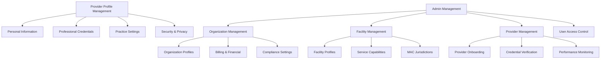
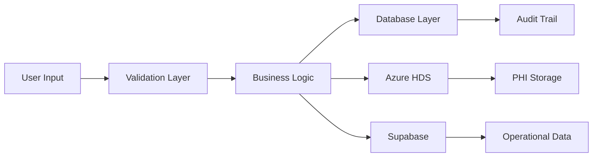
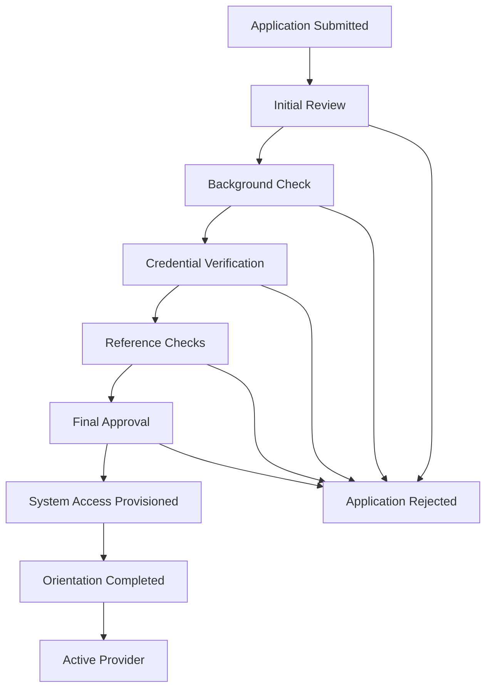

# MSC Wound Care Portal - Profile Management System

## 📋 Overview

The Profile Management System provides comprehensive profile and administrative capabilities for the MSC Wound Care Portal, enabling providers to manage their professional information and giving administrators full control over organizational structure, facilities, and provider management.

## 🏗️ System Architecture

### Core Components



### Data Flow Architecture



## 🧑‍⚕️ Provider Profile Management

### Personal Information Management

**Features:**
- Complete demographic information
- Contact details and communication preferences
- Emergency contact information
- Professional photography upload
- Address validation and geocoding

**Data Structure:**
```typescript
interface ProviderProfile {
  // Core Identity
  firstName: string;
  lastName: string;
  middleName?: string;
  suffix?: string;
  preferredName?: string;
  
  // Contact Information
  primaryPhone: string;
  alternatePhone?: string;
  email: string;
  alternateEmail?: string;
  
  // Address Information
  primaryAddress: Address;
  mailingAddress?: Address;
  
  // Professional Information
  professionalPhoto?: string;
  biography?: string;
  specializations: string[];
  languagesSpoken: string[];
  
  // Emergency Contact
  emergencyContact: EmergencyContact;
  
  // System Information
  lastUpdated: Date;
  verificationStatus: 'pending' | 'verified' | 'rejected';
}
```

### Professional Credentials Management

**Features:**
- NPI number management and validation
- Medical license tracking with expiration alerts
- Board certification management
- DEA registration tracking
- Hospital privileges documentation
- Continuing education credit tracking
- Document upload and verification

**Credential Types:**
- Medical Licenses (state-specific)
- Board Certifications
- DEA Registration
- NPI Validation
- Hospital Privileges
- Malpractice Insurance
- Continuing Education Credits

**Automated Features:**
- Expiration date alerts (30, 60, 90 days)
- Renewal reminder notifications
- Compliance status tracking
- Verification workflow management

### Practice Settings & Preferences

**Clinical Preferences:**
- Default wound care protocols
- Preferred product categories
- Treatment documentation templates
- Clinical decision support settings

**Notification Preferences:**
- Email notification settings
- SMS alert preferences
- System notification timing
- Escalation procedures

**Workflow Customization:**
- Dashboard layout preferences
- Quick action shortcuts
- Report generation defaults
- Integration preferences

## 🏥 Admin Management Areas

### Organization Management

**Organization Profile Management:**
```typescript
interface OrganizationProfile {
  // Basic Information
  organizationName: string;
  organizationType: 'hospital' | 'clinic' | 'practice' | 'health_system';
  taxId: string;
  npi?: string;
  
  // Contact Information
  headquarters: Address;
  billingAddress: Address;
  primaryContact: ContactInformation;
  
  // Business Information
  yearEstablished?: number;
  employeeCount?: string;
  annualRevenue?: string;
  servicesOffered: string[];
  
  // Compliance & Accreditation
  accreditations: Accreditation[];
  licenses: OrganizationLicense[];
  insuranceCarriers: InsuranceCarrier[];
  
  // Financial Information
  billingNpi?: string;
  taxonomyCodes: string[];
  contractedPayers: string[];
  
  // System Settings
  defaultSettings: OrganizationSettings;
  billingSettings: BillingConfiguration;
  complianceSettings: ComplianceConfiguration;
}
```

**Key Features:**
- Multi-location management
- Hierarchical organization structure
- Billing and financial configuration
- Compliance policy management
- Brand identity management
- Service capability definition

### Facility Management

**Facility Profile Management:**
```typescript
interface FacilityProfile {
  // Basic Information
  facilityName: string;
  facilityType: 'hospital' | 'outpatient' | 'clinic' | 'wound_center' | 'asc';
  organizationId: string;
  
  // Location Information
  address: Address;
  coordinates: GeoCoordinates;
  timezone: string;
  serviceArea: ServiceArea;
  
  // Operational Information
  operatingHours: OperatingHours[];
  capacity: FacilityCapacity;
  serviceLines: ServiceLine[];
  
  // Clinical Capabilities
  woundCareServices: WoundCareService[];
  equipmentAvailable: Equipment[];
  specialtyServices: SpecialtyService[];
  
  // Regulatory Information
  facilityLicenses: FacilityLicense[];
  accreditations: Accreditation[];
  macJurisdiction: MacJurisdiction;
  
  // Staff & Providers
  medicalDirector?: string;
  administrativeContact: ContactInformation;
  providerCount: number;
  supportStaffCount: number;
}
```

**Advanced Features:**
- Service capability matrix
- MAC jurisdiction determination
- Equipment and resource tracking
- Provider assignment and scheduling
- Performance metrics and reporting
- Compliance monitoring
- Quality measure tracking

### Provider Management

**Provider Onboarding Workflow:**



**Provider Management Features:**
- Streamlined onboarding process
- Automated credential verification
- Performance monitoring and analytics
- Continuing education tracking
- Privilege and access management
- Disciplinary action tracking
- Provider directory management

## 🔐 Security & Access Control

### Role-Based Access Control (RBAC)

**Provider Profile Roles:**
- `provider:view-own-profile` - View personal profile
- `provider:edit-own-profile` - Edit personal information
- `provider:manage-credentials` - Manage professional credentials
- `provider:view-performance` - View performance metrics

**Admin Management Roles:**
- `admin:manage-organizations` - Full organization management
- `admin:manage-facilities` - Facility administration
- `admin:manage-providers` - Provider management and onboarding
- `admin:view-analytics` - Access to system analytics
- `admin:manage-compliance` - Compliance oversight
- `admin:financial-management` - Financial and billing oversight

### Data Security

**PHI Protection:**
- All personal health information stored in Azure Health Data Services
- Non-PHI operational data in Supabase
- Encryption at rest and in transit
- Audit logging for all data access
- HIPAA compliance monitoring

**Access Controls:**
- Multi-factor authentication
- Session management and timeout
- IP address restrictions
- Device registration and management
- Privileged access monitoring

## 📊 Database Schema

### Core Provider Tables

```sql
-- Provider profiles (non-PHI operational data)
CREATE TABLE provider_profiles (
    provider_id UUID PRIMARY KEY REFERENCES providers(provider_id),
    azure_provider_fhir_id VARCHAR, -- Reference to Azure HDS
    last_profile_update TIMESTAMP WITH TIME ZONE,
    profile_completion_percentage INTEGER DEFAULT 0,
    verification_status provider_verification_status DEFAULT 'pending',
    notification_preferences JSONB DEFAULT '{}',
    practice_preferences JSONB DEFAULT '{}',
    created_at TIMESTAMP WITH TIME ZONE NOT NULL DEFAULT now(),
    updated_at TIMESTAMP WITH TIME ZONE NOT NULL DEFAULT now()
);

-- Provider credentials tracking
CREATE TABLE provider_credentials (
    id UUID PRIMARY KEY DEFAULT gen_random_uuid(),
    provider_id UUID NOT NULL REFERENCES providers(provider_id),
    credential_type credential_type NOT NULL,
    credential_number VARCHAR NOT NULL,
    issuing_authority VARCHAR NOT NULL,
    issue_date DATE,
    expiration_date DATE,
    verification_status verification_status DEFAULT 'pending',
    document_path VARCHAR, -- Secure document storage reference
    auto_renewal_enabled BOOLEAN DEFAULT false,
    reminder_sent_dates JSONB DEFAULT '[]',
    created_at TIMESTAMP WITH TIME ZONE NOT NULL DEFAULT now(),
    updated_at TIMESTAMP WITH TIME ZONE NOT NULL DEFAULT now(),
    UNIQUE(provider_id, credential_type, credential_number)
);

-- Organization management
CREATE TABLE organization_profiles (
    organization_id UUID PRIMARY KEY REFERENCES organizations(organization_id),
    azure_organization_fhir_id VARCHAR, -- Reference to Azure HDS
    organization_settings JSONB DEFAULT '{}',
    billing_configuration JSONB DEFAULT '{}',
    compliance_settings JSONB DEFAULT '{}',
    brand_settings JSONB DEFAULT '{}',
    last_updated TIMESTAMP WITH TIME ZONE DEFAULT now(),
    created_at TIMESTAMP WITH TIME ZONE NOT NULL DEFAULT now()
);

-- Facility detailed profiles
CREATE TABLE facility_profiles (
    facility_id UUID PRIMARY KEY REFERENCES facilities(facility_id),
    azure_facility_fhir_id VARCHAR, -- Reference to Azure HDS
    service_capabilities JSONB DEFAULT '{}',
    operational_settings JSONB DEFAULT '{}',
    equipment_inventory JSONB DEFAULT '{}',
    quality_metrics JSONB DEFAULT '{}',
    last_updated TIMESTAMP WITH TIME ZONE DEFAULT now(),
    created_at TIMESTAMP WITH TIME ZONE NOT NULL DEFAULT now()
);
```

### Supporting Tables

```sql
-- Credential types enumeration
CREATE TYPE credential_type AS ENUM (
    'medical_license',
    'board_certification',
    'dea_registration',
    'npi_number',
    'hospital_privileges',
    'malpractice_insurance',
    'continuing_education'
);

-- Verification status tracking
CREATE TYPE verification_status AS ENUM (
    'pending',
    'in_review',
    'verified',
    'expired',
    'rejected',
    'suspended'
);

-- Provider verification status
CREATE TYPE provider_verification_status AS ENUM (
    'pending',
    'documents_required',
    'under_review',
    'verification_in_progress',
    'verified',
    'rejected',
    'suspended'
);

-- Audit trail for profile changes
CREATE TABLE profile_audit_log (
    id UUID PRIMARY KEY DEFAULT gen_random_uuid(),
    entity_type VARCHAR NOT NULL, -- 'provider', 'organization', 'facility'
    entity_id UUID NOT NULL,
    user_id UUID NOT NULL REFERENCES users(id),
    action_type VARCHAR NOT NULL, -- 'create', 'update', 'delete', 'verify'
    field_changes JSONB, -- Before/after values
    reason VARCHAR,
    ip_address INET,
    user_agent TEXT,
    created_at TIMESTAMP WITH TIME ZONE NOT NULL DEFAULT now()
);
```

## 🚀 Implementation Phases

### Phase 1: Provider Profile Foundation (Weeks 1-3)
**Deliverables:**
- [ ] Personal information management UI
- [ ] Professional credentials tracking
- [ ] Basic notification preferences
- [ ] Profile completion indicators
- [ ] Document upload functionality

**Technical Tasks:**
- [ ] Create provider profile database schema
- [ ] Implement profile APIs
- [ ] Build React profile management components
- [ ] Set up document storage integration
- [ ] Implement basic validation and security

### Phase 2: Credential Management & Verification (Weeks 4-6)
**Deliverables:**
- [ ] Automated credential verification system
- [ ] Expiration tracking and alerts
- [ ] Document verification workflow
- [ ] Compliance status dashboard
- [ ] Integration with verification services

**Technical Tasks:**
- [ ] Build credential verification APIs
- [ ] Implement automated reminder system
- [ ] Create verification workflow components
- [ ] Set up third-party verification integrations
- [ ] Build compliance reporting system

### Phase 3: Admin Organization Management (Weeks 7-9)
**Deliverables:**
- [ ] Organization profile management
- [ ] Multi-location hierarchy support
- [ ] Billing and financial configuration
- [ ] Brand and identity management
- [ ] Service capability definition

**Technical Tasks:**
- [ ] Create organization management database schema
- [ ] Build organization management APIs
- [ ] Develop admin dashboard components
- [ ] Implement hierarchical organization structure
- [ ] Set up billing configuration system

### Phase 4: Facility Management System (Weeks 10-12)
**Deliverables:**
- [ ] Comprehensive facility profiles
- [ ] Service capability matrix
- [ ] Equipment and resource tracking
- [ ] MAC jurisdiction determination
- [ ] Performance metrics tracking

**Technical Tasks:**
- [ ] Build facility management database schema
- [ ] Implement facility management APIs
- [ ] Create facility dashboard components
- [ ] Integrate MAC jurisdiction services
- [ ] Develop resource tracking system

### Phase 5: Provider Management & Onboarding (Weeks 13-15)
**Deliverables:**
- [ ] Automated provider onboarding workflow
- [ ] Performance monitoring dashboard
- [ ] Provider directory management
- [ ] Credential tracking and alerts
- [ ] Privilege and access management

**Technical Tasks:**
- [ ] Build provider onboarding workflow
- [ ] Implement performance monitoring APIs
- [ ] Create provider management components
- [ ] Set up automated workflow engines
- [ ] Develop privilege management system

### Phase 6: Advanced Features & Analytics (Weeks 16-18)
**Deliverables:**
- [ ] Advanced analytics and reporting
- [ ] Predictive credential management
- [ ] Quality improvement insights
- [ ] Regulatory compliance monitoring
- [ ] Performance benchmarking

**Technical Tasks:**
- [ ] Implement advanced analytics engine
- [ ] Build predictive algorithms
- [ ] Create comprehensive reporting system
- [ ] Set up compliance monitoring
- [ ] Develop benchmarking capabilities

## 📱 User Experience Design

### Provider Profile Management UX

**Dashboard Layout:**
```
┌─────────────────────────────────────────────────────────────┐
│ Provider Profile Dashboard                                  │
├─────────────────────────────────────────────────────────────┤
│ [Profile Photo] Dr. Jane Smith, MD                         │
│ Wound Care Specialist • NPI: 1234567890                    │
│ Profile 85% Complete • Last Updated: Dec 15, 2024          │
├─────────────────────────────────────────────────────────────┤
│ Quick Actions                                               │
│ [Update Info] [Upload Document] [View Performance]         │
├─────────────────────────────────────────────────────────────┤
│ Credentials Status          │ Upcoming Renewals            │
│ ✅ Medical License          │ • DEA Registration (30 days) │
│ ✅ Board Certification      │ • Board Cert (90 days)       │
│ ⚠️  DEA Registration        │ • Malpractice (180 days)     │
│ ✅ Malpractice Insurance    │                               │
└─────────────────────────────────────────────────────────────┘
```

### Admin Management UX

**Organization Management Dashboard:**
```
┌─────────────────────────────────────────────────────────────┐
│ MSC Wound Care - Organization Management                    │
├─────────────────────────────────────────────────────────────┤
│ Organization: Regional Medical Center                       │
│ Type: Health System • Providers: 156 • Facilities: 12      │
├─────────────────────────────────────────────────────────────┤
│ Quick Stats                                                 │
│ Active Providers: 143 │ Pending: 8 │ Credentials Due: 23   │
├─────────────────────────────────────────────────────────────┤
│ Management Sections                                         │
│ [Organizations] [Facilities] [Providers] [Analytics]       │
├─────────────────────────────────────────────────────────────┤
│ Recent Activity                                             │
│ • New provider application: Dr. John Doe                   │
│ • Credential expiring: Dr. Smith (DEA - 30 days)          │
│ • Facility updated: Downtown Wound Center                  │
└─────────────────────────────────────────────────────────────┘
```

## 🔍 API Endpoints

### Provider Profile Management

```typescript
// Profile Management
GET    /api/v1/providers/{id}/profile
PUT    /api/v1/providers/{id}/profile
PATCH  /api/v1/providers/{id}/profile

// Credential Management
GET    /api/v1/providers/{id}/credentials
POST   /api/v1/providers/{id}/credentials
PUT    /api/v1/providers/{id}/credentials/{credentialId}
DELETE /api/v1/providers/{id}/credentials/{credentialId}

// Document Management
POST   /api/v1/providers/{id}/documents
GET    /api/v1/providers/{id}/documents
DELETE /api/v1/providers/{id}/documents/{documentId}

// Notification Preferences
GET    /api/v1/providers/{id}/preferences
PUT    /api/v1/providers/{id}/preferences
```

### Admin Management

```typescript
// Organization Management
GET    /api/v1/admin/organizations
POST   /api/v1/admin/organizations
GET    /api/v1/admin/organizations/{id}
PUT    /api/v1/admin/organizations/{id}
DELETE /api/v1/admin/organizations/{id}

// Facility Management
GET    /api/v1/admin/facilities
POST   /api/v1/admin/facilities
GET    /api/v1/admin/facilities/{id}
PUT    /api/v1/admin/facilities/{id}
DELETE /api/v1/admin/facilities/{id}

// Provider Management
GET    /api/v1/admin/providers
POST   /api/v1/admin/providers
GET    /api/v1/admin/providers/{id}
PUT    /api/v1/admin/providers/{id}
GET    /api/v1/admin/providers/{id}/onboarding-status

// Analytics & Reporting
GET    /api/v1/admin/analytics/dashboard
GET    /api/v1/admin/analytics/credentials-expiring
GET    /api/v1/admin/analytics/performance-metrics
```

## ✅ Success Metrics

### Technical KPIs
- [ ] Profile completion rate > 90%
- [ ] Credential verification automation > 80%
- [ ] System response time < 2 seconds
- [ ] 99.9% uptime for profile services
- [ ] Zero PHI data breaches
- [ ] API test coverage > 90%

### User Experience KPIs
- [ ] Provider profile update time < 5 minutes
- [ ] Admin task completion time reduction > 40%
- [ ] User satisfaction score > 4.5/5
- [ ] Support ticket reduction > 50%
- [ ] Provider onboarding time < 24 hours

### Business KPIs
- [ ] Credential compliance rate > 95%
- [ ] Provider onboarding efficiency +60%
- [ ] Administrative cost reduction > 30%
- [ ] Regulatory compliance score > 98%
- [ ] Provider retention rate improvement

## 🔒 Compliance & Security

### HIPAA Compliance
- PHI stored exclusively in Azure Health Data Services
- Audit logging for all profile access
- Encrypted data transmission and storage
- Role-based access controls
- Regular security assessments

### Regulatory Compliance
- CMS compliance monitoring
- State medical board integration
- DEA verification requirements
- Joint Commission standards
- Quality reporting compliance

### Data Governance
- Data retention policies
- Privacy impact assessments
- Consent management
- Data subject rights (GDPR)
- Cross-border data handling

---

**Document Version:** 1.0  
**Last Updated:** January 2025  
**Next Review:** April 2025  
**Status:** Implementation Ready 
