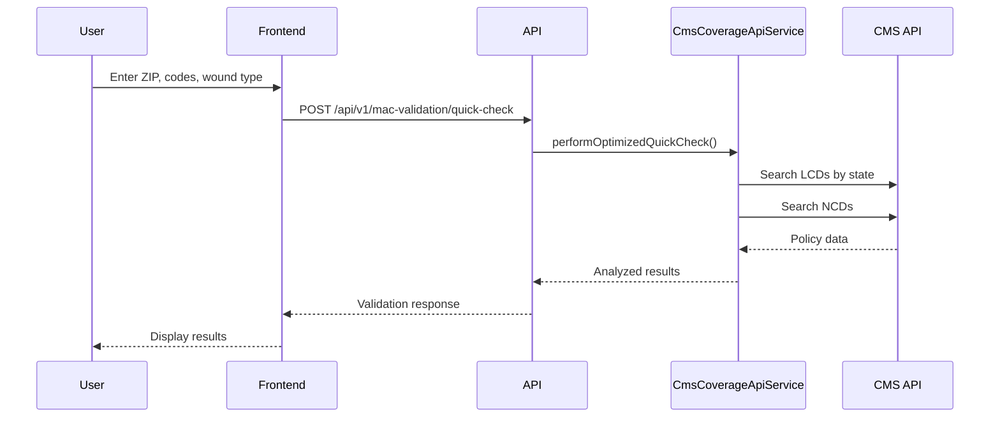

# MAC Validation Complete Workflow Documentation

## System Overview

The MAC (Medicare Administrative Contractor) Validation system provides real-time coverage analysis for wound care services by integrating with the CMS Coverage API.

## Architecture

```
Frontend (React/TypeScript)
    ↓
Inertia.js Bridge
    ↓
Laravel Backend
    ↓
CMS Coverage API Service
    ↓
CMS API (https://api.coverage.cms.gov/v1)
```

## Data Flow

### 1. Quick Check Flow



### 2. Thorough Validation Flow

Similar to Quick Check but includes:
- Enhanced coverage analysis
- Technology assessments
- NCA tracking
- Pricing data
- Clinical requirements
- Documentation requirements

## API Endpoints

### Quick Check
```http
POST /api/v1/mac-validation/quick-check
Content-Type: application/json

{
    "patient_zip": "90210",
    "service_codes": ["Q4151", "97597"],
    "wound_type": "dfu",
    "service_date": "2025-06-05"
}
```

**Response:**
```json
{
    "success": true,
    "data": {
        "validation_id": "uuid",
        "status": "passed",
        "mac_contractor": "Noridian Healthcare Solutions, LLC",
        "mac_jurisdiction": "JF",
        "basic_coverage": true,
        "quick_issues": [],
        "recommendation": "proceed",
        "cms_insights": {
            "service_coverage": [
                {
                    "code": "Q4151",
                    "status": "likely_covered",
                    "requires_prior_auth": false
                }
            ]
        },
        "performance_summary": {
            "policies_analyzed": 4,
            "cms_api_calls": 8,
            "total_response_time_ms": 3500
        }
    }
}
```

### Thorough Validation
```http
POST /api/v1/mac-validation/thorough-validate
Content-Type: application/json

{
    "patient": {
        "address": "123 Main St",
        "city": "Beverly Hills",
        "state": "CA",
        "zip_code": "90210",
        "age": 65,
        "gender": "female"
    },
    "provider": {
        "facility_name": "Wound Care Center",
        "npi": "1234567890",
        "specialty": "wound_care"
    },
    "diagnoses": {
        "primary": "L97.429",
        "secondary": ["E11.9"]
    },
    "wound": {
        "type": "dfu",
        "location": "Right foot",
        "duration_weeks": 8
    },
    "service": {
        "codes": ["Q4151"],
        "date": "2025-06-05"
    }
}
```

## Key Components

### 1. MedicareMacValidationController
- Handles HTTP requests
- Validates input data
- Orchestrates the validation process
- Returns formatted responses

### 2. CmsCoverageApiService
- Manages CMS API integration
- Implements caching strategies
- Handles API failures gracefully
- Provides optimized search methods

### 3. Frontend Components
- `resources/js/Pages/MACValidation/Index.tsx`
- Quick Check form
- Thorough Validation form
- Results display
- Error handling

## MAC Jurisdiction Mapping

The system automatically determines MAC contractors based on ZIP codes:

| State | MAC Contractor | Jurisdiction |
|-------|----------------|--------------|
| CA | Noridian Healthcare Solutions | JF |
| FL | First Coast Service Options | JN |
| TX | Novitas Solutions | JH |
| NY | National Government Services | JK |

## Policy Analysis

The system analyzes:
1. **Local Coverage Determinations (LCDs)** - State-specific policies
2. **National Coverage Determinations (NCDs)** - National policies
3. **Coverage criteria** - Medical necessity requirements
4. **Prior authorization** - Requirements for specific codes
5. **Frequency limitations** - Service frequency caps

## Performance Optimization

1. **Caching**: 60-minute cache for CMS API responses
2. **Parallel API calls**: Multiple endpoints queried simultaneously
3. **Optimized search**: Smart keyword generation for relevant policies
4. **Fallback data**: Sample data when CMS API is unavailable

## Error Handling

1. **CMS API failures**: Graceful fallback to sample data
2. **Invalid inputs**: Detailed validation messages
3. **Network timeouts**: 30-second timeout with retry logic
4. **Rate limiting**: Respects CMS API limits (9000/hour)

## Testing

### End-to-End Test
```bash
php test-mac-validation-e2e.php
```

### API Test
```bash
php test-mac-simple.php
```

### Frontend Test
```bash
php test-frontend-visual.php
```

## Common Use Cases

### 1. Quick Coverage Check
Provider enters minimal data to quickly verify if a service is likely covered.

### 2. Pre-Authorization Check
Detailed validation to determine if prior authorization is required.

### 3. Documentation Requirements
Comprehensive analysis to understand what documentation is needed for reimbursement.

### 4. Multi-Service Validation
Checking coverage for multiple HCPCS/CPT codes simultaneously.

## Troubleshooting

### Issue: "Policies Analyzed: 0"
- **Cause**: CMS API field mapping issues
- **Solution**: Fixed in CmsCoverageApiService.php

### Issue: 502 Bad Gateway
- **Cause**: CMS API temporarily unavailable
- **Solution**: System uses fallback sample data

### Issue: Authentication Required
- **Cause**: Frontend requires user login
- **Solution**: Use authenticated session or API directly

## Future Enhancements

1. **Batch validation** - Process multiple patients at once
2. **PDF reports** - Generate detailed validation reports
3. **Historical tracking** - Store validation history
4. **Advanced analytics** - Coverage trends and insights
5. **Mobile app** - Native mobile interface

## Security Considerations

1. **No PHI storage** - Only ZIP codes and service codes
2. **Rate limiting** - Prevents API abuse
3. **Input validation** - Strict validation rules
4. **HTTPS only** - Encrypted communications
5. **Authentication** - Role-based access control