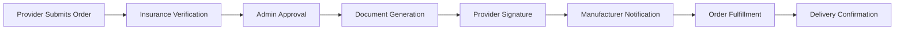

# MSC Wound Care Portal - Platform Overview

**Version:** 1.0  
**Last Updated:** January 2025  
**Status:** Production Ready

---

## 🏥 Platform Overview

The MSC Wound Care Portal is a comprehensive healthcare technology platform designed to streamline wound care product ordering, insurance verification, and provider management. Built with modern web technologies and healthcare compliance in mind, the platform serves as a bridge between healthcare providers, insurance companies, and medical supply manufacturers.

### Key Stakeholders
- **Healthcare Providers**: Order wound care products for patients
- **Office Managers**: Manage facility operations and provider access
- **MSC Representatives**: Facilitate orders and customer relationships
- **MSC Administrators**: Oversee platform operations and compliance
- **Manufacturers**: Receive and fulfill product orders

### Core Value Propositions
- ✅ 90-second product ordering workflow
- ✅ Automated insurance verification
- ✅ HIPAA-compliant data management
- ✅ Real-time order tracking
- ✅ Comprehensive provider credentialing

---

## 🚀 Platform Features

### 1. **Product Request Management**
The cornerstone of the platform, enabling rapid wound care product ordering.

#### Features:
- **Quick Order Form**: Streamlined 90-second workflow
- **Insurance Verification**: Automated eligibility checks
- **Product Catalog**: Comprehensive wound care product database
- **Order Tracking**: Real-time status updates through 8 stages
- **Multi-Manufacturer Support**: Direct routing to appropriate suppliers

#### Order Status Workflow:
```
submitted → approved → ivr_ready → ivr_completed → 
manufacturer_notified → manufacturer_approved → shipped → delivered
```

### 2. **Customer & Organization Management**
Complete healthcare organization lifecycle management.

#### Features:
- **Hierarchical Structure**: Organization → Facility → Provider relationships
- **Multi-Facility Support**: Providers can work across multiple locations
- **Onboarding Automation**: Guided setup with progress tracking
- **Document Management**: Secure credential and compliance document storage
- **NPI Verification**: Automated provider credential validation

### 3. **Insurance Verification & Compliance**
Comprehensive insurance and regulatory compliance management.

#### Features:
- **Real-Time Eligibility**: Availity API integration
- **Medicare MAC Validation**: CMS coverage determination
- **Prior Authorization**: Automated PA workflows
- **Coverage Documentation**: LCD/NCD compliance tracking
- **HIPAA Compliance**: PHI separation via Azure FHIR

### 4. **Document Generation & E-Signatures**
Automated document workflow powered by DocuSeal integration.

#### Features:
- **Auto-Generated Forms**: Insurance verification, order forms, onboarding
- **E-Signature Workflow**: Provider signing with audit trails
- **Manufacturer Organization**: Documents routed by manufacturer
- **Template Management**: Customizable document templates
- **Webhook Integration**: Real-time completion notifications

### 5. **Provider Profile Management**
Comprehensive provider credentialing and profile system.

#### Features:
- **Personal Information**: Contact details and preferences
- **Professional Credentials**: NPI, DEA, medical licenses
- **Insurance Documentation**: Malpractice coverage tracking
- **Facility Assignments**: Multi-location provider support
- **Credential Expiration Alerts**: Proactive renewal notifications

### 6. **Sales & Commission Tracking**
Advanced sales team management and performance tracking.

#### Features:
- **Territory Management**: Geographic and facility-based assignments
- **Commission Calculation**: Automated based on order status
- **Team Hierarchies**: Rep and sub-rep relationships
- **Performance Dashboards**: Real-time metrics and trends
- **Goal Tracking**: Monthly/quarterly targets

### 7. **Clinical Opportunity Engine**
AI-powered insights for improved patient outcomes.

#### Features:
- **Predictive Analytics**: Identify at-risk patients
- **Treatment Recommendations**: Evidence-based suggestions
- **Outcome Tracking**: Monitor healing progress
- **Alert System**: Proactive intervention notifications
- **Performance Metrics**: Facility and provider benchmarking

### 8. **FHIR Integration**
Complete FHIR R4 implementation for healthcare interoperability.

#### Features:
- **Azure Health Data Services**: Secure PHI storage
- **Resource Management**: Patient, Provider, Organization resources
- **Bundle Transactions**: Efficient data exchange
- **Search Capabilities**: Advanced query support
- **MSC Extensions**: Custom wound care data elements

---

## 🏗️ Technical Architecture

### Technology Stack

#### Backend
- **Framework**: Laravel 11 (PHP 8.2+)
- **Database**: MySQL with Eloquent ORM
- **API**: RESTful with Laravel Sanctum authentication
- **Queue**: Redis for background jobs
- **Cache**: Redis for performance optimization

#### Frontend
- **Framework**: React 18 with TypeScript
- **UI Library**: Tailwind CSS with custom components
- **State Management**: React Context + Hooks
- **Build Tool**: Vite for fast development
- **Forms**: React Hook Form with validation

#### Infrastructure
- **Cloud Provider**: Microsoft Azure
- **PHI Storage**: Azure FHIR (Health Data Services)
- **File Storage**: Azure Blob Storage
- **Email Service**: Mailtrap (development), Production TBD
- **Document Service**: DocuSeal for e-signatures

### Security & Compliance

#### HIPAA Compliance
- **PHI Separation**: All PHI stored in Azure FHIR
- **Encryption**: TLS 1.2+ for data in transit
- **Access Control**: Role-based permissions (RBAC)
- **Audit Logging**: Comprehensive activity tracking
- **BAA Agreements**: With all third-party services

#### Authentication & Authorization
- **Multi-Factor Authentication**: Optional 2FA support
- **Session Management**: Secure cookie-based sessions
- **API Security**: Token-based with rate limiting
- **Password Policy**: Strong password requirements
- **Account Lockout**: Brute force protection

### Integration Architecture

#### External Services
1. **Azure FHIR**: PHI storage and management
2. **Availity**: Insurance eligibility verification
3. **CMS API**: Medicare coverage determination
4. **DocuSeal**: Document generation and e-signatures
5. **Azure AI Services**: Intelligent features
6. **Epic/eClinicalWorks**: EHR integration (planned)

#### Webhook Architecture
- **Inbound Webhooks**: DocuSeal completion notifications
- **Outbound Webhooks**: Order status updates to manufacturers
- **Security**: HMAC signature verification
- **Retry Logic**: Exponential backoff for failures

---

## 👥 User Roles & Permissions

### Role Hierarchy

1. **Super Admin**
   - Full system access
   - User management
   - System configuration
   - All features enabled

2. **MSC Admin**
   - Organization management
   - Order oversight
   - Report generation
   - Commission management

3. **MSC Representative**
   - Customer relationship management
   - Order facilitation
   - Commission tracking
   - Territory management

4. **MSC Sub-Representative**
   - Limited territory access
   - Order support
   - Commission visibility (own only)

5. **Office Manager**
   - Facility management
   - Provider oversight
   - Order tracking (no financials)
   - Document management

6. **Healthcare Provider**
   - Patient orders
   - Profile management
   - Document signing
   - Order history

### Permission System
- **Granular Permissions**: 50+ specific permissions
- **Role Templates**: Pre-configured permission sets
- **Custom Roles**: Flexible permission assignment
- **Inheritance**: Hierarchical permission flow

---

## 📊 Key Workflows

### 1. Provider Onboarding Workflow


### 2. Order Processing Workflow


### 3. Commission Tracking Workflow


---

## 🔧 Configuration & Deployment

### Environment Requirements
- **PHP**: 8.2 or higher
- **Node.js**: 18.x or higher
- **MySQL**: 8.0 or higher
- **Redis**: 6.x or higher
- **Composer**: 2.x
- **NPM/Yarn**: Latest stable

### Key Configuration Files
- `.env`: Environment variables
- `config/`: Laravel configuration
- `docker-compose.yml`: Local development
- `package.json`: Frontend dependencies
- `composer.json`: Backend dependencies

### Deployment Checklist
1. ✅ Environment variables configured
2. ✅ Database migrations run
3. ✅ Redis cache cleared
4. ✅ Frontend assets built
5. ✅ Queue workers started
6. ✅ SSL certificates installed
7. ✅ Monitoring configured
8. ✅ Backup strategy implemented

---

## 📈 Performance & Scalability

### Performance Features
- **Database Indexing**: Optimized queries
- **Caching Strategy**: Redis for frequent data
- **Lazy Loading**: Efficient data fetching
- **CDN Integration**: Static asset delivery
- **Queue Processing**: Background job handling

### Scalability Considerations
- **Horizontal Scaling**: Load balanced servers
- **Database Replication**: Read replicas
- **Microservice Ready**: Modular architecture
- **API Rate Limiting**: Traffic management
- **Auto-scaling**: Cloud-based elasticity

---

## 🔍 Monitoring & Analytics

### System Monitoring
- **Application Logs**: Comprehensive logging
- **Error Tracking**: Real-time alerts
- **Performance Metrics**: Response times
- **User Analytics**: Behavior tracking
- **Security Monitoring**: Threat detection

### Business Analytics
- **Order Analytics**: Volume and trends
- **User Engagement**: Activity metrics
- **Commission Reports**: Sales performance
- **Compliance Tracking**: Regulatory metrics
- **ROI Measurement**: Platform effectiveness

---

## 🚀 Future Roadmap

### Phase 1 (Q1 2025)
- ✅ Core platform launch
- ✅ Basic order management
- ✅ Provider onboarding
- ✅ Document automation

### Phase 2 (Q2 2025)
- 🔄 EHR integrations (Epic, eCW)
- 🔄 Advanced analytics
- 🔄 Mobile applications
- 🔄 API marketplace

### Phase 3 (Q3 2025)
- 📋 AI-powered recommendations
- 📋 Predictive analytics
- 📋 Voice ordering
- 📋 International expansion

### Phase 4 (Q4 2025)
- 📋 Blockchain integration
- 📋 IoT device support
- 📋 Advanced ML models
- 📋 Platform white-labeling

---

## 📞 Support & Resources

### Documentation
- **API Documentation**: `/docs/api/`
- **User Guides**: `/docs/guides/`
- **Video Tutorials**: Coming soon
- **Knowledge Base**: In development

### Support Channels
- **Email**: support@mscwoundcare.com
- **Phone**: 1-800-MSC-CARE
- **Chat**: In-app support widget
- **Ticketing**: JIRA integration

### Developer Resources
- **API Sandbox**: `sandbox.mscwoundcare.com`
- **Postman Collection**: Available on request
- **SDK Libraries**: Coming soon
- **Webhook Testing**: Provided tools

---

## 🎯 Success Metrics

### Platform KPIs
- **Order Processing Time**: < 90 seconds
- **System Uptime**: 99.9% SLA
- **User Satisfaction**: > 4.5/5 rating
- **Order Accuracy**: > 99%
- **Document Turnaround**: < 24 hours

### Business Impact
- **Cost Reduction**: 30% operational savings
- **Time Savings**: 70% faster ordering
- **Error Reduction**: 50% fewer mistakes
- **Compliance Rate**: 100% adherence
- **User Adoption**: 80% within 6 months

---

## 📋 Appendices

### A. Glossary
- **IVR**: Insurance Verification Request
- **MAC**: Medicare Administrative Contractor
- **NPI**: National Provider Identifier
- **DEA**: Drug Enforcement Administration
- **PHI**: Protected Health Information
- **FHIR**: Fast Healthcare Interoperability Resources

### B. Compliance Standards
- **HIPAA**: Health Insurance Portability and Accountability Act
- **HITECH**: Health Information Technology for Economic and Clinical Health
- **CMS**: Centers for Medicare & Medicaid Services
- **ONC**: Office of the National Coordinator for Health IT

### C. Technology Partners
- **Microsoft Azure**: Cloud infrastructure
- **DocuSeal**: E-signature platform
- **Availity**: Insurance verification
- **Epic Systems**: EHR integration
- **eClinicalWorks**: EHR integration

---

**© 2025 MSC Wound Care Portal. All rights reserved.**

*This documentation is proprietary and confidential. Unauthorized distribution is prohibited.*
