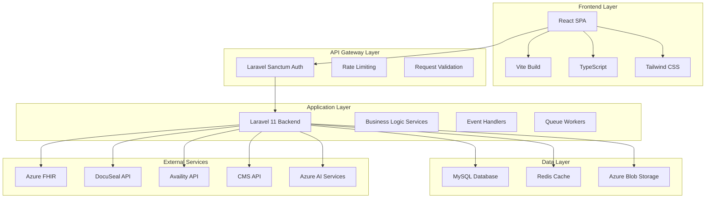
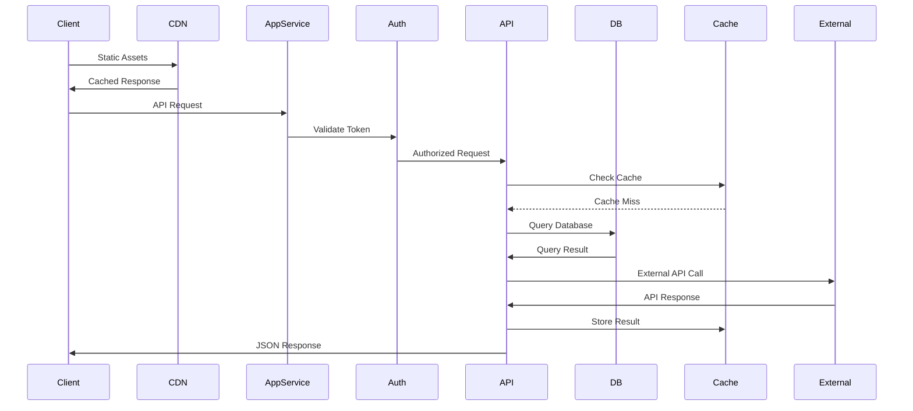
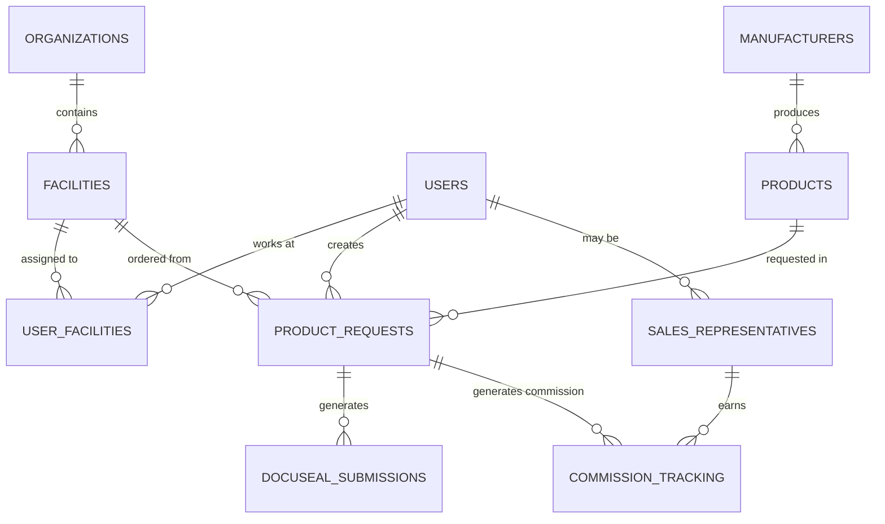
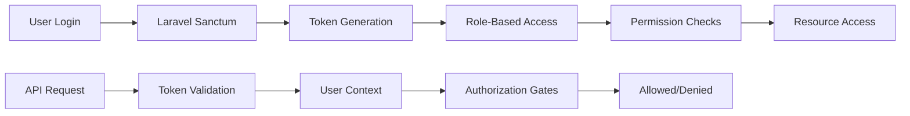
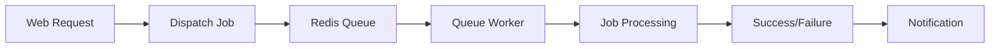
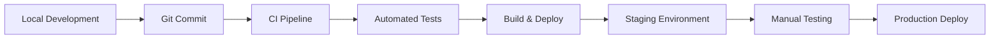

# System Architecture Documentation

**Version:** 1.0  
**Last Updated:** January 2025  
**Status:** Production

---

## 🏗️ High-Level Architecture

The MSC Wound Care Portal follows a modern, cloud-native architecture designed for scalability, security, and healthcare compliance.



## 🔧 Technology Stack

### Frontend Architecture
```yaml
Framework: React 18.2+
Language: TypeScript 5.0+
Styling: Tailwind CSS 3.3+
Build Tool: Vite 4.0+
State Management: React Context + Hooks
Form Handling: React Hook Form
HTTP Client: Axios
Routing: React Router 6+
```

### Backend Architecture
```yaml
Framework: Laravel 11
Language: PHP 8.2+
Database: MySQL 8.0+
Cache: Redis 6.2+
Queue: Redis-backed queues
Authentication: Laravel Sanctum
API: RESTful with JSON responses
File Storage: Azure Blob Storage
```

### Infrastructure
```yaml
Cloud Provider: Microsoft Azure
Compute: Azure App Service
Database: Azure Database for MySQL
Cache: Azure Cache for Redis
Storage: Azure Blob Storage
PHI Storage: Azure Health Data Services (FHIR)
CDN: Azure CDN
DNS: Azure DNS
SSL: Azure-managed certificates
```

## 🔄 Application Flow

### Request Lifecycle


## 🗄️ Database Architecture

### Core Entity Relationships


### Database Design Principles
- **Normalization**: Third normal form (3NF) compliance
- **Indexing**: Strategic indexes for performance
- **Constraints**: Foreign key and check constraints
- **Soft Deletes**: Audit trail preservation
- **Timestamps**: Created/updated tracking
- **UUIDs**: External reference identifiers

## 🔐 Security Architecture

### Authentication & Authorization


### Data Protection Layers
1. **Network Security**: TLS 1.2+ encryption
2. **Application Security**: Input validation, CSRF protection
3. **Database Security**: Encrypted connections, access controls
4. **PHI Security**: Azure FHIR isolation
5. **File Security**: Azure Blob encryption
6. **Audit Logging**: Comprehensive activity tracking

## 📊 Caching Strategy

### Multi-Layer Caching
```yaml
Browser Cache:
  - Static assets (CSS, JS, images)
  - API responses (short TTL)
  
CDN Cache:
  - Global static asset distribution
  - Edge caching for performance
  
Application Cache (Redis):
  - User sessions
  - Database query results
  - External API responses
  - Computed values
  
Database Cache:
  - Query result sets
  - Frequently accessed data
```

### Cache Invalidation
- **Time-based**: TTL expiration
- **Event-based**: Model updates trigger invalidation
- **Manual**: Admin cache clearing
- **Versioned**: Cache key versioning

## 🔄 Queue Architecture

### Background Job Processing


### Queue Types
- **Default**: Standard background jobs
- **High Priority**: Critical operations
- **Email**: Email sending queue
- **Document**: Document generation
- **External API**: Third-party API calls

## 🚀 Scalability Design

### Horizontal Scaling
- **Load Balancing**: Multiple app service instances
- **Database Scaling**: Read replicas for queries
- **Cache Scaling**: Redis cluster mode
- **File Storage**: Distributed blob storage
- **Queue Processing**: Multiple worker instances

### Performance Optimization
- **Database Indexing**: Query optimization
- **Connection Pooling**: Efficient DB connections
- **Lazy Loading**: On-demand data fetching
- **Asset Optimization**: Minified CSS/JS
- **Image Optimization**: Compressed images

## 🔍 Monitoring & Observability

### Application Monitoring
```yaml
Metrics Collection:
  - Response times
  - Error rates
  - Throughput
  - Resource utilization
  
Logging:
  - Application logs
  - Error logs
  - Audit logs
  - Performance logs
  
Alerting:
  - Error thresholds
  - Performance degradation
  - Resource exhaustion
  - Security events
```

### Health Checks
- **Database connectivity**
- **Redis availability**
- **External API status**
- **File storage access**
- **Queue processing**

## 🔧 Development Architecture

### Development Workflow


### Environment Strategy
- **Local**: Docker Compose development
- **Development**: Shared dev environment
- **Staging**: Production-like testing
- **Production**: Live system

## 📈 Future Architecture Plans

### Microservices Evolution
- **API Gateway**: Centralized routing
- **Service Decomposition**: Feature-based services
- **Event-Driven**: Asynchronous communication
- **Container Orchestration**: Kubernetes deployment

### Technology Upgrades
- **PHP 8.3+**: Latest language features
- **React 19**: Concurrent features
- **Database**: PostgreSQL consideration
- **Search**: Elasticsearch integration
- **Real-time**: WebSocket support

---

**Related Documentation:**
- [Database Schema](./DATABASE_SCHEMA.md)
- [API Reference](./API_REFERENCE.md)
- [Security Architecture](./SECURITY_ARCHITECTURE.md)
- [Deployment Guide](../deployment/)
