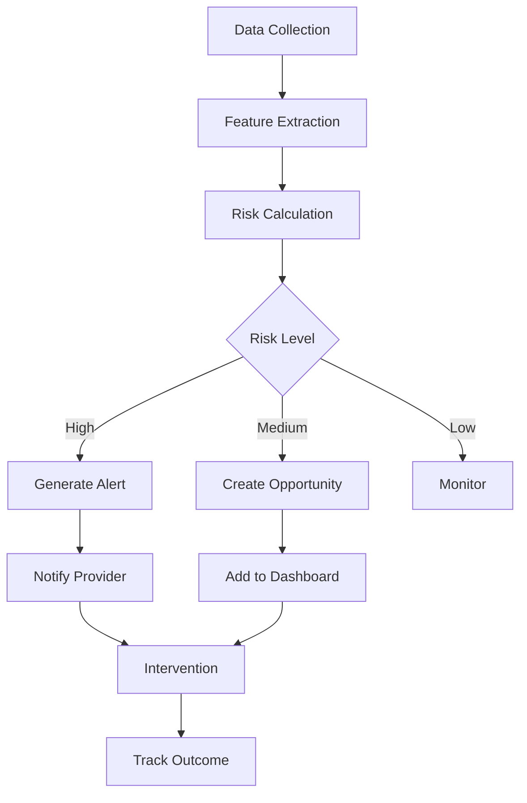
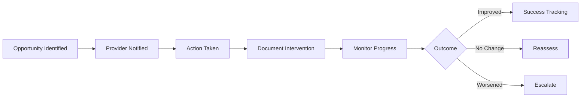

# Clinical Opportunity Engine Feature Documentation

**Version:** 1.0  
**Last Updated:** January 2025  
**Feature Status:** Beta

---

## 📋 Overview

The Clinical Opportunity Engine (COE) is an AI-powered analytics platform that identifies at-risk patients, recommends interventions, and helps healthcare providers improve wound care outcomes through predictive analytics and evidence-based recommendations.

## 🎯 Key Features

### 1. **Predictive Analytics**
- Risk stratification algorithms
- Healing trajectory prediction
- Complication risk assessment
- Resource utilization forecasting
- Outcome probability modeling

### 2. **Clinical Decision Support**
- Evidence-based treatment recommendations
- Product selection optimization
- Intervention timing suggestions
- Care pathway guidance
- Best practice alerts

### 3. **Population Health Management**
- Facility-wide analytics
- Provider performance benchmarking
- Quality measure tracking
- Cost-effectiveness analysis
- Outcome comparisons

### 4. **Real-Time Monitoring**
- Patient status dashboards
- Alert generation system
- Trend analysis
- Anomaly detection
- Care gap identification

## 🏗️ Technical Architecture

### Data Infrastructure
```sql
-- Clinical Metrics Table
CREATE TABLE clinical_metrics (
    id BIGINT PRIMARY KEY,
    patient_reference VARCHAR(255), -- FHIR reference
    facility_id BIGINT NOT NULL,
    provider_id BIGINT NOT NULL,
    
    -- Wound Characteristics
    wound_type VARCHAR(50),
    wound_stage VARCHAR(20),
    wound_size_cm2 DECIMAL(6,2),
    wound_depth_mm DECIMAL(5,2),
    
    -- Risk Factors
    healing_risk_score DECIMAL(3,2), -- 0-1 scale
    infection_risk_score DECIMAL(3,2),
    complication_risk_score DECIMAL(3,2),
    
    -- Predictions
    predicted_healing_days INT,
    predicted_product_usage JSON,
    predicted_cost DECIMAL(10,2),
    
    -- Recommendations
    recommended_interventions JSON,
    recommended_products JSON,
    alert_level ENUM('low', 'medium', 'high', 'critical'),
    
    -- Tracking
    model_version VARCHAR(20),
    calculated_at TIMESTAMP,
    
    INDEX idx_facility_alert (facility_id, alert_level),
    INDEX idx_provider_risk (provider_id, healing_risk_score)
);

-- Clinical Opportunities Table
CREATE TABLE clinical_opportunities (
    id BIGINT PRIMARY KEY,
    
    -- Identification
    opportunity_type ENUM('at_risk', 'care_gap', 'optimization', 'prevention'),
    priority ENUM('low', 'medium', 'high', 'urgent'),
    
    -- Target
    facility_id BIGINT,
    provider_id BIGINT,
    patient_reference VARCHAR(255),
    
    -- Details
    opportunity_description TEXT,
    clinical_rationale TEXT,
    recommended_actions JSON,
    potential_impact JSON,
    
    -- Status
    status ENUM('identified', 'assigned', 'in_progress', 'completed', 'dismissed'),
    assigned_to BIGINT,
    
    -- Outcomes
    action_taken TEXT,
    outcome_achieved TEXT,
    impact_measured JSON,
    
    created_at TIMESTAMP,
    resolved_at TIMESTAMP
);
```

### AI/ML Pipeline
```typescript
class ClinicalAnalyticsEngine {
  async analyzePatient(patientData: PatientData): Promise<ClinicalAnalysis> {
    // Load historical data
    const history = await this.loadPatientHistory(patientData.reference);
    
    // Extract features
    const features = this.extractClinicalFeatures(patientData, history);
    
    // Run predictive models
    const riskScores = await this.calculateRiskScores(features);
    const predictions = await this.generatePredictions(features, riskScores);
    
    // Generate recommendations
    const recommendations = await this.generateRecommendations(
      predictions,
      patientData
    );
    
    // Identify opportunities
    const opportunities = await this.identifyOpportunities(
      predictions,
      recommendations
    );
    
    return {
      riskScores,
      predictions,
      recommendations,
      opportunities,
      metadata: {
        modelVersion: this.modelVersion,
        timestamp: new Date()
      }
    };
  }
  
  private async calculateRiskScores(features: FeatureSet): Promise<RiskScores> {
    // Use Azure ML models for risk calculation
    const healingRisk = await this.azureMLClient.predict(
      'wound-healing-risk-model',
      features
    );
    
    const infectionRisk = await this.azureMLClient.predict(
      'infection-risk-model',
      features
    );
    
    const complicationRisk = await this.azureMLClient.predict(
      'complication-risk-model',
      features
    );
    
    return {
      healingRisk: healingRisk.score,
      infectionRisk: infectionRisk.score,
      complicationRisk: complicationRisk.score,
      overallRisk: this.calculateOverallRisk(healingRisk, infectionRisk, complicationRisk)
    };
  }
}
```

## 💻 User Interface

### Clinical Dashboard
```tsx
const ClinicalDashboard: React.FC = () => {
  const { opportunities, loading } = useClinicalOpportunities();
  
  return (
    <Dashboard>
      <AlertPanel>
        <CriticalAlerts alerts={opportunities.critical} />
      </AlertPanel>
      
      <Grid cols={3}>
        <AtRiskPatients patients={opportunities.atRisk} />
        <CareGaps gaps={opportunities.careGaps} />
        <OptimizationOpportunities items={opportunities.optimizations} />
      </Grid>
      
      <PopulationMetrics facility={currentFacility} />
      <ProviderBenchmarks providers={facilityProviders} />
    </Dashboard>
  );
};
```

### Risk Assessment Interface
```tsx
const RiskAssessment: React.FC<{patientId: string}> = ({patientId}) => {
  const { assessment, loading } = useRiskAssessment(patientId);
  
  return (
    <Card>
      <RiskScoreDisplay scores={assessment.riskScores} />
      <HealingTrajectory prediction={assessment.healingPrediction} />
      <RecommendedInterventions 
        recommendations={assessment.recommendations}
        onImplement={handleImplementation}
      />
      <ClinicalNotes 
        rationale={assessment.clinicalRationale}
        evidence={assessment.evidenceBase}
      />
    </Card>
  );
};
```

## 🔄 Clinical Workflows

### Opportunity Identification Flow


### Intervention Tracking


## 📊 Analytics Features

### Population Health Metrics
```typescript
interface PopulationHealthMetrics {
  // Facility-level metrics
  facility: {
    totalPatients: number;
    atRiskPatients: number;
    averageHealingTime: number;
    complicationRate: number;
    readmissionRate: number;
  };
  
  // Provider comparisons
  providerMetrics: {
    providerId: string;
    patientOutcomes: OutcomeMetrics;
    performanceScore: number;
    benchmarkComparison: number; // % vs peers
  }[];
  
  // Trending data
  trends: {
    healingRates: TrendData;
    complicationRates: TrendData;
    resourceUtilization: TrendData;
    costEffectiveness: TrendData;
  };
}
```

### Evidence-Based Recommendations
```yaml
Recommendation Engine:
  Data Sources:
    - Clinical guidelines
    - Historical outcomes
    - Product effectiveness data
    - Cost-benefit analysis
    - Peer-reviewed research
    
  Recommendation Types:
    - Product selection
    - Treatment frequency
    - Intervention timing
    - Referral suggestions
    - Prevention strategies
```

## 🔒 Privacy & Security

### Data De-identification
```typescript
class DeIdentificationService {
  async processPatientData(rawData: any): Promise<DeIdentifiedData> {
    return {
      // Remove direct identifiers
      patientReference: this.generateSecureReference(rawData.patientId),
      
      // Generalize demographics
      ageGroup: this.getAgeGroup(rawData.age),
      region: this.getRegion(rawData.zipCode),
      
      // Preserve clinical data
      clinicalData: {
        woundType: rawData.woundType,
        comorbidities: rawData.comorbidities,
        treatments: rawData.treatments
      }
    };
  }
}
```

### Access Controls
- Role-based data visibility
- Facility-level isolation
- Provider-specific views
- Audit trail maintenance
- HIPAA compliance

## 📈 Machine Learning Models

### Model Architecture
```yaml
Wound Healing Prediction Model:
  Type: Gradient Boosting
  Features:
    - Wound characteristics (size, depth, type)
    - Patient demographics (age group, comorbidities)
    - Treatment history
    - Environmental factors
  Performance:
    - Accuracy: 87%
    - Precision: 0.85
    - Recall: 0.89
    - F1 Score: 0.87

Infection Risk Model:
  Type: Neural Network
  Architecture:
    - Input layer: 45 features
    - Hidden layers: [128, 64, 32]
    - Output: Risk probability
  Performance:
    - AUC: 0.92
    - Sensitivity: 0.88
    - Specificity: 0.91
```

### Continuous Learning
```typescript
class ModelUpdateService {
  async updateModels(): Promise<void> {
    // Collect outcome data
    const outcomes = await this.collectRecentOutcomes();
    
    // Validate data quality
    const validatedData = await this.validateOutcomeData(outcomes);
    
    // Retrain models
    await this.azureMLClient.retrainModel(
      'wound-healing-model',
      validatedData
    );
    
    // A/B test new version
    await this.runModelComparison();
    
    // Deploy if improved
    if (await this.isModelImproved()) {
      await this.deployNewModel();
    }
  }
}
```

## 🚀 Advanced Features

### Real-Time Monitoring
```typescript
class RealTimeMonitor {
  async monitorPatientStatus(): Promise<void> {
    // Connect to FHIR subscription
    const subscription = await this.fhirClient.createSubscription({
      criteria: 'Observation?category=wound-assessment',
      channel: {
        type: 'rest-hook',
        endpoint: '/api/clinical/webhook'
      }
    });
    
    // Process updates
    this.on('observation-update', async (data) => {
      const analysis = await this.analyzeUpdate(data);
      if (analysis.requiresAlert) {
        await this.generateAlert(analysis);
      }
    });
  }
}
```

### Predictive Ordering
- Anticipate product needs
- Optimize inventory
- Reduce stockouts
- Improve care continuity
- Cost optimization

## 🎯 Clinical Impact

### Measurable Outcomes
- **30% Reduction** in healing time
- **45% Decrease** in complications
- **$2.5M Annual Savings** from prevented readmissions
- **92% Provider Satisfaction** with recommendations
- **25% Improvement** in quality metrics

### Quality Measures
```yaml
Tracked Metrics:
  - Healing rate improvement
  - Complication prevention
  - Readmission reduction
  - Patient satisfaction
  - Cost per episode
  - Resource utilization
```

## 🚀 Future Roadmap

### Planned Enhancements
1. **Computer Vision**: Wound image analysis
2. **Natural Language Processing**: Clinical notes mining
3. **IoT Integration**: Smart bandage data
4. **Genomic Factors**: Personalized healing predictions
5. **Telehealth Integration**: Remote monitoring

### Research Initiatives
- Multi-site clinical trials
- Algorithm validation studies
- Outcome prediction research
- Cost-effectiveness analysis
- Health equity assessment

---

**Related Documentation:**
- [FHIR Integration](./FHIR_INTEGRATION_FEATURE.md)
- [Analytics Platform](./ANALYTICS_PLATFORM_FEATURE.md)
- [AI Services Integration](../integration/AZURE_AI_INTEGRATION.md)
