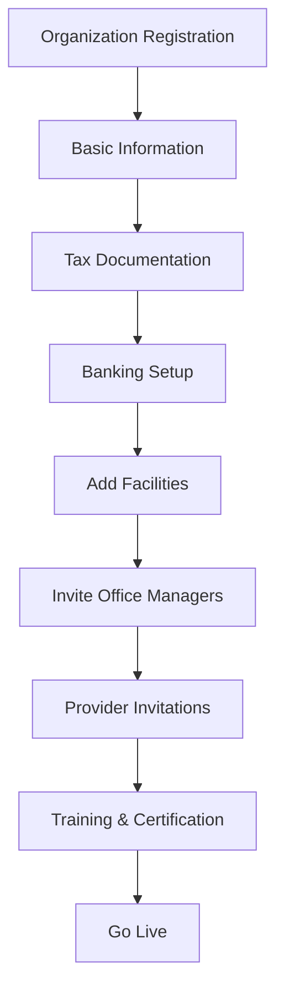

# Customer & Organization Management Feature Documentation

**Version:** 1.0  
**Last Updated:** January 2025  
**Feature Status:** Production Ready

---

## 📋 Overview

The Customer & Organization Management system provides comprehensive tools for managing the hierarchical structure of healthcare organizations, facilities, and providers. This feature supports complex healthcare networks while maintaining simple workflows for individual practices.

## 🎯 Key Features

### 1. **Hierarchical Organization Structure**
```
Organization (Health System)
  └── Facilities (Hospitals/Clinics)
      └── Providers (Doctors/Nurses)
          └── Provider-Facility Relationships
```

### 2. **Flexible Provider Assignment**
- Providers can work at multiple facilities
- Primary facility designation
- Cross-organization support
- Credential sharing across locations

### 3. **Automated Onboarding**
- Guided setup wizards
- Progress tracking
- Document collection
- Compliance verification
- Training integration

### 4. **Multi-level Management**
- Organization administrators
- Facility office managers
- Provider self-service
- MSC admin oversight

## 🏗️ Technical Architecture

### Database Schema
```sql
-- Organizations Table
CREATE TABLE organizations (
    id BIGINT PRIMARY KEY,
    uuid VARCHAR(36) UNIQUE,
    name VARCHAR(255) NOT NULL,
    tax_id VARCHAR(20),
    organization_type ENUM('hospital_system', 'group_practice', 'individual'),
    
    -- Contact Information
    primary_contact_name VARCHAR(255),
    primary_contact_email VARCHAR(255),
    primary_contact_phone VARCHAR(20),
    
    -- Status
    status ENUM('pending', 'active', 'suspended', 'inactive'),
    onboarding_status ENUM('initiated', 'in_progress', 'completed'),
    
    -- Relationships
    msc_representative_id BIGINT,
    parent_organization_id BIGINT,
    
    -- Timestamps
    created_at TIMESTAMP,
    updated_at TIMESTAMP,
    activated_at TIMESTAMP
);

-- Facilities Table
CREATE TABLE facilities (
    id BIGINT PRIMARY KEY,
    uuid VARCHAR(36) UNIQUE,
    organization_id BIGINT NOT NULL,
    
    -- Facility Information
    name VARCHAR(255) NOT NULL,
    npi VARCHAR(10),
    ptan VARCHAR(255),
    facility_type ENUM('hospital', 'clinic', 'wound_center', 'snf'),
    
    -- Address
    address VARCHAR(255),
    city VARCHAR(100),
    state VARCHAR(2),
    zip_code VARCHAR(10),
    
    -- Contact
    phone VARCHAR(20),
    email VARCHAR(255),
    office_manager_id BIGINT,
    
    -- Medicare Information
    mac_jurisdiction VARCHAR(10),
    place_of_service VARCHAR(2) DEFAULT '11',
    
    -- Status
    active BOOLEAN DEFAULT TRUE,
    created_at TIMESTAMP,
    updated_at TIMESTAMP
);

-- User-Facility Relationships
CREATE TABLE user_facilities (
    id BIGINT PRIMARY KEY,
    user_id BIGINT NOT NULL,
    facility_id BIGINT NOT NULL,
    is_primary BOOLEAN DEFAULT FALSE,
    start_date DATE,
    end_date DATE,
    status ENUM('active', 'inactive', 'pending'),
    created_at TIMESTAMP,
    UNIQUE KEY unique_primary (user_id, is_primary)
);
```

### API Endpoints
```yaml
# Organization Management
POST   /api/v1/admin/organizations           # Create organization
GET    /api/v1/admin/organizations           # List organizations
GET    /api/v1/admin/organizations/{id}      # Get organization details
PUT    /api/v1/admin/organizations/{id}      # Update organization
GET    /api/v1/admin/organizations/{id}/hierarchy  # Get full hierarchy

# Facility Management
POST   /api/v1/admin/organizations/{id}/facilities  # Add facility
GET    /api/v1/admin/facilities              # List all facilities
GET    /api/v1/admin/facilities/{id}         # Get facility details
PUT    /api/v1/admin/facilities/{id}         # Update facility
GET    /api/v1/admin/facilities/{id}/providers     # List facility providers

# Provider Management
POST   /api/v1/admin/providers/invite        # Invite provider
GET    /api/v1/admin/providers               # List providers
GET    /api/v1/admin/providers/{id}/facilities    # Get provider facilities
POST   /api/v1/admin/providers/{id}/assign-facility  # Assign to facility
```

## 💻 User Interface

### Organization Dashboard
```typescript
interface OrganizationDashboard {
  overview: {
    totalFacilities: number;
    totalProviders: number;
    activeOrders: number;
    complianceScore: number;
  };
  
  facilities: FacilityCard[];
  recentActivity: ActivityLog[];
  onboardingProgress: OnboardingStatus;
}
```

### Facility Management Interface
```tsx
const FacilityManager: React.FC = () => {
  return (
    <div className="facility-manager">
      <FacilityList />
      <ProviderRoster />
      <ComplianceTracker />
      <OrderHistory />
    </div>
  );
};
```

## 🔄 Onboarding Workflow

### Organization Onboarding Steps


### Provider Onboarding Checklist
- ✅ Personal information
- ✅ NPI verification
- ✅ Medical license upload
- ✅ DEA registration (if applicable)
- ✅ Malpractice insurance
- ✅ Facility assignment
- ✅ System training
- ✅ First order submission

## 📊 Management Features

### Organization Analytics
```yaml
Metrics:
  - Total order volume
  - Provider activity rates
  - Facility utilization
  - Compliance scores
  - Revenue tracking
  - Growth trends
```

### Compliance Monitoring
- License expiration tracking
- Insurance renewal alerts
- Credential verification status
- Training completion rates
- Document compliance scores

## 🔒 Security & Access Control

### Role-Based Permissions
```typescript
const organizationPermissions = {
  'organization_admin': [
    'manage-facilities',
    'invite-providers',
    'view-all-orders',
    'manage-billing',
    'view-analytics'
  ],
  'office_manager': [
    'manage-providers',
    'view-facility-orders',
    'update-facility-info',
    'run-reports'
  ],
  'provider': [
    'view-own-profile',
    'update-credentials',
    'select-facilities',
    'place-orders'
  ]
};
```

### Data Isolation
- Organization-level data separation
- Facility-specific access controls
- Provider privacy protection
- Audit trail maintenance

## 🚀 Advanced Features

### Multi-Organization Support
```sql
-- Providers working across organizations
SELECT DISTINCT o.name as organization_name,
       f.name as facility_name,
       uf.is_primary
FROM user_facilities uf
JOIN facilities f ON f.id = uf.facility_id
JOIN organizations o ON o.id = f.organization_id
WHERE uf.user_id = ? AND uf.status = 'active';
```

### Automated Compliance
- Real-time NPI verification
- License lookup integration
- Insurance verification
- Automated renewal reminders

## 🎯 Business Benefits

### For Healthcare Organizations
- Streamlined provider management
- Centralized compliance tracking
- Multi-facility coordination
- Simplified onboarding

### For MSC
- Scalable customer management
- Automated onboarding
- Compliance assurance
- Relationship tracking

## 🚀 Future Enhancements

### Planned Features
1. **AI-Powered Insights**: Predictive analytics for organizations
2. **Mobile Management**: Native apps for administrators
3. **Advanced Reporting**: Custom report builder
4. **Integration Hub**: Third-party system connections
5. **Automated Workflows**: Custom automation rules

---

**Related Documentation:**
- [Provider Profile Feature](./PROVIDER_PROFILE_FEATURE.md)
- [Onboarding System](./ONBOARDING_FEATURE.md)
- [Compliance Management](../compliance/COMPLIANCE_FEATURE.md)
