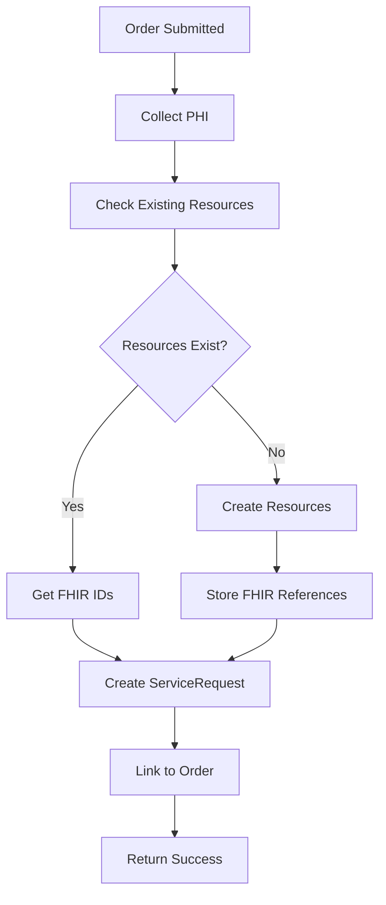
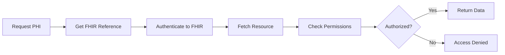

# FHIR Integration Feature Documentation

**Version:** 1.0  
**Last Updated:** January 2025  
**Feature Status:** Production Ready

---

## 📋 Overview

The FHIR Integration feature provides comprehensive healthcare data interoperability using the HL7 FHIR R4 standard, integrated with Azure Health Data Services (formerly Azure API for FHIR). This enables secure storage and exchange of Protected Health Information (PHI) while maintaining HIPAA compliance.

## 🎯 Key Features

### 1. **PHI Data Separation**
- Complete isolation of PHI from application database
- FHIR-compliant resource storage
- Reference-based architecture
- Secure data access patterns

### 2. **Resource Management**
- Patient resource handling
- Provider/Practitioner management
- Organization hierarchies
- Coverage (Insurance) resources
- ServiceRequest (Orders) tracking

### 3. **Bundle Transactions**
- Atomic multi-resource operations
- Episode of care creation
- Batch processing support
- Transaction rollback capability

### 4. **Advanced Search**
- FHIR search parameters
- Chained searches
- Include/revinclude support
- Custom search parameters

## 🏗️ Technical Architecture

### FHIR Resource Mapping
```typescript
// Patient Resource
interface FHIRPatient {
  resourceType: 'Patient';
  id?: string;
  identifier: [{
    system: 'https://mscwoundcare.com/patient-id';
    value: string; // Internal patient ID
  }];
  name: [{
    use: 'official';
    family: string;
    given: string[];
  }];
  gender: 'male' | 'female' | 'other' | 'unknown';
  birthDate: string; // YYYY-MM-DD
  address?: Address[];
  telecom?: ContactPoint[];
}

// ServiceRequest (Order) Resource
interface FHIRServiceRequest {
  resourceType: 'ServiceRequest';
  id?: string;
  identifier: [{
    system: 'https://mscwoundcare.com/order-id';
    value: string; // Order UUID
  }];
  status: 'draft' | 'active' | 'completed' | 'cancelled';
  intent: 'order';
  category: [{
    coding: [{
      system: 'http://snomed.info/sct';
      code: '225358003';
      display: 'Wound care';
    }];
  }];
  code: {
    coding: [{
      system: 'https://www.cms.gov/Medicare/Coding/HCPCSReleaseCodeSets';
      code: string; // HCPCS code
      display: string;
    }];
  };
  subject: Reference; // Patient reference
  requester: Reference; // Practitioner reference
  performer: Reference[]; // Organization reference
  occurrenceDateTime: string;
}
```

### Service Implementation
```typescript
class FHIRService {
  private client: FHIRClient;
  
  constructor() {
    this.client = new FHIRClient({
      baseUrl: process.env.AZURE_FHIR_BASE_URL,
      auth: {
        clientId: process.env.AZURE_FHIR_CLIENT_ID,
        clientSecret: process.env.AZURE_FHIR_CLIENT_SECRET,
        tokenEndpoint: `${process.env.AZURE_FHIR_AUTHORITY}/oauth2/v2.0/token`,
        scope: process.env.AZURE_FHIR_SCOPE
      }
    });
  }
  
  async createEpisodeOfCare(orderData: OrderData): Promise<Bundle> {
    const bundle: Bundle = {
      resourceType: 'Bundle',
      type: 'transaction',
      entry: []
    };
    
    // 1. Create/Update Patient
    const patient = this.buildPatientResource(orderData.patient);
    bundle.entry.push({
      resource: patient,
      request: {
        method: 'PUT',
        url: `Patient?identifier=${patient.identifier[0].value}`
      }
    });
    
    // 2. Create/Update Practitioner
    const practitioner = this.buildPractitionerResource(orderData.provider);
    bundle.entry.push({
      resource: practitioner,
      request: {
        method: 'PUT',
        url: `Practitioner?identifier=${practitioner.identifier[0].value}`
      }
    });
    
    // 3. Create ServiceRequest
    const serviceRequest = this.buildServiceRequest(orderData);
    bundle.entry.push({
      resource: serviceRequest,
      request: {
        method: 'POST',
        url: 'ServiceRequest'
      }
    });
    
    // 4. Create Coverage if insurance provided
    if (orderData.insurance) {
      const coverage = this.buildCoverageResource(orderData.insurance);
      bundle.entry.push({
        resource: coverage,
        request: {
          method: 'POST',
          url: 'Coverage'
        }
      });
    }
    
    // Execute bundle transaction
    return await this.client.transaction(bundle);
  }
  
  async searchPatients(criteria: SearchCriteria): Promise<Bundle> {
    const params = new URLSearchParams();
    
    if (criteria.name) {
      params.append('name', criteria.name);
    }
    if (criteria.birthdate) {
      params.append('birthdate', criteria.birthdate);
    }
    if (criteria.identifier) {
      params.append('identifier', criteria.identifier);
    }
    
    return await this.client.search('Patient', params);
  }
}
```

## 💻 Implementation Details

### Resource Handlers
```typescript
// Patient Handler
class PatientHandler {
  async createOrUpdate(patientData: any): Promise<string> {
    const existing = await this.findByIdentifier(patientData.identifier);
    
    const patient: Patient = {
      resourceType: 'Patient',
      identifier: [{
        system: 'https://mscwoundcare.com/patient-id',
        value: patientData.identifier
      }],
      name: [{
        use: 'official',
        family: patientData.lastName,
        given: [patientData.firstName]
      }],
      gender: patientData.gender,
      birthDate: patientData.birthDate,
      address: patientData.address ? [{
        use: 'home',
        line: [patientData.address.street],
        city: patientData.address.city,
        state: patientData.address.state,
        postalCode: patientData.address.zip
      }] : undefined
    };
    
    if (existing) {
      patient.id = existing.id;
      const updated = await this.fhirClient.update(patient);
      return updated.id;
    } else {
      const created = await this.fhirClient.create(patient);
      return created.id;
    }
  }
}

// Order Handler
class OrderHandler {
  async createServiceRequest(order: Order): Promise<string> {
    const serviceRequest: ServiceRequest = {
      resourceType: 'ServiceRequest',
      identifier: [{
        system: 'https://mscwoundcare.com/order-id',
        value: order.uuid
      }],
      status: this.mapOrderStatus(order.status),
      intent: 'order',
      category: [{
        coding: [{
          system: 'http://snomed.info/sct',
          code: '225358003',
          display: 'Wound care'
        }]
      }],
      code: {
        coding: [{
          system: 'https://www.cms.gov/Medicare/Coding/HCPCSReleaseCodeSets',
          code: order.product.hcpcsCode,
          display: order.product.name
        }]
      },
      subject: {
        reference: `Patient/${order.patientFhirId}`
      },
      requester: {
        reference: `Practitioner/${order.providerFhirId}`
      },
      performer: [{
        reference: `Organization/${order.facilityFhirId}`
      }],
      occurrenceDateTime: order.serviceDate.toISOString(),
      note: order.notes ? [{
        text: order.notes
      }] : undefined
    };
    
    const created = await this.fhirClient.create(serviceRequest);
    return created.id;
  }
}
```

### Database Integration
```sql
-- FHIR Reference Storage
CREATE TABLE fhir_references (
    id BIGINT PRIMARY KEY,
    entity_type VARCHAR(50) NOT NULL, -- 'user', 'facility', 'order', etc.
    entity_id BIGINT NOT NULL,
    fhir_resource_type VARCHAR(50) NOT NULL, -- 'Patient', 'Practitioner', etc.
    fhir_resource_id VARCHAR(255) NOT NULL,
    fhir_version_id VARCHAR(50),
    
    created_at TIMESTAMP,
    updated_at TIMESTAMP,
    
    UNIQUE KEY unique_entity (entity_type, entity_id),
    INDEX idx_fhir_resource (fhir_resource_type, fhir_resource_id)
);
```

## 🔄 Integration Workflows

### Order Creation with FHIR


### PHI Retrieval Flow


## 📊 Search Capabilities

### Advanced Search Examples
```typescript
// Search patients by name and birthdate
const patients = await fhirService.search('Patient', {
  name: 'Smith',
  birthdate: 'ge1990-01-01', // Greater than or equal
  _count: 10,
  _sort: '-_lastUpdated'
});

// Search orders with includes
const orders = await fhirService.search('ServiceRequest', {
  patient: 'Patient/123',
  _include: ['ServiceRequest:patient', 'ServiceRequest:requester'],
  status: 'active,completed',
  date: 'ge2024-01-01'
});

// Chained search - Orders for patients in a specific city
const cityOrders = await fhirService.search('ServiceRequest', {
  'patient.address-city': 'Boston',
  _count: 50
});
```

### Custom Search Parameters
```yaml
Custom Parameters:
  - MSC Episode ID: Links all resources in an episode
  - Wound Type: Clinical categorization
  - Insurance Status: Coverage verification state
  - Provider Specialty: Practitioner taxonomy
```

## 🔒 Security & Compliance

### Authentication Flow
```typescript
class FHIRAuthService {
  private tokenCache: TokenCache;
  
  async getAccessToken(): Promise<string> {
    // Check cache first
    const cached = await this.tokenCache.get('fhir_token');
    if (cached && !this.isExpired(cached)) {
      return cached.access_token;
    }
    
    // Get new token
    const response = await axios.post(
      `${process.env.AZURE_FHIR_AUTHORITY}/oauth2/v2.0/token`,
      new URLSearchParams({
        client_id: process.env.AZURE_FHIR_CLIENT_ID,
        client_secret: process.env.AZURE_FHIR_CLIENT_SECRET,
        scope: process.env.AZURE_FHIR_SCOPE,
        grant_type: 'client_credentials'
      })
    );
    
    // Cache token
    await this.tokenCache.set('fhir_token', response.data, {
      ttl: response.data.expires_in - 300 // 5 min buffer
    });
    
    return response.data.access_token;
  }
}
```

### Audit Logging
```yaml
Logged Events:
  - Resource creation
  - Resource updates
  - Search queries
  - Access attempts
  - Permission checks
  - Bundle transactions
```

## 📈 Performance Optimization

### Caching Strategy
```typescript
class FHIRCacheService {
  async getResource(type: string, id: string): Promise<any> {
    const cacheKey = `fhir:${type}:${id}`;
    
    // Check cache
    const cached = await this.cache.get(cacheKey);
    if (cached) return cached;
    
    // Fetch from FHIR
    const resource = await this.fhirClient.read(type, id);
    
    // Cache based on resource type
    const ttl = this.getTTLForResourceType(type);
    await this.cache.set(cacheKey, resource, { ttl });
    
    return resource;
  }
  
  private getTTLForResourceType(type: string): number {
    const ttlMap = {
      'Patient': 3600,        // 1 hour
      'Practitioner': 86400,  // 24 hours
      'Organization': 86400,  // 24 hours
      'ServiceRequest': 300,  // 5 minutes
      'Coverage': 1800        // 30 minutes
    };
    return ttlMap[type] || 600; // Default 10 minutes
  }
}
```

### Batch Operations
- Bundle transactions for efficiency
- Batch resource creation
- Bulk updates
- Parallel processing
- Connection pooling

## 🚀 Advanced Features

### FHIR Subscriptions
```typescript
class FHIRSubscriptionService {
  async createOrderStatusSubscription(): Promise<void> {
    const subscription = {
      resourceType: 'Subscription',
      status: 'active',
      criteria: 'ServiceRequest?status=completed',
      channel: {
        type: 'rest-hook',
        endpoint: 'https://api.mscwoundcare.com/webhooks/fhir/order-completed',
        header: [`Authorization: Bearer ${this.webhookToken}`]
      }
    };
    
    await this.fhirClient.create(subscription);
  }
}
```

### Data Migration
- Bulk import capabilities
- Historical data conversion
- Resource validation
- Referential integrity
- Progress tracking

## 🎯 Business Benefits

### Compliance & Security
- **HIPAA Compliance**: PHI properly isolated
- **Audit Trail**: Complete access logging
- **Data Integrity**: FHIR validation
- **Interoperability**: Standards-based
- **Scalability**: Cloud-native architecture

### Operational Benefits
- Simplified PHI management
- Reduced compliance risk
- Enhanced data sharing
- Future-proof architecture
- Ecosystem integration

## 🚀 Future Enhancements

### Planned Features
1. **SMART on FHIR**: App platform integration
2. **Bulk Export**: Large-scale data extraction
3. **CDS Hooks**: Clinical decision support
4. **US Core Profiles**: Enhanced compliance
5. **Real-time Sync**: Bi-directional updates

---

**Related Documentation:**
- [Azure FHIR Setup](../infrastructure/AZURE_FHIR_SETUP.md)
- [PHI Management](../security/PHI_MANAGEMENT.md)
- [API Documentation](../api/FHIR_API_REFERENCE.md)
