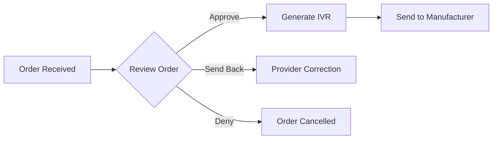

# Product Request Management Feature Documentation

**Version:** 1.0  
**Last Updated:** January 2025  
**Feature Status:** Production Ready

---

## 📋 Overview

The Product Request Management system is the cornerstone of the MSC Wound Care Portal, enabling healthcare providers to order wound care products in under 90 seconds. This feature streamlines the entire ordering process from initial request through delivery confirmation.

## 🎯 Key Features

### 1. **90-Second Order Workflow**
- Streamlined form with smart defaults
- Auto-population from provider profile
- Product search with predictive text
- Size selection with visual aids
- One-click submission

### 2. **Intelligent Product Selection**
- Comprehensive product catalog
- Manufacturer filtering
- HCPCS code search
- Product comparison tools
- Wound type matching

### 3. **Real-Time Status Tracking**
Eight distinct status stages with visual indicators:
```
submitted → processing → approved → pending_ivr → 
ivr_sent → manufacturer_approved → submitted_to_manufacturer → 
shipped → delivered
```

### 4. **Insurance Integration**
- Automatic eligibility verification
- Prior authorization detection
- Coverage determination
- Documentation requirements
- Medicare MAC validation

## 🏗️ Technical Architecture

### Database Schema
```sql
-- Product Requests Table
CREATE TABLE product_requests (
    id BIGINT PRIMARY KEY,
    uuid VARCHAR(36) UNIQUE,
    request_number VARCHAR(20) UNIQUE,
    user_id BIGINT NOT NULL,
    facility_id BIGINT NOT NULL,
    organization_id BIGINT NOT NULL,
    
    -- Product Information
    product_id BIGINT NOT NULL,
    manufacturer_id BIGINT NOT NULL,
    quantity INT DEFAULT 1,
    sizes JSON,
    
    -- Status Tracking
    status ENUM(...) DEFAULT 'submitted',
    status_updated_at TIMESTAMP,
    status_updated_by BIGINT,
    
    -- Insurance Information
    insurance_verified BOOLEAN DEFAULT FALSE,
    prior_auth_required BOOLEAN DEFAULT FALSE,
    coverage_determination JSON,
    
    -- Document Management
    docuseal_submission_id VARCHAR(255),
    ivr_document_url VARCHAR(255),
    
    -- Timestamps
    created_at TIMESTAMP,
    updated_at TIMESTAMP,
    delivered_at TIMESTAMP
);
```

### API Endpoints
```yaml
POST   /api/v1/product-requests              # Create new request
GET    /api/v1/product-requests              # List requests
GET    /api/v1/product-requests/{id}         # Get request details
PUT    /api/v1/product-requests/{id}/status  # Update status
POST   /api/v1/product-requests/{id}/verify  # Verify insurance
GET    /api/v1/product-requests/{id}/track   # Track shipment
```

## 💻 User Interface

### Provider Order Form
```typescript
interface OrderFormData {
  // Auto-populated fields
  providerId: string;
  facilityId: string;
  organizationId: string;
  
  // Product selection
  productId: string;
  manufacturerId: string;
  quantity: number;
  sizes: string[];
  
  // Clinical information
  woundType: string;
  woundLocation: string;
  serviceDate: Date;
  
  // Insurance (if available)
  insurancePlan?: string;
  memberId?: string;
}
```

### Status Display Component
```tsx
const OrderStatus: React.FC<{status: OrderStatus}> = ({status}) => {
  const statusConfig = {
    submitted: { color: 'blue', icon: 'clock', text: 'Submitted' },
    processing: { color: 'yellow', icon: 'gear', text: 'Processing' },
    approved: { color: 'green', icon: 'check', text: 'Approved' },
    // ... other statuses
  };
  
  return (
    <Badge color={statusConfig[status].color}>
      <Icon name={statusConfig[status].icon} />
      {statusConfig[status].text}
    </Badge>
  );
};
```

## 🔄 Workflow Integration

### 1. **Order Submission Flow**


### 2. **Admin Processing Flow**


### 3. **Fulfillment Flow**


## 📊 Performance Metrics

### Key Performance Indicators
- **Average Order Time**: < 90 seconds
- **Auto-fill Accuracy**: > 95%
- **First-time Approval Rate**: > 80%
- **Insurance Verification Speed**: < 3 seconds
- **End-to-end Fulfillment**: < 5 days

### Monitoring Dashboard
```yaml
Metrics Tracked:
  - Orders per hour/day/week
  - Status distribution
  - Average processing time
  - Manufacturer response time
  - Delivery success rate
```

## 🔒 Security & Compliance

### Access Control
- Role-based permissions for order management
- Provider can only view own orders
- Office managers see facility orders
- Admins have full visibility

### Data Protection
- PHI stored in Azure FHIR
- Encrypted data transmission
- Audit logging for all actions
- HIPAA-compliant workflows

## 🚀 Future Enhancements

### Planned Features
1. **Bulk Ordering**: Multiple products in single request
2. **Recurring Orders**: Automated reordering
3. **Mobile App**: Native mobile ordering
4. **Voice Ordering**: AI-powered voice interface
5. **Predictive Ordering**: ML-based suggestions

### Integration Roadmap
- Epic MyChart integration
- Direct manufacturer APIs
- Real-time inventory checking
- Automated prior authorization

---

**Related Documentation:**
- [Insurance Verification Feature](./INSURANCE_VERIFICATION_FEATURE.md)
- [Document Generation Feature](./DOCUMENT_GENERATION_FEATURE.md)
- [Admin Order Center](./ADMIN_ORDER_CENTER_FEATURE.md)
