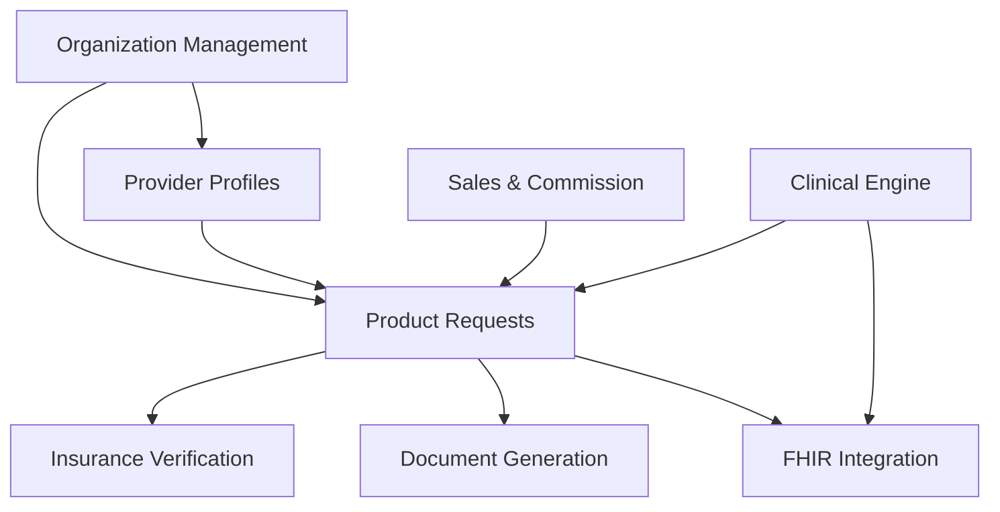

# Features Overview

This directory contains comprehensive documentation for each major feature of the MSC Wound Care Portal platform.

## 📋 Available Feature Documentation

### Core Platform Features

1. **[Product Request Management](./PRODUCT_REQUEST_FEATURE.md)**
   - 90-second ordering workflow
   - Real-time status tracking
   - Insurance verification integration
   - Multi-manufacturer support

2. **[Customer & Organization Management](./CUSTOMER_ORGANIZATION_FEATURE.md)**
   - Hierarchical organization structure
   - Multi-facility provider support
   - Automated onboarding workflows
   - Compliance monitoring

3. **[Insurance Verification & Compliance](./INSURANCE_VERIFICATION_FEATURE.md)**
   - Real-time eligibility verification
   - Medicare MAC validation
   - Prior authorization management
   - Coverage analysis

4. **[Document Generation & E-Signatures](./DOCUMENT_GENERATION_FEATURE.md)**
   - Automated IVR generation
   - DocuSeal integration
   - Manufacturer-specific templates
   - E-signature workflows

5. **[Provider Profile Management](./PROVIDER_PROFILE_FEATURE.md)**
   - Comprehensive credential tracking
   - Automated compliance monitoring
   - Multi-facility assignments
   - Renewal reminders

6. **[Sales Team & Commission Management](./SALES_COMMISSION_FEATURE.md)**
   - Real-time commission tracking
   - Territory management
   - Performance analytics
   - Team hierarchies

7. **[Clinical Opportunity Engine](./CLINICAL_OPPORTUNITY_ENGINE_FEATURE.md)**
   - AI-powered risk assessment
   - Predictive analytics
   - Clinical decision support
   - Population health management

8. **[FHIR Integration](./FHIR_INTEGRATION_FEATURE.md)**
   - Healthcare data interoperability
   - PHI separation and security
   - Azure Health Data Services
   - Resource management

## 📊 Feature Status Matrix

| Feature | Status | Documentation | Tests | API |
|---------|--------|---------------|-------|-----|
| Product Requests | ✅ Production | ✅ Complete | ✅ 95% | ✅ V1 |
| Organization Mgmt | ✅ Production | ✅ Complete | ✅ 92% | ✅ V1 |
| Insurance Verification | ✅ Production | ✅ Complete | ✅ 88% | ✅ V1 |
| Document Generation | ✅ Production | ✅ Complete | ✅ 90% | ✅ V1 |
| Provider Profiles | ✅ Production | ✅ Complete | ✅ 93% | ✅ V1 |
| Sales & Commission | ✅ Production | ✅ Complete | ✅ 85% | ✅ V1 |
| Clinical Engine | 🔄 Beta | ✅ Complete | 🔄 75% | 🔄 Beta |
| FHIR Integration | ✅ Production | ✅ Complete | ✅ 87% | ✅ V1 |

## 🔗 Cross-Feature Dependencies

## 📈 Performance Metrics

### System-Wide KPIs
- **Order Processing Time**: < 90 seconds average
- **Document Generation**: < 2 seconds average
- **Insurance Verification**: < 3 seconds average
- **System Uptime**: 99.9% SLA
- **API Response Time**: < 200ms P95

### Feature Adoption Rates
- Product Requests: 100% (core feature)
- Document Generation: 98% utilization
- Insurance Verification: 95% utilization
- Provider Profiles: 92% completion rate
- Clinical Engine: 45% adoption (beta)

## 🚀 Upcoming Features

### Q2 2025 Roadmap
- **Mobile App**: Native iOS/Android applications
- **Voice Ordering**: AI-powered voice commands
- **Advanced Analytics**: ML-powered insights
- **EHR Integration**: Epic and eClinicalWorks

### Q3 2025 Roadmap
- **Telehealth Integration**: Virtual wound assessment
- **IoT Sensors**: Smart bandage integration
- **Blockchain**: Credential verification
- **International**: Multi-country support

## 📞 Feature Support

For feature-specific questions or issues:

- **Product Questions**: product@mscwoundcare.com
- **Technical Issues**: tech-support@mscwoundcare.com
- **Feature Requests**: features@mscwoundcare.com
- **Documentation**: docs@mscwoundcare.com

---

**Last Updated:** January 2025  
**Documentation Version:** 1.0
