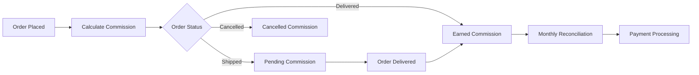
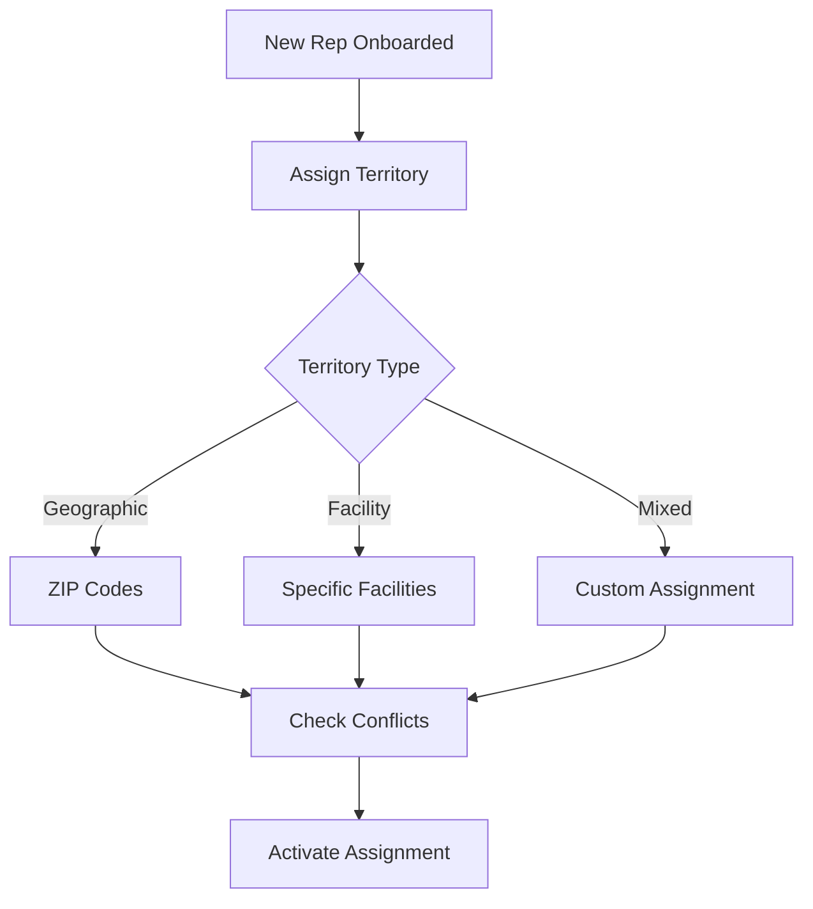

# Sales Team & Commission Management Feature Documentation

**Version:** 1.0  
**Last Updated:** January 2025  
**Feature Status:** Production Ready

---

## 📋 Overview

The Sales Team & Commission Management system provides comprehensive tools for managing MSC sales representatives, tracking their performance, calculating commissions, and supporting complex team hierarchies including sub-representatives.

## 🎯 Key Features

### 1. **Team Hierarchy Management**
- Sales representatives
- Sub-representatives with split commissions
- Territory assignments
- Team performance rollups
- Manager oversight

### 2. **Commission Tracking**
- Real-time commission calculation
- Order status-based earnings
- Split commission support
- Historical tracking
- Payment management

### 3. **Performance Analytics**
- Provider acquisition metrics
- Order volume tracking
- Revenue attribution
- Conversion rates
- Team comparisons

### 4. **Territory Management**
- Geographic assignments
- Facility-based territories
- Overlap handling
- Transfer workflows
- Coverage analytics

## 🏗️ Technical Architecture

### Database Schema
```sql
-- Sales Representatives Table
CREATE TABLE sales_representatives (
    id BIGINT PRIMARY KEY,
    user_id BIGINT NOT NULL UNIQUE,
    
    -- Hierarchy
    parent_rep_id BIGINT, -- For sub-reps
    team_id BIGINT,
    
    -- Commission Structure
    commission_rate DECIMAL(5,2) DEFAULT 5.00,
    split_percentage DECIMAL(5,2), -- For sub-reps
    
    -- Territory
    territory_type ENUM('geographic', 'facility', 'mixed'),
    territory_data JSON,
    
    -- Performance
    total_providers_acquired INT DEFAULT 0,
    total_orders_facilitated INT DEFAULT 0,
    lifetime_commission_earned DECIMAL(10,2) DEFAULT 0,
    
    -- Status
    status ENUM('active', 'inactive', 'suspended'),
    start_date DATE,
    end_date DATE,
    
    created_at TIMESTAMP,
    updated_at TIMESTAMP
);

-- Commission Tracking Table
CREATE TABLE commission_tracking (
    id BIGINT PRIMARY KEY,
    
    -- References
    order_id BIGINT NOT NULL,
    rep_id BIGINT NOT NULL,
    sub_rep_id BIGINT,
    
    -- Commission Details
    order_value DECIMAL(10,2),
    commission_rate DECIMAL(5,2),
    commission_amount DECIMAL(10,2),
    split_amount DECIMAL(10,2), -- If split with sub-rep
    
    -- Status
    status ENUM('pending', 'earned', 'paid', 'adjusted', 'cancelled'),
    earned_date DATE, -- When order delivered
    paid_date DATE,
    payment_reference VARCHAR(100),
    
    -- Tracking
    order_status VARCHAR(50), -- Status when commission calculated
    
    created_at TIMESTAMP,
    updated_at TIMESTAMP,
    
    INDEX idx_rep_status (rep_id, status),
    INDEX idx_earned_date (earned_date)
);

-- Territory Assignments Table
CREATE TABLE territory_assignments (
    id BIGINT PRIMARY KEY,
    rep_id BIGINT NOT NULL,
    
    -- Assignment Details
    assignment_type ENUM('zip_code', 'state', 'facility', 'organization'),
    assignment_value VARCHAR(255), -- ZIP, state code, facility ID, etc.
    
    -- Status
    is_primary BOOLEAN DEFAULT FALSE,
    is_exclusive BOOLEAN DEFAULT FALSE,
    start_date DATE,
    end_date DATE,
    
    created_at TIMESTAMP,
    
    UNIQUE KEY unique_assignment (assignment_type, assignment_value, is_exclusive)
);
```

### Commission Calculation Service
```typescript
class CommissionService {
  async calculateCommission(order: Order): Promise<CommissionRecord> {
    // Get sales rep for the order
    const rep = await this.getRepForOrder(order);
    if (!rep) return null;
    
    // Check if rep has sub-rep
    const subRep = await this.getActiveSubRep(rep.id);
    
    // Calculate base commission
    const orderValue = this.calculateOrderValue(order);
    const commissionRate = rep.commission_rate;
    let repCommission = orderValue * (commissionRate / 100);
    let subRepCommission = 0;
    
    // Apply split if sub-rep exists
    if (subRep) {
      subRepCommission = repCommission * (subRep.split_percentage / 100);
      repCommission = repCommission - subRepCommission;
    }
    
    // Create commission records
    const commission = await this.createCommissionRecord({
      order_id: order.id,
      rep_id: rep.id,
      sub_rep_id: subRep?.id,
      order_value: orderValue,
      commission_rate: commissionRate,
      commission_amount: repCommission,
      split_amount: subRepCommission,
      status: this.getCommissionStatus(order.status)
    });
    
    return commission;
  }
  
  private getCommissionStatus(orderStatus: string): string {
    switch (orderStatus) {
      case 'delivered':
        return 'earned';
      case 'shipped':
      case 'submitted_to_manufacturer':
        return 'pending';
      case 'cancelled':
      case 'denied':
        return 'cancelled';
      default:
        return 'pending';
    }
  }
}
```

## 💻 User Interface

### Sales Rep Dashboard
```tsx
const SalesRepDashboard: React.FC = () => {
  const { metrics, loading } = useSalesMetrics();
  
  return (
    <Dashboard>
      <Grid cols={4}>
        <MetricCard
          title="MTD Earnings"
          value={`$${metrics.mtdEarnings.toLocaleString()}`}
          subValue={`Pending: $${metrics.mtdPending.toLocaleString()}`}
        />
        <MetricCard
          title="Active Providers"
          value={metrics.activeProviders}
          subValue={`New this month: ${metrics.newProviders}`}
        />
        <MetricCard
          title="Orders This Month"
          value={metrics.ordersThisMonth}
          subValue={`Delivered: ${metrics.deliveredOrders}`}
        />
        <MetricCard
          title="Conversion Rate"
          value={`${metrics.conversionRate}%`}
          trend={metrics.conversionTrend}
        />
      </Grid>
      
      <ProviderPerformanceTable providers={metrics.topProviders} />
      <CommissionHistory commissions={metrics.recentCommissions} />
      <TerritoryMap assignments={metrics.territories} />
    </Dashboard>
  );
};
```

### Commission Tracking Interface
```tsx
const CommissionTracker: React.FC = () => {
  return (
    <div className="commission-tracker">
      <CommissionSummary />
      <OrderCommissionTable>
        <Column field="orderNumber" header="Order #" />
        <Column field="provider" header="Provider" />
        <Column field="orderValue" header="Order Value" />
        <Column field="commission" header="Commission" />
        <Column field="status" header="Status" render={StatusBadge} />
        <Column field="earnedDate" header="Earned Date" />
      </OrderCommissionTable>
    </div>
  );
};
```

## 🔄 Commission Workflows

### Commission Lifecycle


### Territory Assignment Flow


## 📊 Analytics & Reporting

### Performance Metrics
```typescript
interface SalesMetrics {
  // Financial Metrics
  mtdEarnings: number;
  ytdEarnings: number;
  pendingCommissions: number;
  averageOrderValue: number;
  
  // Activity Metrics
  providersAcquired: number;
  activeProviders: number; // Ordered in last 90 days
  ordersThisMonth: number;
  deliveredOrders: number;
  
  // Performance Metrics
  conversionRate: number; // Delivered / Total Orders
  providerRetention: number;
  territoryPenetration: number;
  
  // Team Metrics (if applicable)
  teamPerformance?: {
    totalTeamEarnings: number;
    subRepContribution: number;
    teamRanking: number;
  };
}
```

### Commission Reports
```yaml
Available Reports:
  - Monthly Commission Summary
  - YTD Earnings Report
  - Provider Performance Analysis
  - Territory Coverage Report
  - Team Performance Comparison
  - Commission Reconciliation
  - Tax Documentation (1099)
```

## 🔒 Security & Compliance

### Access Control
```typescript
const salesPermissions = {
  'sales_rep': [
    'view-own-commissions',
    'view-own-providers',
    'view-territory-data',
    'manage-sub-reps'
  ],
  'sub_rep': [
    'view-own-commissions',
    'view-assigned-providers',
    'view-parent-rep'
  ],
  'sales_manager': [
    'view-all-commissions',
    'manage-territories',
    'adjust-commissions',
    'run-reports'
  ]
};
```

### Financial Controls
- Commission calculation audit trails
- Adjustment approval workflows
- Payment reconciliation
- Tax reporting compliance
- Dispute resolution process

## 📈 Advanced Features

### Territory Intelligence
```typescript
class TerritoryIntelligence {
  async analyzeTerritory(repId: string): Promise<TerritoryAnalysis> {
    const territory = await this.getRepTerritory(repId);
    
    return {
      totalAddressableMarket: await this.calculateTAM(territory),
      currentPenetration: await this.calculatePenetration(territory),
      growthOpportunities: await this.identifyOpportunities(territory),
      competitiveAnalysis: await this.analyzeCompetition(territory),
      recommendations: await this.generateRecommendations(territory)
    };
  }
}
```

### Commission Optimization
- Dynamic commission rates
- Performance-based bonuses
- Tiered commission structures
- Special incentive tracking
- Automated calculations

## 🎯 Business Impact

### For Sales Representatives
- Real-time earnings visibility
- Performance tracking
- Territory insights
- Provider relationship management
- Goal tracking

### For MSC Management
- Sales force effectiveness
- Territory optimization
- Commission cost control
- Performance management
- Revenue attribution

## 🚀 Future Enhancements

### Planned Features
1. **AI Sales Assistant**: Predictive analytics and recommendations
2. **Mobile Sales App**: On-the-go commission tracking
3. **Gamification**: Leaderboards and achievements
4. **Advanced Analytics**: ML-powered insights
5. **CRM Integration**: Salesforce/HubSpot connectivity

---

**Related Documentation:**
- [Product Request Feature](./PRODUCT_REQUEST_FEATURE.md)
- [Customer Organization Feature](./CUSTOMER_ORGANIZATION_FEATURE.md)
- [Analytics Platform](./ANALYTICS_FEATURE.md)
